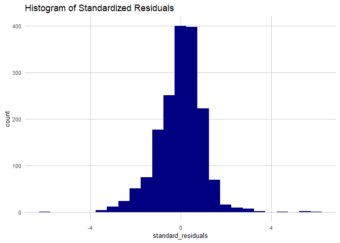

# Introduction

The ability to accurately predict house values is of great interest to real estate investors, homeowners and policymakers. This analysis examines the relationship between home sale values and select neighborhood attributes in Philadelphia.

In a survey of methods and input types for house price prediction, Geerts and colleagues (2023) present a set of variable types for prediction models, including structural features, temporal data, environmental features, and socioeconomic features. For this analysis, we focus on variables from the latter category, specifically the following:
- Residents with at least a bachelor’s degree (%)
- Housing units that are vacant (%)
- Housing units that are detached single family houses (%)
- Number of households with incomes below 100% poverty level
- Median household income (%).  
These indicators present a crude socioeconomic context for a neighborhood, and are well-documented as predictors of home prices. Indeed, it is reasonable that residents with higher educational attainment and income are able to afford more expensive homes. Conversely, it is also possible that the arrival of residents with higher socioeconomic status may lead to an eventual increase in property values. Using regression analysis, we find that __________________________. In light of this, we recommend that _________. Future research is needed _______________________.

# Methods  
## Data cleaning
The data in this analysis comes from the US Census Bureau's American Community Survey 5 year estimates. This dataframe is aggregated at the block-group level, with 1816 original observations. We clean the data to remove block groups with populations below 40, no housing units, median house values below $10,000, and one block-group with an extreme outlier for median house value. This leaves 1720 entries in our working dataframe. We additionally load a shapefile of Philadelphia's block-groups and join it to our dataframe for analysis and visualization. 

## Exploratory data analysis  
To prepare for our regression analysis, we first conduct an exploratory analysis by examining summary statistics as well as distributions of our independent and dependent variables. To test for co-linearity among our predictors, we also calculate the correlations between each independent variable. The correlation is a measure of how two variables change in relation to each other. The sample correlation coefficient, r, ranges from -1, indicating a perfect negative correlation, to 1, indicating a perfect positive correlation. A positive correlation means that the two variables increase together, and a negative correlation means that one decreases as the other increase. A correlation coefficient of 0 indicates no linear relationship between the variables. The sample correlation coefficient r is calculated as follows:

[[INSERT FORMULA HERE]]

First, the mean values of both variables x and y are calculated. Following, we find both variables' standard deviations. For each of the n observations in the dataset, we subtract the mean of each variable (__, __) from the observation, and divide the difference (__, __) by the variable's standard deviation (__, __). We then multiply this quotient (__, __) for each observation's x and y variable and sum this product at each observation. Finally, we divide this sum by the number of observations minus 1. 

## Multiple regression analysis
For our regression analysis, we use a multiple regression to analyze the relationship between one dependent variable (median home value) and multiple explanatory variables. Using this, we are able to gauge the strength of the relationship between each predictor and median home value, the direction of the relationship, and the goodness of model fit on our observations. Specifically, it allows us to hold individual predictors in isolation to see how, and if, median home values change in response to a unit change in the predictor.

In the following formula, median household value is a function of ______________________________________________________________, where _______________.

[[insert formula here]]

This method makes a few assumptions:
- x and y have a linear relationship
- the residuals are normally distributed, random, and homoscedastic
- observations and residuals are independent
- y is continuous and normally distributed
- predictors are not collinear (highly-correlated) 

Assuming all these conditions are met, we need to calculate the following parameters:
- β0
- βk
- σ2
- ....


[[need to complete this section!!]]

## Additional Analyses
### Stepwise regression
### K-fold cross validation

## Software
All analysis in this study was completed using R packages in RStudio. 


# Results
## Exploratory results  
### Summary statistics
To begin our analysis, we first examine the summary statistics and distributions of our variables. The median home value (MEDHVAL) has a median value of $53,250 and a mean value of $66,288. This indicates that the data is positively skewed, with a higher share of observations below than the mean. Similarly, the independent variables (PCTBACHMOR, MEDHHINC, PCTVACANT, PCTSINGLES, and NBELPOV100) all have lower medians than means, indicating positive skewness.

In the summary statistics table, the dependent variable is the median home value (MEDHVAL), while the rest of the variables including the percentage of individuals with bachelor’s degrees or higher (PCTBACHMOR), median household income (MEDHHINC), percentage of vacant houses (PCTVACANT), percentage of single house units (PCTSINGLES), and households living in poverty (NBELPOV100) are all predictors of the dependent variable. The summary statistics table contains some key measurements, such as quantile 1, median, mean, quantile 3, maximum, and standard deviation.

Quantiles order the values of the data from lowest to highest and divide the value of each variable into 4 equal parts. Quantile 1 represents the value below which 25% of the data falls, the median (Q2) represents the value below which 50% of the data falls, and the third quartile (Q3) represents the value below which 75% of the data falls. The maximum in the table can be interpreted as quantile 4 and measures the value below which 100% of the data falls.

In the summary table, the dependent variable MEDHVAL has a quartile 1 of 35075, a median of 53250, a quartile 3 of 78625, and a maximum of 1e+06 (equal to 1,000,000). The interval between quantile 1 and the median is the smallest, indicating that the value of MEDHVAL is less variant. For PCTBACHMOR, the first quartile is 4.847, the median is 10, the mean is 16.08, the third quartile is 20.07, with a maximum value of 92.99. The standard deviation is 17.77. The first quartile for MEDHHINC is 21061, the median is 29719, the mean is 31542, the third quartile is 38750, with a maximum value of 2e+05 (200,000). The standard deviation is 16298.For PCTVACANT, the first quartile is 4.372, the median is 9.091, the mean is 11.29, the third quartile is 16.28, with a maximum value of 77.12. The standard deviation is 9.628.For PCTSINGLES, the first quartile is 2.11, the median is 5.714, the mean is 9.226, the third quartile is 11.06, with a maximum value of 100. The standard deviation is 13.25.And for NBELPOV100, the first quartile is 72, the median is 147, the mean is 189.8, the third quartile is 257, with a maximum value of 1267. The standard deviation is 164.3.

In addition to the four quantiles, the summary statistics table also provides the mean and standard deviation. The mean is the average of all values of a dataset and can be calculated by adding all values and dividing the result by the count. The standard deviation measures how dispersed the data of the dependent variable and the predictors are in relation to their means. A small standard deviation indicates that the data are clustered near the mean, while a large standard deviation indicates that the data are more spread out.

In the summary statistics table, the mean of the dependent variable MEDHVAL is 66288, and its standard deviation is 60006, which is considerably large, indicating that the data of the dependent variable is spread out. The mean of PCTBACHMOR is 16.08, and its standard deviation is 17.77, indicating that this data is also very spread out. The mean and standard deviation for MEDHHINC are 31542 and 16298, respectively. The data is not as spread out as the previous two data but still spread. The mean and standard deviation of PCTVACANT are 11.29 and 9.628, respectively, making PCTVACANT a relatively spread-out dataset as well. PCTSINGLES has a mean of 9.226 and a standard deviation of 13.25, making this predictor the most spread-out data. NBELPOV100 has a mean of 189.8 and a standard deviation of 164.3, indicating a considerable spread of data.


```r
sum_stat <- function(var) {
  dat <- 
  dat %>%
    dplyr::select(var) %>%
    mutate(variable = var) %>%
    summarize(quartile_1 = quantile(dat[var], probs = 0.25, na.rm = TRUE),
           median = quantile(dat[var], probs = 0.5, na.rm = TRUE),
           mean = mean(dat[[var]], na.rm = TRUE),
           quartile_3 = quantile(dat[var], probs = 0.75, na.rm = TRUE),
           max = max(dat[var], na.rm = TRUE),
           sd = sd(dat[[var]], na.rm = TRUE),
           variance = var(dat[[var]], na.rm = TRUE))
  return(dat)
  }

medhval_summ <- sum_stat("MEDHVAL")
pctbachmorr_summ <- sum_stat("PCTBACHMOR")
medhhinc_summ <- sum_stat("MEDHHINC")
pctvacant_summ <- sum_stat("PCTVACANT")
pctsingles_summ <- sum_stat("PCTSINGLES")
nbelpov100_summ <- sum_stat("NBELPOV100")

dat.stat <- rbind(medhval_summ,
                  pctbachmorr_summ,
                  medhhinc_summ,
                  pctvacant_summ,
                  pctsingles_summ,
                  nbelpov100_summ) 

pander(dat.stat, caption = "Summary Statistics")
```


----------------------------------------------------------------------
 quartile_1   median   mean    quartile_3    max     sd     variance  
------------ -------- ------- ------------ ------- ------- -----------
   35075      53250    66288     78625      1e+06   60006   3.601e+09 

   4.847        10     16.08     20.07      92.99   17.77     315.8   

   21060      29719    31542     38750      2e+05   16298   265638946 

   4.372      9.091    11.29     16.28      77.12   9.628     92.71   

    2.11      5.714    9.226     11.06       100    13.25     175.5   

     72        147     189.8      257       1267    164.3     27001   
----------------------------------------------------------------------

Table: Summary Statistics

## Variable distributions 
Looking at the variables plotted as histograms, the positive skews are evident for median home value. individuals with bachelors degrees, vacant houses, single family houses, and households in poverty. Median household income is not visibly skewed. 

```r
grid.arrange(
ggplot(dat %>% filter(MEDHVAL <= 152525), aes(x = MEDHVAL)) + # filtering for outliers, keeping 95%
  geom_histogram(fill = "orchid", bins = 50) +
  labs(title = "Median Home Value ($)", y = "", x = "Dollars") +
  plotTheme(),

ggplot(dat %>% filter(PCTBACHMOR <= 59.13698), aes(x = PCTBACHMOR)) + # filtering for outliers, keeping 95%
  geom_histogram(fill = "navy", bins = 50) +
  labs(title = "Individuals with Bachelor’s Degrees or Higher (%)", y = "", x = "Percent") +
  plotTheme(),

ggplot(dat %>% filter(MEDHHINC <= 56444.9), aes(x = MEDHHINC)) + # filtering for outliers, keeping 95%
  geom_histogram(fill = "navy", bins = 50) +
  labs(title = "Median Household Income", y = "Block groups (n = 1720)", x = "Dollars") +
  plotTheme(),

ggplot(dat %>% filter(PCTVACANT <= 28.5154), aes(x = PCTVACANT)) + # filtering for outliers, keeping 95%
  geom_histogram(fill = "navy", bins = 50) +
  labs(title = "Vacant Houses (%)", y = "", x = "Percent") +
  plotTheme(),

ggplot(dat %>% filter(PCTSINGLES <= 30.68176), aes(x = PCTSINGLES)) + # filtering for outliers, keeping 95%
  geom_histogram(fill = "navy", bins = 50) +
  labs(title = "Single House Units (%)", y = "", x = "Percent") +
  plotTheme(),

ggplot(dat %>% filter(NBELPOV100 <= 514.05), aes(x = NBELPOV100)) + # filtering for outliers, keeping 95%
  geom_histogram(fill = "navy", bins = 50) +
  labs(title = "Households Living in Poverty", y = "", x = "Households") +
  plotTheme(),
top = "Histogram of analysis variables")
```

<!-- -->

## Log-transformed variable distributions 
After log-transformation, the dependent variable (Median Home Value) has a roughly normal distribution, so we will use LNMEDHVAL in our analysis. Of the independent variables, log-transformation only normalizes NBELPOV100 (Households living in poverty), so we will only use the log-transformed values for this variable and un-transformed values for the others.The regression we did in our assignment is all based on this log-transformed variable. The more explicit explanation of the regression assumptions will be examined in a separate section below in regression assumption checks.

```r
dat.log <- dat %>%
  mutate(LNMEDHVAL = log(MEDHVAL),
         LNPCTBACHMOR = log(1 + PCTBACHMOR), #adding one for variables with 0 values
         LNMEDHHINC = log(MEDHHINC),
         LNPCTVACANT = log(1 + PCTVACANT),
         LNPCTSINGLES = log(1 + PCTSINGLES),
         LNNBELPOV100 = log(1 + NBELPOV100))

grid.arrange(
ggplot(dat.log, aes(x = LNMEDHVAL)) + # filtering for outliers, keeping 95%
  geom_histogram(fill = "orchid", bins = 50) +
  labs(title = "Median Home Value ($)", y = "", x = "Dollars") +
  plotTheme(),

ggplot(dat.log, aes(x = LNPCTBACHMOR)) + # filtering for outliers, keeping 95%
  geom_histogram(fill = "navy", bins = 50) +
  labs(title = "Individuals with Bachelor’s Degrees or Higher (%)", y = "", x = "Percent") +
  plotTheme(),

ggplot(dat.log, aes(x = LNMEDHHINC)) + # filtering for outliers, keeping 95%
  geom_histogram(fill = "navy", bins = 50) +
  labs(title = "Median Household Income", y = "Block groups (n = 1720)", x = "Dollars") +
  plotTheme(),

ggplot(dat.log, aes(x = LNPCTVACANT)) + # filtering for outliers, keeping 95%
  geom_histogram(fill = "navy", bins = 50) +
  labs(title = "Vacant Houses (%)", y = "", x = "Percent") +
  plotTheme(),

ggplot(dat.log, aes(x = LNPCTSINGLES)) + # filtering for outliers, keeping 95%
  geom_histogram(fill = "navy", bins = 50) +
  labs(title = "Single House Units (%)", y = "", x = "Percent") +
  plotTheme(),

ggplot(dat.log, aes(x = LNNBELPOV100)) + # filtering for outliers, keeping 95%
  geom_histogram(fill = "navy", bins = 50) +
  labs(title = "Households Living in Poverty", y = "", x = "Households") +
  plotTheme(),
top = "Histogram of log-transformed independent variables")
```

<!-- -->

## Scatter plots

```r
cor.long <- dat.log %>%
  dplyr::select(LNMEDHVAL, PCTBACHMOR, MEDHHINC, PCTVACANT, PCTSINGLES, LNNBELPOV100) %>%
  gather(Variable, Value, -LNMEDHVAL) %>%
  mutate(Value = as.numeric(Value))

cor.cor <-
  cor.long %>%
    group_by(Variable) %>%
    summarize(correlation = cor(Value, LNMEDHVAL, use = "complete.obs"))

ggplot(cor.long, aes(Value, LNMEDHVAL)) +
  geom_point(size = 0.1, color = "navy", alpha = 0.4) +
  geom_text(data = cor.cor, aes(label = paste("r =", round(correlation, 2))),
            x=-Inf, y=Inf, vjust = 1.5, hjust = -.1, size = 4) +
  geom_smooth(method = "lm", se = FALSE, color = "orchid", linewidth = 0.5) +
  facet_wrap(~Variable, ncol = 3, scales = "free") +
  plotTheme() + 
  labs(title = "Median Home Value as a Function of Independent Variables", subtitle = "Philadelphia, PA Block Groups; n = 1720") 
```

<!-- -->

## Correlation matrix 
The correlation matrix generally supports the conclusions based on the visual comparison of the predictor maps, but provides a more quantitative visualization of the relationships between the predictors. 

There is presence of severe multicollinearity in this correlation matrix. In this correlation matrix, high correlations between certain pairs of variables are observed. For example, the correlation coefficients between MEDHHINC and PCTBACHMOR is 0.7, as well as the correlation coefficients between PCTBACHMOR and LNMEDHVAL. This result could indicate the possibility of multicollinearity. Additionally, the high correlation coefficient between MEDHHINC and LNNBELPOV100 is 0.6 and the correlation coefficient between PCTVACANT and LNMEDHVAL is 0.5. These results of coefficients also hint at potential multicollinearity. While the correlation matrix suggests a degree of multicollinearity.
 

```r
dat.corplot <- dat.log %>%
  dplyr::select(-POLY_ID, -AREAKEY, -MEDHVAL, -LNPCTBACHMOR, -LNMEDHHINC, -LNPCTVACANT, -LNPCTSINGLES, -NBELPOV100)

ggcorrplot(round(cor(dat.corplot %>% na.omit()), 1),
  p.mat = cor_pmat(dat.corplot %>% na.omit()),
  colors = c("navy", "white", "orchid1"),
  type="lower",
  insig = "blank",
  show.legend = FALSE,
  lab = TRUE) +  
    labs(title = "Log-transformed median home value correlation with independent variables") 
```

<!-- -->

## Chloropleth maps
Visually interpreting the choropleth maps, the median home value and households in poverty share similarities. From the map of median home value, the region to the north of downtown Philadelphia appears darker, indicating a lower median home value. Similarly, the map of households in poverty shows yellowish clustering in the same region, indicating a higher prevalence of households in poverty. This correlation is logical because households in poverty typically cannot afford homes with high values, leading them to reside in regions with lower home values. Consequently, it is reasonable to conclude that households in poverty are strong predictors for the dependent variable of median home value.

Additionally, the median home value and the percentage of individuals with a bachelor's degree or higher also exhibit similarities. The region with a lower median home value is predominantly occupied by individuals without a bachelor's degree or higher, especially in the area north of downtown Philadelphia. Conversely, the region near Mt. Airy (northwestern) displays a higher median home value and a greater percentage of individuals with a bachelor's degree or higher. This correlation aligns with the general expectation that individuals with higher education tend to have a better financial status, in contrast to those without higher education degrees. Thus, it is also reasonable to conclude that the percentage of individuals with a bachelor's degree or higher is a strong predictor for the dependent variable of median home value.

Moreover, the percentage of single-home units shares similarities with median home value, but there are also variances. The higher percentage of single-home units in Mt. Airy and the northeastern region correlates with a higher median home value. However, the low percentage of single-home units downtown also suggests a high median home value. Consequently, the percentage of single-home units is not considered as strong a predictor for median home value as households in poverty and the percentage of individuals with a bachelor's degree or higher.

The percentage of vacant homes also shows a strong correlation with median home value. A low percentage of vacant homes is observed in areas with high median home values, while a high percentage of vacant homes is found in regions with lower median home values. Hence, the percentage of vacant homes serves as another strong predictor for median home value.

Given the high inter-correlation observed between the dependent variable, median home value, and predictors such as households in poverty, the percentage of individuals with a bachelor's degree or higher, and the percentage of vacant homes, concerns may arise regarding multicollinearity. These variables might display high correlations, posing challenges in differentiating the individual effects of each predictor on the dependent variable.

```r
grid.arrange(
ggplot(dat.sf) +
  geom_sf(aes(fill = LNMEDHVAL), color = "transparent") +
  scale_fill_viridis_c(option = "A", direction = 1) +
  labs(title = "Log-transformed median home value") +
  theme_void() +
  theme(legend.position = c(0.8, 0.2)),

ggplot(dat.sf) +
  geom_sf(aes(fill = PCTVACANT), color = "transparent") +
  scale_fill_viridis_c(option = "A", direction = 1) +
  labs(title = "Vacant homes (%)") +
  theme_void() +
  theme(legend.position = c(0.8, 0.2)),

ggplot(dat.sf) +
  geom_sf(aes(fill = PCTSINGLES), color = "transparent") +
  scale_fill_viridis_c(option = "A", direction = 1) +
  labs(title = "Single home units (%)") +
  theme_void() +
  theme(legend.position = c(0.8, 0.2)),

ggplot(dat.sf) +
  geom_sf(aes(fill = PCTBACHMOR), color = "transparent") +
  scale_fill_viridis_c(option = "A", direction = 1) +
  labs(title = "Individuals with bachelors or more (%)") +
  theme_void() +
  theme(legend.position = c(0.8, 0.2)),

ggplot(dat.sf) +
  geom_sf(aes(fill = LNNBELPOV), color = "transparent") +
  scale_fill_viridis_b(option = "A", direction = 1) +
  labs(title = "Log-transformed households in poverty") +
  theme_void() +
  theme(legend.position = c(0.8, 0.2)), ncol = 3)
```

<!-- -->

# Multiple Regression Analysis
## Regression results 
The regression is natural logarithm median home value (LNMEDHVAL) regressed on percent of vacant house (PCTVACANT), percent of single home units (PCTSINGLES), percent of individuals with bachelor degree or higher (PCTBACHMOR), and household living in poverty (LNNBELPOV100) with logarithm transformation. PCTSINGLES and PCTBACHMOR is negatively associated with median home value and PCTVACANT and LNNBELPOV100 is positively associated with median home value. 
The estimate of PCTVACANT is -0.0191569, which demonstrates that a 1-unit increase in the percentage of vacant homes is associated with a decrease of 0.0191569 in the response variable of median home value. Same as LNNBELPOV100, a 1-unit increase in the household in poverty is associated with a decrease of 0.0789054 in the median home value. PCTSINGLES and PCTBACHMOR has the estimate of 0.0029769 and 0.209098 respectively, which implies that a 1-unit increase in the percentage of single home unit and percentage of individuals with bachelor degree and more is individually associated with an increase of 0.0029769 and 0.209098 in median home value. The std. error measures the variability and precision of the estimate. Lower values mean higher precision and vice versa. 
The t value measures the strength of the relationship between the predictor and the dependent variable. Higher absolute t values indicate a stronger relationship. In this regression PCTBACHMOR has the highest absolute t value of 38.494 indicating its strongest relationship with median home value, and PCTSINGLES has the lowest absolute t value of 4.234 which means its least strong relationship with median home value.
The extreme low overall p-value of 2.2 e-16 of regression coefficients suggest that PCTVACANT, PCTSINGLES, PCTBACHMOR, LNNBELPOV100 have an extremely low probability of occurring by chance and are highly significant impact on the dependent variable MEDHVAL. Thus, it is reasonable to reject the null hypothesis that the coefficients for these variables are equal to 0.
The logarithm transformed regression model has a multiple R-square of 0.6623 and adjusted R-square of 0.6615 which means that approximately 66.23% of median home value can be explained by the predictors in the model. This result can be considered as indicating a strong relationship between the dependent variable of median home value and its predictors.


```r
# Assuming there’s no severe multicollinearity, use the lm command to run
# the regression where LNMEDHVAL is the dependent variable and
# PCTVACANT, PCTSINGLES, PCTBACHMOR, and LNNBELPOV100 are
# predictors.
# 
# In your report, be sure to present the summary of the fit as well as the
# ANOVA table containing the regression and error sum of squares (use the
# summary and anova commands). The only thing you should be looking at in
# the output from the anova command is the error sum of squares, and not
# any of the p-values.
# 
# c. Use the fitted, residuals and rstandard commands to save the predicted
# values, residuals and standardized residuals, respectively.

reg <- lm(LNMEDHVAL ~ PCTVACANT + PCTSINGLES + PCTBACHMOR + LNNBELPOV100, data=dat.log)
summary(reg)
```

```
## 
## Call:
## lm(formula = LNMEDHVAL ~ PCTVACANT + PCTSINGLES + PCTBACHMOR + 
##     LNNBELPOV100, data = dat.log)
## 
## Residuals:
##      Min       1Q   Median       3Q      Max 
## -2.25825 -0.20391  0.03822  0.21744  2.24347 
## 
## Coefficients:
##                Estimate Std. Error t value Pr(>|t|)    
## (Intercept)  11.1137661  0.0465330 238.836  < 2e-16 ***
## PCTVACANT    -0.0191569  0.0009779 -19.590  < 2e-16 ***
## PCTSINGLES    0.0029769  0.0007032   4.234 2.42e-05 ***
## PCTBACHMOR    0.0209098  0.0005432  38.494  < 2e-16 ***
## LNNBELPOV100 -0.0789054  0.0084569  -9.330  < 2e-16 ***
## ---
## Signif. codes:  0 '***' 0.001 '**' 0.01 '*' 0.05 '.' 0.1 ' ' 1
## 
## Residual standard error: 0.3665 on 1715 degrees of freedom
## Multiple R-squared:  0.6623,	Adjusted R-squared:  0.6615 
## F-statistic: 840.9 on 4 and 1715 DF,  p-value: < 2.2e-16
```

```r
anova(reg)
```

```
## Analysis of Variance Table
## 
## Response: LNMEDHVAL
##                Df  Sum Sq Mean Sq  F value    Pr(>F)    
## PCTVACANT       1 180.392 180.392 1343.087 < 2.2e-16 ***
## PCTSINGLES      1  24.543  24.543  182.734 < 2.2e-16 ***
## PCTBACHMOR      1 235.118 235.118 1750.551 < 2.2e-16 ***
## LNNBELPOV100    1  11.692  11.692   87.054 < 2.2e-16 ***
## Residuals    1715 230.344   0.134                       
## ---
## Signif. codes:  0 '***' 0.001 '**' 0.01 '*' 0.05 '.' 0.1 ' ' 1
```

```r
#vif(reg)
dat.log$pred_values <- fitted(reg)
dat.log$residual_values <- residuals(reg)
dat.log$standard_residuals <- rstandard(reg)
```

# Regression Assumption Checks 
## Scatterplot of standardized residuals

```r
# Create a scatter plot with Standardized Residuals on the y-axis and
# Predicted Values on the x-axis. You will be asked to present this scatter plot
# in your report, so take a screenshot of it if you plan to use MS Word.

ggplot(dat.log, aes(pred_values, standard_residuals)) +
  geom_point(size = 0.5, color = "navy", alpha = 0.4) +
  #geom_text(data = cor.cor, aes(label = paste("r =", round(correlation, 2))),
  #          x=-Inf, y=Inf, vjust = 1.5, hjust = -.1, size = 4) +
  geom_smooth(method = "lm", se = FALSE, color = "orchid", linewidth = 0.5) +
  plotTheme() + 
  labs(title = "Standardized residuals") 
```

<!-- -->

## Additional Models

```r
#Use the step and step$anova commands in the MASS library to run stepwise
# regression and determine the best model based on the Akaike Information
# Criterion.

step <- stepAIC(reg, direction="both")
```

```
## Start:  AIC=-3448.07
## LNMEDHVAL ~ PCTVACANT + PCTSINGLES + PCTBACHMOR + LNNBELPOV100
## 
##                Df Sum of Sq    RSS     AIC
## <none>                      230.34 -3448.1
## - PCTSINGLES    1     2.407 232.75 -3432.2
## - LNNBELPOV100  1    11.692 242.04 -3364.9
## - PCTVACANT     1    51.546 281.89 -3102.7
## - PCTBACHMOR    1   199.020 429.36 -2379.0
```

```r
step$anova
```

```
## Stepwise Model Path 
## Analysis of Deviance Table
## 
## Initial Model:
## LNMEDHVAL ~ PCTVACANT + PCTSINGLES + PCTBACHMOR + LNNBELPOV100
## 
## Final Model:
## LNMEDHVAL ~ PCTVACANT + PCTSINGLES + PCTBACHMOR + LNNBELPOV100
## 
## 
##   Step Df Deviance Resid. Df Resid. Dev       AIC
## 1                       1715   230.3435 -3448.073
```


## K-folds cross validation

```r
#Perform k-fold cross-validation (in which k = 5) using the CVlm command in the
# DAAG library and calculate the root mean square error (RMSE). Then re-run the
# regression model only using PCTVACANT and MEDHHINC as predictors, and again
# perform k-fold cross-validation in which k = 5. You will be asked to present the
# RMSE of both this model and the original model in your report.

cv <- CVlm(data=dat.log, reg, m=5)
```


<!-- -->

```
## 
## fold 1 
## Observations in test set: 344 
##                     20         27         32        35          36         44
## Predicted   12.5446791 12.1908340 11.7943923 11.946024 12.00900782 12.1314071
## cvpred      12.5505271 12.1956021 11.7967462 11.951460 12.01051260 12.1329055
## LNMEDHVAL   12.6723192 12.1291916 11.6055046 12.385055 11.99843328 13.0049303
## CV residual  0.1217921 -0.0664105 -0.1912415  0.433595 -0.01207932  0.8720248
##                       45          64        67         69          70
## Predicted   11.403737703 12.26410114 12.168848 11.7284995 11.62021519
## cvpred      11.405000627 12.27637776 12.177464 11.7326978 11.62627345
## LNMEDHVAL   11.400875961 12.32385568 11.918391 11.9652742 11.67843990
## CV residual -0.004124665  0.04747792 -0.259073  0.2325763  0.05216646
##                     72        75         88          89         91         92
## Predicted   11.5973031 10.345476 10.5490288 10.64651696 10.9844744 10.4049343
## cvpred      11.6047281 10.343032 10.5457388 10.65156220 10.9859876 10.4037289
## LNMEDHVAL   11.4031106 12.323856 10.1345993 10.63103616 10.7600283 11.0020998
## CV residual -0.2016175  1.980824 -0.4111395 -0.02052604 -0.2259593  0.5983709
##                    110        117        124        126         129        140
## Predicted   10.7567030 10.5185287 10.6773466 10.6534219 10.94306876 10.5827600
## cvpred      10.7516835 10.5134579 10.6756050 10.6487618 10.94605256 10.5769483
## LNMEDHVAL   11.2424282 10.6213273 11.0728689 10.8930287 10.87426647 10.4659564
## CV residual  0.4907447  0.1078695  0.3972639  0.2442669 -0.07178609 -0.1109919
##                    141        142        148         154       158       159
## Predicted   10.5056839 10.2895549 10.5723541 10.36685107 10.809322 11.526857
## cvpred      10.5006335 10.2865381 10.5692504 10.36721675 10.808813 11.530235
## LNMEDHVAL   10.6286178 10.5400644 10.3189030 10.42821608 10.069002  9.268609
## CV residual  0.1279843  0.2535263 -0.2503474  0.06099933 -0.739811 -2.261626
##                    161        166         180         184       193        197
## Predicted   10.1171207 10.5407087 10.43507436 10.61636443 10.666739 10.8287808
## cvpred      10.1109623 10.5384357 10.42925672 10.61195517 10.665694 10.8308029
## LNMEDHVAL    9.6927665  9.8934372 10.50232405 10.63585545 10.992050 11.1995836
## CV residual -0.4181957 -0.6449985  0.07306733  0.02390028  0.326356  0.3687808
##                    202        203       234         246         250        252
## Predicted   10.7710263 10.7169028 10.784298 10.56525496 10.78440771 10.8088821
## cvpred      10.7724847 10.7168394 10.786129 10.56377199 10.78510311 10.8107551
## LNMEDHVAL   11.0898054 11.0697585  9.769956 10.60162227 10.72546760 10.6942151
## CV residual  0.3173207  0.3529191 -1.016173  0.03785028 -0.05963551 -0.1165401
##                     253          255          256        265        267
## Predicted   10.67336482 10.507470132 10.495926598 10.7983661 10.5007421
## cvpred      10.67241102 10.504923688 10.492500656 10.7978179 10.4975240
## LNMEDHVAL   10.72985358 10.510532034 10.491274217 10.6188853 10.2715969
## CV residual  0.05744255  0.005608346 -0.001226438 -0.1789325 -0.2259272
##                     275          280        281        288        291
## Predicted   10.20992099 10.935172773 10.6874143 10.7191221 10.2506026
## cvpred      10.20525002 10.938758818 10.6848358 10.7189970 10.2433340
## LNMEDHVAL   10.24352486 10.933106970 10.5891065 10.5078035 10.4659564
## CV residual  0.03827483 -0.005651849 -0.0957293 -0.2111935  0.2226224
##                    293        299        300        307          314
## Predicted   10.5005932 10.4294838 10.4007282 10.6667472 10.467676443
## cvpred      10.4992114 10.4266329 10.3962673 10.6666436 10.464336388
## LNMEDHVAL   10.3254820 10.6430411 10.6041067 10.8177763 10.465956409
## CV residual -0.1737295  0.2164083  0.2078395  0.1511326  0.001620021
##                      321        322        327       332       334          338
## Predicted   10.315880766 10.5491969 10.7354967 10.989836 10.544189 10.547890404
## cvpred      10.311931241 10.5452226 10.7342705 10.989306 10.538956 10.544447369
## LNMEDHVAL   10.302263672 10.3513734 11.2910311 11.565518 11.030039 10.550590795
## CV residual -0.009667568 -0.1938492  0.5567606  0.576212  0.491083  0.006143426
##                   343        344         352          353        360
## Predicted   10.654774 10.6998494 11.00955399 10.956096290 10.5103161
## cvpred      10.658199 10.6988987 11.00904998 10.958425620 10.5054338
## LNMEDHVAL   10.491274 10.4042628 11.09589372 10.959540227 10.6712783
## CV residual -0.166925 -0.2946359  0.08684374  0.001114607  0.1658445
##                     364        365        366        369         370        395
## Predicted   10.63858995 10.7855881 10.7591280 10.6714819 10.51286543 11.4404717
## cvpred      10.63699559 10.7789166 10.7636245 10.6705515 10.51178634 11.4371143
## LNMEDHVAL   10.54534144 10.4544950 10.6016223 10.4341158 10.56100756 11.1562505
## CV residual -0.09165415 -0.3244216 -0.1620023 -0.2364357  0.04922122 -0.2808638
##                    405         407        410        411        414
## Predicted   10.6712491 10.51968094 10.6109074 10.5504233 10.4795444
## cvpred      10.6653266 10.51903109 10.6067604 10.5464041 10.4754758
## LNMEDHVAL   10.9150885 10.49127422 10.2921455 10.1345993 10.2327913
## CV residual  0.2497619 -0.02775687 -0.3146148 -0.4118048 -0.2426845
##                      426         431        444        448        456
## Predicted   10.427621144 10.49886917 10.7203036 10.9434522 10.6216723
## cvpred      10.425193738 10.49478144 10.7220381 10.9538409 10.6228920
## LNMEDHVAL   10.422281346 10.52137225 10.8874369 11.1243175 10.7188524
## CV residual -0.002912393  0.02659081  0.1653988  0.1704766  0.0959604
##                    465        471        472        476         493        496
## Predicted   10.3309515 10.6199825 10.3908190 10.4367965 10.51721485 10.3619908
## cvpred      10.3283264 10.6221035 10.3869266 10.4306662 10.51207499 10.3511424
## LNMEDHVAL   10.4370527 10.2750511 10.1924188 10.0816337 10.53475933 10.4311703
## CV residual  0.1087263 -0.3470524 -0.1945077 -0.3490325  0.02268434  0.0800279
##                     498        500        512        513        515        517
## Predicted   11.09752654 10.7235130 10.7299168 10.5084815 10.4997124 10.7998381
## cvpred      11.09835590 10.7256800 10.7331249 10.5040776 10.4993293 10.8035215
## LNMEDHVAL   11.05247605 10.4341158 10.5400644 10.2327913 10.3672216 10.5738777
## CV residual -0.04587985 -0.2915642 -0.1930605 -0.2712863 -0.1321077 -0.2296437
##                    522        526         531        532         533
## Predicted   10.6889530 11.1638238 11.24446905 10.9556108 11.22265906
## cvpred      10.6922596 11.1714735 11.24437754 10.9582308 11.23414331
## LNMEDHVAL    9.8469172 10.7851868 11.31691058 11.2797316 11.14908203
## CV residual -0.8453424 -0.3862866  0.07253304  0.3215008 -0.08506128
##                     537         538        541        545         546
## Predicted   10.94960794 11.79976429 11.2170443 10.8108968 10.95238455
## cvpred      10.95229037 11.79567391 11.2173380 10.8127598 10.95615844
## LNMEDHVAL   10.98529272 11.89546307 11.5740206 10.9630125 10.88556602
## CV residual  0.03300236  0.09978916  0.3566825  0.1502526 -0.07059241
##                    548       549       553        558         566        570
## Predicted   10.8689389 10.987137 10.776458 11.8416052 11.20101290  9.9817694
## cvpred      10.8702221 10.989376 10.781320 11.8391342 11.20174490  9.9977893
## LNMEDHVAL   10.9937316 11.221235 10.905956 11.9524699 11.25674206 10.7144178
## CV residual  0.1235095  0.231859  0.124636  0.1133357  0.05499716  0.7166284
##                    572       573         576        591        592        609
## Predicted   12.3415187 12.573198 11.47628690 10.4466004 11.0354645 12.1532754
## cvpred      12.3556959 12.593638 11.48179282 10.4451550 11.0360395 12.1620363
## LNMEDHVAL   11.6307085 11.225243 11.39975677 10.6188853 11.2252434 11.7605665
## CV residual -0.7249874 -1.368394 -0.08203606  0.1737304  0.1892039 -0.4014698
##                     610        612         629         632       639        641
## Predicted   11.86994091 11.5983271 10.38731708 10.69213776 10.098788 10.3423398
## cvpred      11.87200228 11.6009034 10.38463383 10.69389946 10.097904 10.3519586
## LNMEDHVAL   11.79433792 11.4053403 10.32548196 10.74720759  9.602382 10.4744671
## CV residual -0.07766435 -0.1955631 -0.05915187  0.05330813 -0.495522  0.1225085
##                     648        650        659        671        681        683
## Predicted   10.68679707 10.2476423 10.5909988 10.7439058 10.3290119 10.7069721
## cvpred      10.68735922 10.2515187 10.5905970 10.7419532 10.3244130 10.7139766
## LNMEDHVAL   10.71441777 10.9595402 10.2750511 11.0284171  9.9330464 10.2219413
## CV residual  0.02705855  0.7080215 -0.3155459  0.2864639 -0.3913666 -0.4920353
##                    692       698        714        719        723        728
## Predicted   10.0854341 9.2054407 10.5780589 10.3908758 10.6509945 11.1453644
## cvpred      10.0785965 9.1948856 10.5698703 10.3847055 10.6511859 11.1482042
## LNMEDHVAL   10.3889954 9.7699562 10.0774409 10.1105017 10.9886768 10.5661755
## CV residual  0.3103989 0.5750705 -0.4924294 -0.2742037  0.3374909 -0.5820286
##                     732        735       743        744        748       750
## Predicted   10.58794745 10.5113604 10.257101 10.2697870 10.4287168 10.413991
## cvpred      10.58662915 10.5102743 10.254677 10.2602375 10.4254452 10.408364
## LNMEDHVAL   10.51596683 10.8277465 10.118599  9.8201059 11.0508900 10.118599
## CV residual -0.07066232  0.3174722 -0.136078 -0.4401316  0.6254448 -0.289765
##                    751        756        758        761       762        763
## Predicted   10.3372606 10.2465648 10.7142351 10.3769196 10.481577 10.2853027
## cvpred      10.3295998 10.2379018 10.7257515 10.3723124 10.479493 10.2800854
## LNMEDHVAL   10.0475879 10.6188853 10.3889954 10.0982316 10.257659  9.8984750
## CV residual -0.2820119  0.3809836 -0.3367561 -0.2740808 -0.221834 -0.3816104
##                    774        791        797        800        805        820
## Predicted   10.1273341 10.2083169 10.4311670 10.1616932 11.0132369 10.5943455
## cvpred      10.1215239 10.2075220 10.4201175 10.1516407 11.0165296 10.5921714
## LNMEDHVAL    9.5030100  9.3842937  9.8036672  9.6091165 10.3513734 10.1145585
## CV residual -0.6185139 -0.8232283 -0.6164503 -0.5425243 -0.6651562 -0.4776129
##                   821        825        828        835        838        841
## Predicted   10.445338 10.3834235 10.3304651 10.5977777 10.3782222 10.2027207
## cvpred      10.440480 10.3808402 10.3261428 10.5956997 10.3667630 10.1917029
## LNMEDHVAL   10.077441  9.9617565 10.0212706  9.8146563  9.7291342  9.7526647
## CV residual -0.363039 -0.4190838 -0.3048722 -0.7810434 -0.6376288 -0.4390382
##                    843        846        847          853        855        859
## Predicted   10.5176106 10.1964181 10.2567332 10.274061461 10.5543679 10.3182837
## cvpred      10.5153253 10.1879659 10.2503951 10.267344086 10.5459195 10.3074774
## LNMEDHVAL   10.3981838  9.8036672  9.8416121 10.271596874 10.3449631 10.0816337
## CV residual -0.1171415 -0.3842986 -0.4087829  0.004252788 -0.2009564 -0.2258437
##                     862        865        867        872         875        878
## Predicted   10.65001466 10.1162864 10.4055264 11.6126797 10.74984413 10.9602234
## cvpred      10.64724588 10.1093153 10.4004947 11.6377891 10.75068624 10.9761947
## LNMEDHVAL   10.59913161 10.2291877 10.5023241 11.3504065 10.73856823 10.8297286
## CV residual -0.04811426  0.1198724  0.1018293 -0.2873825 -0.01211801 -0.1464661
##                    882        888        889       896         897        900
## Predicted   10.7169362 10.8325526 10.6674099 10.664872 10.50836796 10.6966596
## cvpred      10.7177126 10.8378033 10.6689534 10.662857 10.50894830 10.6962953
## LNMEDHVAL   10.9595402 11.0572191 11.0153451 10.815770 10.46595641 10.5815211
## CV residual  0.2418277  0.2194158  0.3463917  0.152913 -0.04299189 -0.1147742
##                     903        911         917        920         925
## Predicted   10.35879781 11.2666973 10.88258833 10.5885403 10.41741144
## cvpred      10.35362495 11.2749423 10.88519331 10.5879566 10.41292056
## LNMEDHVAL   10.42228135 10.7493558 10.85514543 10.7747809 10.35774282
## CV residual  0.06865639 -0.5255865 -0.03004788  0.1868243 -0.05517773
##                     926          928        944         945        951
## Predicted   10.56677323 10.265245722 10.4184637 10.74416056 10.3522886
## cvpred      10.56279816 10.257774003 10.4118492 10.74276509 10.3473829
## LNMEDHVAL   10.46310334 10.261161997 10.2887500 10.75577295 10.3254820
## CV residual -0.09969482  0.003387994 -0.1230992  0.01300786 -0.0219009
##                    952         957         963        966        967        968
## Predicted   10.5159361 10.43718744 10.52538598 10.4713159 10.5911026 10.5262066
## cvpred      10.5124007 10.43601702 10.52868972 10.4620673 10.5875527 10.5231372
## LNMEDHVAL   10.3951304 10.47163824 10.48010092 10.0212706 10.2819240 10.3859137
## CV residual -0.1172703  0.03562122 -0.04858881 -0.4407967 -0.3056287 -0.1372235
##                   974       976        982         989        992         994
## Predicted   10.287333 10.431934 10.3668500 10.14054029 10.8049218 10.35910218
## cvpred      10.282281 10.423558 10.3655856 10.13573930 10.8029198 10.36128198
## LNMEDHVAL   10.150348 10.268131 10.0732303 10.19615717 10.4222813 10.32875529
## CV residual -0.131933 -0.155427 -0.2923553  0.06041786 -0.3806384 -0.03252669
##                   1004      1005       1012        1015        1020
## Predicted   11.6614501 11.547550 11.6317152 11.12058433 11.29429994
## cvpred      11.6675942 11.552639 11.6390243 11.12755582 11.29831003
## LNMEDHVAL   11.2398035 11.200951 11.3839551 11.06819964 11.30343824
## CV residual -0.4277906 -0.351688 -0.2550692 -0.05935618  0.00512821
##                     1026        1032       1033       1040       1046
## Predicted   11.371117485 11.30737970 11.1319939 11.1945598 11.4348615
## cvpred      11.376187211 11.31474045 11.1368137 11.2031717 11.4343835
## LNMEDHVAL   11.370209163 11.33976185 11.2502612 11.3108093 11.7613468
## CV residual -0.005978048  0.02502139  0.1134474  0.1076376  0.3269633
##                   1047       1051         1052        1058       1065
## Predicted   11.2697874 11.9938817 11.708458477 11.93568536 12.5321968
## cvpred      11.2739356 11.9932875 11.705205330 11.93323329 12.5402664
## LNMEDHVAL   11.6018517 11.7566556 11.713414326 11.95825211 12.3238557
## CV residual  0.3279161 -0.2366319  0.008208995  0.02501882 -0.2164107
##                   1068       1072       1073       1084       1097       1098
## Predicted   13.1704136 11.9970884 11.9785666 12.7523040 11.0986162 11.1220401
## cvpred      13.1794566 11.9998370 11.9848280 12.7526682 11.1031698 11.1219099
## LNMEDHVAL   13.6456708 11.7829526 11.4563551 12.5974388 11.1243175 11.3132543
## CV residual  0.4662141 -0.2168844 -0.5284729 -0.1552293  0.0211477  0.1913444
##                     1101       1105       1114       1120        1122
## Predicted   10.453310301 10.8992759 10.7252301 10.9543285 10.76208267
## cvpred      10.447441423 10.8983119 10.7264271 10.9661321 10.76218190
## LNMEDHVAL   10.451608961 11.4489201 11.0806029 11.1418618 10.74720759
## CV residual  0.004167538  0.5506082  0.3541758  0.1757297 -0.01497431
##                    1129       1133       1138        1139       1170       1176
## Predicted   10.77015855 10.5648079 10.5473231 10.56494388 11.2376457 11.5435979
## cvpred      10.76818019 10.5643655 10.5469381 10.56807582 11.2378525 11.5486889
## LNMEDHVAL   10.68281243 10.1811193 10.6572594 10.54270639 11.4845260 12.0161221
## CV residual -0.08536776 -0.3832462  0.1103212 -0.02536943  0.2466735  0.4674331
##                   1177       1207       1208      1211       1212       1215
## Predicted   12.1737709 11.5430604 10.6469577 11.077002 11.7367264 10.7554612
## cvpred      12.1815885 11.5550725 10.6437654 11.088233 11.7610290 10.7569871
## LNMEDHVAL   11.8159886 11.0989240 11.0619398 11.021902 11.4360444 11.0477104
## CV residual -0.3655999 -0.4561485  0.4181745 -0.066331 -0.3249846  0.2907232
##                   1227        1230       1232       1233       1234       1235
## Predicted   10.9982712 11.03727588 10.8123972 10.8113165 11.1649300 11.0401133
## cvpred      11.0040645 11.04181942 10.8158947 10.8114984 11.1709318 11.0492119
## LNMEDHVAL   10.8117461 11.10945836 10.9472916 10.9612778 10.6642934 10.6572594
## CV residual -0.1923184  0.06763894  0.1313969  0.1497795 -0.5066384 -0.3919525
##                   1238       1239       1242       1244       1248       1250
## Predicted   10.6507711 10.7266469 11.3240198 11.1745552 11.3421462 11.0881903
## cvpred      10.6481705 10.7223587 11.3244794 11.1731023 11.3429273 11.0830329
## LNMEDHVAL   10.9612778 11.1927202 11.4616322 11.4917018 11.6622072 11.7905572
## CV residual  0.3131073  0.4703615  0.1371528  0.3185995  0.3192799  0.7075243
##                    1257       1259        1261       1271      1279       1286
## Predicted   11.02103561 10.6966099 10.77523488 10.8953210 10.793259 10.5405213
## cvpred      11.01922714 10.6955811 10.77380919 10.8937409 10.791586 10.5416274
## LNMEDHVAL   11.06819964 10.9022795 10.73639668 11.0928542 11.085215 10.8855660
## CV residual  0.04897251  0.2066984 -0.03741252  0.1991133  0.293629  0.3439387
##                   1287       1293        1296       1297       1307      1312
## Predicted   10.6707588 10.5763284 10.49568906 10.8397205 10.3814582 10.804800
## cvpred      10.6682868 10.5728585 10.49523398 10.8398597 10.3787102 10.802205
## LNMEDHVAL   10.7934343 10.9259385 10.46024211 10.5713169 10.5584135 10.680516
## CV residual  0.1251475  0.3530799 -0.03499188 -0.2685428  0.1797033 -0.121689
##                   1316       1318       1319       1323       1335        1338
## Predicted   10.5008526 10.8160077 10.7637992 10.5527794 10.6938764 10.68264672
## cvpred      10.4978045 10.8116105 10.7608342 10.5534808 10.6924922 10.67807317
## LNMEDHVAL   10.9384498 10.9132686 10.5584135 10.7536385 10.8097279 10.71663753
## CV residual  0.4406454  0.1016582 -0.2024207  0.2001577  0.1172357  0.03856436
##                   1342       1365       1367       1381        1396       1397
## Predicted   10.8728445 10.6921497 11.1801569 10.9286261 10.65288974 10.9485796
## cvpred      10.8723467 10.6935461 11.1998459 10.9263821 10.64907801 10.9543784
## LNMEDHVAL   10.2146420 11.0202671 10.8551454 10.5078035 10.61643736 10.7144178
## CV residual -0.6577047  0.3267211 -0.3447005 -0.4185786 -0.03264065 -0.2399607
##                   1402        1406        1408        1409       1412
## Predicted   10.9063925 10.40046431 10.61249676 10.57424178 10.5134465
## cvpred      10.9063910 10.39514861 10.61625079 10.57213230 10.5108421
## LNMEDHVAL   10.4631033 10.41331268 10.69421506 10.54796956 10.7684850
## CV residual -0.4432877  0.01816407  0.07796427 -0.02416274  0.2576429
##                    1416        1417       1419        1424        1427
## Predicted   11.29855605 11.27462761 10.6499197 10.84958465 10.86455989
## cvpred      11.31107432 11.27835695 10.6460546 10.85219191 10.86779024
## LNMEDHVAL   11.39639165 11.24242822 10.8137602 10.88556602 10.77895629
## CV residual  0.08531732 -0.03592874  0.1677057  0.03337412 -0.08883395
##                     1428       1429       1430        1432       1434      1436
## Predicted   10.877475613 10.8660521 10.5244909 10.69478056 10.9887051 10.672226
## cvpred      10.879030365 10.8663833 10.5261456 10.69437513 10.9919797 10.669394
## LNMEDHVAL   10.872370735 11.0603687 10.7810375 10.76214917 11.1899616 10.858999
## CV residual -0.006659631  0.1939855  0.2548918  0.06777404  0.1979819  0.189605
##                   1447        1455       1465      1467      1478        1480
## Predicted   11.1168950 11.54596788 11.3452287 11.376379 10.714514 10.84241512
## cvpred      11.1184581 11.55226309 11.3390213 11.382314 10.714268 10.84633762
## LNMEDHVAL   11.2515607 11.48040227 11.6307085 11.275937 11.033275 10.94552949
## CV residual  0.1331026 -0.07186082  0.2916872 -0.106378  0.319007  0.09919187
##                   1495       1511        1518       1526        1529
## Predicted   10.9508304 10.9043615 11.04635055 10.8874732 10.95399502
## cvpred      10.9498008 10.9080495 11.05225554 10.8944882 10.95752764
## LNMEDHVAL   11.0635085 11.1109542 11.04132055 11.0461167 10.93844981
## CV residual  0.1137076  0.2029047 -0.01093498  0.1516285 -0.01907783
##                    1530       1531      1533        1545       1561       1566
## Predicted   10.85440437 11.1787828 10.941648 10.67372886 10.8967719 10.8508373
## cvpred      10.86359231 11.1851706 10.946342 10.67922003 10.9012015 10.8607231
## LNMEDHVAL   10.92052819 10.8197783 11.049301 10.61643736 11.0728689 10.6139834
## CV residual  0.05693588 -0.3653923  0.102959 -0.06278266  0.1716674 -0.2467397
##                   1571       1572       1576        1577       1580       1581
## Predicted   10.9003970 10.9346363 10.5782331 10.90800423 10.7851881 11.0684858
## cvpred      10.8983749 10.9371197 10.5789116 10.90733254 10.7888104 11.0678522
## LNMEDHVAL   11.3083583 11.2935249 10.6964801 10.99204951 10.9543092 11.0836798
## CV residual  0.4099834  0.3564052  0.1175684  0.08471697  0.1654988  0.0158276
##                    1590       1591       1595       1598      1604       1608
## Predicted   11.34318730 11.5316892 11.8739621 11.0511228 11.103905 10.9877565
## cvpred      11.36671563 11.5562316 11.8817658 11.0525965 11.113789 10.9858680
## LNMEDHVAL   11.41751528 11.4230008 11.7027190 11.3678997 11.288531 11.4240943
## CV residual  0.05079965 -0.1332308 -0.1790468  0.3153031  0.174742  0.4382262
##                   1609         1613      1614       1620       1621       1622
## Predicted   10.9976439 11.406997797 11.126029 11.1448272 10.9031879 11.0619977
## cvpred      10.9950358 11.412573615 11.130077 11.1436560 10.9007314 11.0637752
## LNMEDHVAL   11.5898865 11.421906067 11.336188 11.3805363 11.3930152 11.3725133
## CV residual  0.5948507  0.009332451  0.206111  0.2368803  0.4922838  0.3087381
##                   1627       1630       1631       1637      1639       1645
## Predicted   11.0734101 10.9955955 11.0649484 11.2516202 11.404260 10.9948140
## cvpred      11.0736463 10.9946009 11.0657646 11.2498674 11.401695 10.9939024
## LNMEDHVAL   11.4425030 11.4521133 11.5991032 11.6733422 11.662207 11.6163842
## CV residual  0.3688567  0.4575124  0.5333386  0.4234748  0.260512  0.6224818
##                   1667       1668       1683        1689       1690       1693
## Predicted   11.2167523 11.4504970 11.2685004 11.69204524 11.4269174 11.2090052
## cvpred      11.2154760 11.4460857 11.2675494 11.70026592 11.4250345 11.2020506
## LNMEDHVAL   11.4552964 11.7068462 11.5199011 11.63425775 11.7775948 11.7051974
## CV residual  0.2398204  0.2607605  0.2523516 -0.06600817  0.3525603  0.5031467
##                   1702         1705       1707       1711       1712       1713
## Predicted   11.0102581 1.181817e+01 11.1966225 11.0050045 11.0380243 10.9659950
## cvpred      11.0131811 1.181805e+01 11.1965950 11.0065477 11.0477541 10.9684765
## LNMEDHVAL   11.3850921 1.181820e+01 11.4230008 11.4031106 11.4008760 11.3690551
## CV residual  0.3719109 1.558354e-04  0.2264058  0.3965629  0.3531219  0.4005786
##                   1715       1716
## Predicted   11.2355012 11.2018773
## cvpred      11.2602305 11.1996471
## LNMEDHVAL   11.4616322 11.6289291
## CV residual  0.2014017  0.4292821
## 
## Sum of squares = 42.42    Mean square = 0.12    n = 344 
## 
## fold 2 
## Observations in test set: 344 
##                      3        10         13        21         28         31
## Predicted   11.9686116 10.773532 11.7628120 11.565852 12.2005299 11.5789321
## cvpred      11.9466939 10.777180 11.7576099 11.564508 12.1873213 11.5759635
## LNMEDHVAL   12.3238557 13.017003 10.9733574 12.595747 12.6555546 11.9563284
## CV residual  0.3771617  2.239822 -0.7842525  1.031239  0.4682333  0.3803649
##                     41         48          49          50         59         60
## Predicted   12.2940067 10.6789267 10.69773287 10.80279976 11.2949542 11.7644988
## cvpred      12.2775942 10.6831655 10.68920602 10.80282474 11.2908919 11.7545536
## LNMEDHVAL   12.4634244 10.7995756 10.71441777 10.88743693 11.5843155 11.9984333
## CV residual  0.1858302  0.1164101  0.02521174  0.08461219  0.2934236  0.2438797
##                     63         68          71         81         83         84
## Predicted   10.6608244 12.0269369 11.48739902 10.7254024 10.3537444 10.4789065
## cvpred      10.6637144 12.0162003 11.48261300 10.7262865 10.3581845 10.4881088
## LNMEDHVAL   10.7684850 12.1388639 11.44464662 10.2989023 10.1385597 10.1464337
## CV residual  0.1047706  0.1226636 -0.03796637 -0.4273841 -0.2196249 -0.3416751
##                     87          90         94          98         100
## Predicted   10.3290576 10.25494376 10.6942609 11.30410566 11.19393957
## cvpred      10.3366866 10.26411783 10.6967737 11.30130499 11.18705728
## LNMEDHVAL   10.0345158 10.27505111 10.0345158 11.25415474 11.20640030
## CV residual -0.3021708  0.01093328 -0.6622579 -0.04715026  0.01934302
##                     103        107        109        114        115        116
## Predicted   11.14149890 11.5499753 10.7276462 10.9118978 10.2576949 10.3808608
## cvpred      11.13496634 11.5370583 10.7324872 10.9142262 10.2674922 10.3915408
## LNMEDHVAL   11.06036875 11.4186148 10.8356516 11.0681996 10.3981838 10.6188853
## CV residual -0.07459759 -0.1184435  0.1031645  0.1539734  0.1306916  0.2273445
##                     120        123        127        130        131        132
## Predicted   10.74211773 10.5687563 10.6527898 10.8828862 10.6930528 10.9779627
## cvpred      10.75000033 10.5751265 10.6582960 10.8848076 10.6981858 10.9816423
## LNMEDHVAL   10.80567936 10.7077288 10.7975327 10.7684850 11.0603687 11.0943751
## CV residual  0.05567903  0.1326023  0.1392367 -0.1163226  0.3621829  0.1127329
##                    136        137          145        152        155        156
## Predicted   10.5522179 10.4114049 10.473044821 10.3457917 10.6232437 10.5671379
## cvpred      10.5593879 10.4195196 10.481237890 10.3529793 10.6271184 10.5717255
## LNMEDHVAL   10.0690020 10.5687495 10.482905968 10.0858091 10.3545632  9.8416121
## CV residual -0.4903859  0.1492299  0.001668078 -0.2671702 -0.2725553 -0.7301134
##                    160        164        171         190       191        195
## Predicted   10.2612612 10.5788609 10.2452898 11.60021591 11.065617 10.7161758
## cvpred      10.2667333 10.5887702 10.2508555 11.59530379 11.065906 10.7239641
## LNMEDHVAL    9.8469172 10.2327913 10.5213722 11.63867667 11.243738 10.6041067
## CV residual -0.4198161 -0.3559789  0.2705168  0.04337288  0.177832 -0.1198574
##                    206        208        209        211        217        219
## Predicted   10.8204729 10.2594778 10.4038451 10.3181710 10.7883155 10.5346847
## cvpred      10.8248090 10.2684929 10.4116929 10.3293195 10.7924230 10.5422929
## LNMEDHVAL   11.1198829  9.9183762  9.9427083 10.7121931 11.0284171 11.0524760
## CV residual  0.2950739 -0.3501168 -0.4689846  0.3828736  0.2359941  0.5101832
##                    221        226        229       232       239        240
## Predicted   10.5908823 10.9307266 10.9618362 10.158650 10.961276 11.0889604
## cvpred      10.5995769 10.9311815 10.9624688 10.163558 10.961797 11.0919286
## LNMEDHVAL   10.8704714 11.1447561 11.3527567 11.824812 11.310809 11.3034382
## CV residual  0.2708945  0.2135746  0.3902879  1.661255  0.349012  0.2115096
##                    245        248        259        260         277         284
## Predicted   10.8133676 10.7499449 10.6789291 10.4330947 10.50863119 10.53457573
## cvpred      10.8163734 10.7568261 10.6827430 10.4361384 10.51543667 10.54493980
## LNMEDHVAL   10.6596095 11.0186291 10.3889954 10.5610076 10.56617553 10.58405595
## CV residual -0.1567638  0.2618031 -0.2937477  0.1248692  0.05073885  0.03911615
##                   294        295        298        308        318        319
## Predicted   10.654247 10.5155531 10.6856851 10.6703173 10.2499517 10.6817247
## cvpred      10.661768 10.5231092 10.6913128 10.6757996 10.2552226 10.6901378
## LNMEDHVAL   10.126631 10.6237634 10.4103052 10.4516090 10.5050675 10.2819240
## CV residual -0.535137  0.1006542 -0.2810077 -0.2241907  0.2498449 -0.4082138
##                    324      325        328         348         355        357
## Predicted   10.8234608 11.21058 11.8529585 10.70226023 10.72287993 10.9076498
## cvpred      10.8260073 11.20916 11.8419074 10.70968915 10.72938317 10.9114227
## LNMEDHVAL   10.9818971 11.47106 11.7174976 10.65725935 10.78725509 10.6896696
## CV residual  0.1558898  0.26190 -0.1244098 -0.05242979  0.05787192 -0.2217531
##                     362        368        376        384       385         390
## Predicted   10.43974826 10.7248227 10.4295126 10.7121635 10.759999 11.72276192
## cvpred      10.44899288 10.7298977 10.4381753 10.7184491 10.765599 11.71765883
## LNMEDHVAL   10.53475933 10.5713169 10.7705880 11.0332755 10.878047 11.76756768
## CV residual  0.08576645 -0.1585808  0.3324127  0.3148264  0.112448  0.04990885
##                    399       404         408        419        420         422
## Predicted   11.8350263 10.787387 10.58739946 10.5545391 10.6953537 10.65762545
## cvpred      11.8278803 10.796668 10.59233827 10.5640578 10.6984576 10.66064471
## LNMEDHVAL   11.9336075 11.959533 10.67127828 10.2182983 10.3155972 10.61152335
## CV residual  0.1057272  1.162864  0.07894001 -0.3457595 -0.3828604 -0.04912136
##                    432        434        436      449          450         452
## Predicted   10.4481548 11.7933362 11.0995374 10.42745 10.631580127 10.54958808
## cvpred      10.4543960 11.7791622 11.1031698 10.43579 10.636325289 10.55271494
## LNMEDHVAL   10.6759079 11.4467857 11.2279065 10.61644 10.635855446 10.50780352
## CV residual  0.2215119 -0.3323766  0.1247367  0.18065 -0.000469843 -0.04491142
##                    463         469        473         474        478        480
## Predicted   10.6328006 10.32414246 10.7361187 10.09769060 10.3838890 10.1294223
## cvpred      10.6359709 10.32978778 10.7423856 10.10571874 10.3897749 10.1331398
## LNMEDHVAL   10.4429006 10.42228135 10.2819240 10.19241884 10.0562086 10.6406516
## CV residual -0.1930703  0.09249357 -0.4604616  0.08670011 -0.3335663  0.5075119
##                    483        486        491        492        494        505
## Predicted   10.2724946 10.4322689 10.3155695 10.6499346 10.4888858 10.3208999
## cvpred      10.2830858 10.4337917 10.3237814 10.6531436 10.4930174 10.3262653
## LNMEDHVAL   10.1425045  9.8521943  9.9987977 10.1023384 10.2399598  9.8730283
## CV residual -0.1405813 -0.5815975 -0.3249837 -0.5508052 -0.2530576 -0.4532369
##                    506        507        508         514        516        518
## Predicted   10.3730032 10.4471767 10.0712119 10.11548705 10.6581535 10.8076529
## cvpred      10.3830993 10.4531949 10.0822240 10.12278758 10.6656917 10.8106977
## LNMEDHVAL    9.5956028  9.6091165 10.4716382 10.17732422 10.3951304 10.5713169
## CV residual -0.7874965 -0.8440784  0.3894142  0.05453663 -0.2705613 -0.2393808
##                     528       539         540         542         543
## Predicted   10.64321329 12.279260 11.44235552 12.12868012 11.35843178
## cvpred      10.65060197 12.253885 11.43466183 12.10747116 11.35413140
## LNMEDHVAL   10.72766300 11.984802 11.39526742 12.04119800 11.32900263
## CV residual  0.07706103 -0.269083 -0.03939441 -0.06627315 -0.02512877
##                    560          564        569       574        577       582
## Predicted   11.3607358 1.163696e+01 11.8572084 11.661065 11.6238297 9.5656282
## cvpred      11.3587541 1.163036e+01 11.8483486 11.642338 11.6161039 9.5772638
## LNMEDHVAL   11.4865815 1.163071e+01 11.4584693 11.395267 11.4108927 9.8416121
## CV residual  0.1278274 3.489813e-04 -0.3898794 -0.247071 -0.2052111 0.2643484
##                    586        587        589        596        601         603
## Predicted   11.0491250 10.7242237 12.0305794 11.8472006 10.9363738 11.27740038
## cvpred      11.0504868 10.7268101 12.0188239 11.8376248 10.9356977 11.27790876
## LNMEDHVAL   11.2158662 11.0821425 11.0635085 11.9860492 10.7557730 11.33379880
## CV residual  0.1653794  0.3553324 -0.9553154  0.1484245 -0.1799248  0.05589003
##                    604        607        618        621        627        628
## Predicted   11.1027445 11.7866305 10.8448993 10.3686562 10.5305903 10.0288366
## cvpred      11.1025545 11.7786985 10.8481134 10.3774294 10.5350554 10.0302278
## LNMEDHVAL   11.5356650 11.3736634 11.0120502 10.2219413  9.8781697 10.2921455
## CV residual  0.4331104 -0.4050351  0.1639367 -0.1554882 -0.6568856  0.2619178
##                    634       635        645        653       666        668
## Predicted    9.9692889 9.7033732 10.5124455 11.0700534  9.869481 10.7360928
## cvpred       9.9743664 9.7153548 10.5150339 11.0665464  9.877990 10.7385425
## LNMEDHVAL    9.2965181 9.7699562 10.9150885 11.3144745 11.042922 11.4616322
## CV residual -0.6778483 0.0546014  0.4000546  0.2479282  1.164932  0.7230897
##                     673       677        678         682        684        689
## Predicted   10.97559099 10.575076 10.0366965 10.50684477 10.2417981 10.1030249
## cvpred      10.97450811 10.583102 10.0426466 10.51598468 10.2482372 10.1125392
## LNMEDHVAL   11.06350847  9.384294  9.5178251 10.57131693 11.1830315  9.3413686
## CV residual  0.08900036 -1.198808 -0.5248216  0.05533225  0.9347943 -0.7711705
##                    693        696        697       701        702       703
## Predicted   10.3032293 10.5248102 10.5618747 10.001281 10.4314185 10.193992
## cvpred      10.3094470 10.5329585 10.5727290 10.008814 10.4394550 10.199256
## LNMEDHVAL   10.0301202  9.9134379 10.1064284  9.532424  9.7350689  9.210340
## CV residual -0.2793268 -0.6195206 -0.4663006 -0.476390 -0.7043861 -0.988916
##                    705        708        711        717        718         722
## Predicted   10.3364284 10.0359313 10.7719664 10.8617727 10.9157911 10.75715687
## cvpred      10.3389772 10.0442514 10.7770794 10.8614215 10.9194814 10.75765697
## LNMEDHVAL    9.9475044 10.6041067 10.4163112 10.0301202 10.7144178 10.77687078
## CV residual -0.3914727  0.5598554 -0.3607683 -0.8313013 -0.2050636  0.01921381
##                    740        766        770        776        781        782
## Predicted   10.4978222 10.3581719 10.3873523 10.3877851 10.1211000 10.5080869
## cvpred      10.5055150 10.3681192 10.3955394 10.3979611 10.1279118 10.5157779
## LNMEDHVAL    9.8883739 10.2291877  9.5539301 10.2681307 10.2646524  9.7409686
## CV residual -0.6171411 -0.1389315 -0.8416093 -0.1298304  0.1367406 -0.7748092
##                   783        793        795        796       814        815
## Predicted   10.153619 10.8647729 10.3727248 10.4494073 10.451644 10.3818805
## cvpred      10.164786 10.8687837 10.3796174 10.4588701 10.461912 10.3907233
## LNMEDHVAL    9.862666 10.5159668 10.2715969 10.5078035  9.952278  9.8574436
## CV residual -0.302120 -0.3528169 -0.1080206  0.0489334 -0.509634 -0.5332796
##                    817        824        829        831        833        837
## Predicted   10.3594911 10.2498373 10.4060938 10.3094379 10.2982104 10.3359593
## cvpred      10.3678406 10.2588216 10.4126462 10.3194367 10.3081920 10.3465219
## LNMEDHVAL    9.9758082  9.6803440  9.9475044  9.6677652  9.9475044  9.6803440
## CV residual -0.3920324 -0.5784776 -0.4651417 -0.6516715 -0.3606875 -0.6661779
##                   840        849        858        871        874        884
## Predicted   10.205650 10.2764155 10.1724080 10.5687503 10.9962995 10.7888532
## cvpred      10.217087 10.2843553 10.1826926 10.5726841 10.9988640 10.7909304
## LNMEDHVAL    9.735069 10.1064284  9.8984750 10.7995756 10.6666271 10.9022795
## CV residual -0.482018 -0.1779269 -0.2842176  0.2268915 -0.3322369  0.1113491
##                    885         899         907         916        921
## Predicted   10.7355723 10.41177363 10.52291396 10.82746508 10.6341951
## cvpred      10.7395420 10.42060349 10.53002131 10.83178881 10.6420667
## LNMEDHVAL   10.9472916 10.46310334 10.47163824 10.85707407 10.7913788
## CV residual  0.2077496  0.04249985 -0.05838306  0.02528526  0.1493121
##                     923        930        931         934         935
## Predicted   10.85743627 10.2300798 10.3934199 10.30799705 10.34952032
## cvpred      10.86254446 10.2400145 10.4042409 10.31898574 10.35903869
## LNMEDHVAL   10.92773543 10.0941079 10.5505908 10.33201793 10.37349118
## CV residual  0.06519097 -0.1459065  0.1463499  0.01303219  0.01445249
##                    939        940        946         948        954        958
## Predicted   10.3669198 10.3418939 10.6382207 10.35667223 10.5399972 10.4197507
## cvpred      10.3774357 10.3505922 10.6500814 10.36765678 10.5484651 10.4317626
## LNMEDHVAL    9.8626656  9.8883739 10.2363820 10.31559720  9.9758082  9.9281802
## CV residual -0.5147701 -0.4622183 -0.4136994 -0.05205958 -0.5726569 -0.5035824
##                    959       961        964        965        985        986
## Predicted   10.4505309 10.656393 10.5473658 10.2879210 10.4908510 10.5296443
## cvpred      10.4583775 10.662548 10.5509542 10.2981532 10.4963886 10.5337205
## LNMEDHVAL   10.1542463  9.546813  9.8781697  9.9034876 10.3609124 10.4103052
## CV residual -0.3041312 -1.115735 -0.6727845 -0.3946656 -0.1354762 -0.1234154
##                    995        999        1017       1041        1044
## Predicted   10.5634213 10.6201283 11.30637164 11.4429020 11.34944302
## cvpred      10.5686632 10.6293118 11.29964250 11.4357365 11.34445809
## LNMEDHVAL   10.3320179 10.3320179 11.31203252 11.2822536 11.37825056
## CV residual -0.2366453 -0.2972938  0.01239003 -0.1534829  0.03379247
##                    1054       1055       1061       1062        1067       1078
## Predicted   11.75251130 11.5503357 12.5338681 12.5552017 12.31569707 13.1891717
## cvpred      11.72061087 11.5352809 12.4937930 12.5162980 12.29415669 13.1364912
## LNMEDHVAL   11.77375008 11.8726956 12.8818193 13.0634623 12.35147085 12.8762071
## CV residual  0.05313922  0.3374147  0.3880263  0.5471643  0.05731416 -0.2602841
##                   1085       1088        1089       1091        1095       1099
## Predicted   12.9052892 11.5315708 11.23896324 11.6695495 11.34879154 11.1138856
## cvpred      12.8733379 11.5188427 11.23263787 11.6610100 11.34403107 11.1116018
## LNMEDHVAL   11.9754008 11.2252434 11.27212698 11.8371805 11.25932271 11.3896272
## CV residual -0.8979371 -0.2935993  0.03948911  0.1761705 -0.08470836  0.2780255
##                   1106       1110       1116        1118       1124       1126
## Predicted   11.0266437 10.5808258 10.5081255 10.77008532 10.7003285 10.6959369
## cvpred      11.0249011 10.5888253 10.5151719 10.77141897 10.7028112 10.6989861
## LNMEDHVAL   11.3034382 11.2683029 10.7099634 10.83368119 10.5966347 10.8277465
## CV residual  0.2785372  0.6794776  0.1947916  0.06226222 -0.1061764  0.1287604
##                    1128       1143       1147       1148        1153       1155
## Predicted   10.68213102 10.6960063 11.1363302 10.8367676 11.20637306 10.9111280
## cvpred      10.68559769 10.7033199 11.1348271 10.8385480 11.20806744 10.9166220
## LNMEDHVAL   10.65490364 11.0650746 11.4865815 10.9612778 11.17465161 11.0681996
## CV residual -0.03069405  0.3617547  0.3517544  0.1227298 -0.03341583  0.1515776
##                    1161       1163       1164        1187       1191       1194
## Predicted   10.75420150 10.9436865 11.3012731 11.19877794 11.3476848 11.6959103
## cvpred      10.75599322 10.9474212 11.2992906 11.19266638 11.3380187 11.6757402
## LNMEDHVAL   10.83958091 11.3278000 11.1968439 11.23321156 11.4855543 11.5655179
## CV residual  0.08358769  0.3803788 -0.1024467  0.04054519  0.1475355 -0.1102223
##                    1195       1200       1206       1209        1213       1217
## Predicted   11.11919726 11.6153528 10.6835271 10.9092205 11.39359246 10.6075674
## cvpred      11.12020154 11.5874135 10.6914131 10.9136575 11.38608299 10.6148022
## LNMEDHVAL   11.13604781 11.7550870 11.0759697 11.1389590 11.47314459 11.0219025
## CV residual  0.01584628  0.1676735  0.3845566  0.2253015  0.08706161  0.4071002
##                    1218      1223       1226        1231       1237       1240
## Predicted   10.91406596 10.968946 10.6335880 10.79169263 10.6125557 11.0288605
## cvpred      10.91797096 10.972523 10.6418995 10.79579300 10.6197878 11.0286392
## LNMEDHVAL   11.01205017 10.807706 11.0120502 10.85127695 10.9419959 11.1316650
## CV residual  0.09407921 -0.164817  0.3701506  0.05548395  0.3222081  0.1030259
##                  1243       1246       1249       1254       1256       1268
## Predicted   10.648323 12.1923817 11.5198987 11.0541375 11.0178988 11.5182521
## cvpred      10.654138 12.1618327 11.4999202 11.0580656 11.0201555 11.5130780
## LNMEDHVAL   11.085215 11.8415095 11.8026055 11.2528586 11.2305626 10.8742665
## CV residual  0.431077 -0.3203232  0.3026853  0.1947929  0.2104071 -0.6388115
##                    1274       1275       1276       1278       1280       1281
## Predicted   10.77104390 10.7880284 10.6858965 10.7619992 11.0039436 10.8265879
## cvpred      10.77664933 10.7928544 10.6915568 10.7641856 11.0045671 10.8285102
## LNMEDHVAL   10.86283777 10.9801950 10.9132686 11.0429218 10.7995756 10.6358554
## CV residual  0.08618844  0.1873406  0.2217119  0.2787362 -0.2049915 -0.1926547
##                    1282       1284       1285       1291       1295       1298
## Predicted   10.60955501 10.6104915 10.5791391 10.6696711 11.3050975 10.6666601
## cvpred      10.61866026 10.6151544 10.5852818 10.6771737 11.2972054 10.6727226
## LNMEDHVAL   10.52406404 10.8551454 10.9295291 11.0316586 10.6896696 10.6619542
## CV residual -0.09459622  0.2399911  0.3442474  0.3544849 -0.6075358 -0.0107684
##                  1305       1306        1309       1310        1311       1315
## Predicted   10.695353 10.8171224 10.55416691 11.0700411 10.78311666 11.2249154
## cvpred      10.703390 10.8212700 10.55716721 11.0715131 10.78668699 11.2202244
## LNMEDHVAL   10.594132 10.9577996 10.63585545 10.9114455 10.80364890 10.9560559
## CV residual -0.109258  0.1365295  0.07868824 -0.1600676  0.01696192 -0.2641685
##                     1320       1332       1333       1336       1337       1341
## Predicted   10.621282248 10.7500432 10.3409947 10.6851708 10.5966752 10.6347208
## cvpred      10.625568447 10.7545652 10.3468426 10.6912786 10.6030562 10.6410805
## LNMEDHVAL   10.628617779 10.7210623 10.6666271 10.5764320 10.7320394 10.8336812
## CV residual  0.003049332 -0.0335029  0.3197845 -0.1148466  0.1289831  0.1926007
##                    1343       1359       1368        1382        1388
## Predicted   10.78049028 10.6479942 10.8225613 10.45889272 11.17065535
## cvpred      10.78205256 10.6541902 10.8256222 10.46540180 11.16278358
## LNMEDHVAL   10.75577295 10.6919449 10.9259385 10.51325312 11.22524339
## CV residual -0.02627961  0.0377547  0.1003162  0.04785132  0.06245982
##                   1391       1401        1403       1404      1405       1407
## Predicted   10.7623359 10.8797385 10.37548287 11.1403615 10.794948 10.3488699
## cvpred      10.7664726 10.8790396 10.38634714 11.1412598 10.802386 10.3490501
## LNMEDHVAL   10.3417425 10.4912742 10.41030515 10.9437643 10.558414 10.4544950
## CV residual -0.4247301 -0.3877654  0.02395802 -0.1974955 -0.243972  0.1054448
##                   1415       1431       1433       1441       1442      1443
## Predicted   10.8550272 10.5231362 10.8327622 11.1621659 10.9792207 10.839171
## cvpred      10.8561107 10.5301086 10.8335843 11.1633267 10.9800390 10.842561
## LNMEDHVAL   10.9886768 10.7975327 10.9818971 11.0300392 11.3265959 11.097410
## CV residual  0.1325661  0.2674241  0.1483128 -0.1332875  0.3465569  0.254849
##                    1445       1446       1450       1451       1458      1461
## Predicted   11.00813516 11.1975642 10.9578374 11.1683636 10.9505753 10.973606
## cvpred      11.00787365 11.1930950 10.9575341 11.1618524 10.9490127 10.977850
## LNMEDHVAL   11.04611673 11.2554492 11.3736634 11.3713619 11.4019939 11.164785
## CV residual  0.03824308  0.0623542  0.4161293  0.2095095  0.4529812  0.186935
##                   1470         1486        1494        1497        1512
## Predicted   11.1144898 11.091048700 10.98628445 11.01091484 11.11623541
## cvpred      11.1138870 11.092531874 10.98934781 11.01375210 11.11356196
## LNMEDHVAL   11.3144745 11.088277537 11.03488966 11.03327546 11.18719532
## CV residual  0.2005875 -0.004254337  0.04554186  0.01952336  0.07363336
##                    1513       1520       1521       1525       1527      1539
## Predicted   11.23040559 10.8694819 10.9520077 10.8713448 10.7716699 10.813927
## cvpred      11.22857129 10.8743657 10.9552604 10.8731579 10.7750018 10.818717
## LNMEDHVAL   11.21855440 11.0898054 11.0556406 11.0619398 10.9869862 10.941996
## CV residual -0.01001688  0.2154397  0.1003802  0.1887819  0.2119844  0.123279
##                    1554       1558       1565       1573        1574
## Predicted   10.67498837 11.0298112 10.9935759 10.8405151 10.94529260
## cvpred      10.67695864 11.0299294 10.9910957 10.8424312 10.94728280
## LNMEDHVAL   10.75577295 11.1690257 11.1375045 11.0136990 11.03488966
## CV residual  0.07881431  0.1390964  0.1464088  0.1712677  0.08760686
##                    1579        1585      1588       1592       1602       1605
## Predicted   10.88207836 11.08786848 10.944075 11.2787746 11.2028055 11.2733336
## cvpred      10.88584028 11.08886539 10.945055 11.2763841 11.2019630 11.2706705
## LNMEDHVAL   10.96992094 11.15625052 11.326596 11.4721035 11.3586081 11.3850921
## CV residual  0.08408066  0.06738513  0.381541  0.1957194  0.1566451  0.1144216
##                   1607       1615       1616       1636       1648       1649
## Predicted   11.1043703 11.0407224 11.1865201 11.0297146 11.0090711 10.8572945
## cvpred      11.0976399 11.0416008 11.1885572 11.0154008 11.0078203 10.8627777
## LNMEDHVAL   11.3862278 11.5415129 11.3504065 11.7280368 11.3975146 11.3884954
## CV residual  0.2885879  0.4999121  0.1618493  0.7126361  0.3896943  0.5257177
##                  1652       1662      1676     1680     1688       1699
## Predicted   10.866850 10.7951410 11.160665 11.50074 11.38934 10.9647581
## cvpred      10.872988 10.8010216 11.152522 11.47405 11.38469 10.9700127
## LNMEDHVAL    9.588777 11.1019452 11.799607 11.90969 11.59266 11.3621026
## CV residual -1.284211  0.3009235  0.647085  0.43564  0.20797  0.3920898
##                   1709       1714       1718       1719
## Predicted   10.9830126 11.1480832 11.3389329 11.4275084
## cvpred      10.9850234 11.1479130 11.3305736 11.4100687
## LNMEDHVAL   11.2984939 11.4053403 11.7890409 11.9150517
## CV residual  0.3134704  0.2574272  0.4584673  0.5049829
## 
## Sum of squares = 52.42    Mean square = 0.15    n = 344 
## 
## fold 3 
## Observations in test set: 344 
##                     2          6         11         15         19         25
## Predicted   12.503973 11.4218976 11.8802558 12.1542627 12.2737602 12.1169797
## cvpred      12.526674 11.4272584 11.9052343 12.1796853 12.2950598 12.1277029
## LNMEDHVAL   12.111212 10.9150885 12.3238557 11.7027190 12.7035090 12.5886102
## CV residual -0.415462 -0.5121699  0.4186214 -0.4769663  0.4084492  0.4609074
##                     30         37         39          42         43          47
## Predicted   12.3937319 11.6884564 12.1118500 12.46314278 12.1912172 10.62900872
## cvpred      12.4156223 11.7028234 12.1328282 12.48877499 12.2151777 10.62668340
## LNMEDHVAL   12.2060726 11.8817266 12.3423503 12.43121420 13.1307283 10.61398337
## CV residual -0.2095496  0.1789031  0.2095221 -0.05756079  0.9155506 -0.01270003
##                     54         57          61         62         74         82
## Predicted   10.5898495 11.4206183 12.30166748 11.3817911 10.8488562 10.5758887
## cvpred      10.5883259 11.4334420 12.32344459 11.3903635 10.8511465 10.5675594
## LNMEDHVAL   11.3986363 11.3265959 12.22538496 11.7629057 10.2611620 10.0816337
## CV residual  0.8103104 -0.1068461 -0.09805963  0.3725422 -0.5899845 -0.4859256
##                     85         86         96         108         128        133
## Predicted   10.2981151 10.6221284 11.2393299 11.43903343 10.96571066 11.4574318
## cvpred      10.2939373 10.6209072 11.2444003 11.44487718 10.96493166 11.4663468
## LNMEDHVAL    9.9942419 10.4072886 11.0020998 11.40978471 10.88369161 11.1243175
## CV residual -0.2996954 -0.2136186 -0.2423005 -0.03509248 -0.08124005 -0.3420294
##                      144        149        150         153        165
## Predicted   10.119747860 10.2660622 10.1047358 10.54980956 10.8625902
## cvpred      10.117980168 10.2650351 10.1012802 10.54812266 10.8546634
## LNMEDHVAL   10.114558523 10.3287553  9.8146563 10.53209621 10.1542463
## CV residual -0.003421645  0.0637202 -0.2866238 -0.01602645 -0.7004171
##                    167        175        185       186        188        189
## Predicted   10.2888149 11.4395499 10.9303946 10.794900 10.9648188 11.6866395
## cvpred      10.2821547 11.4396519 10.9274111 10.791814 10.9611877 11.6821943
## LNMEDHVAL    9.5104450 10.8911683 10.6139834 10.925938 11.3702092 11.8313792
## CV residual -0.7717097 -0.5484836 -0.3134277  0.134124  0.4090215  0.1491849
##                    200        205        214        223        228        236
## Predicted   10.8192348 10.7153623 10.6891362 10.8784525 10.9857125 11.1097593
## cvpred      10.8210944 10.7104466 10.6816895 10.8757603 10.9799171 11.1106080
## LNMEDHVAL   10.9954109 11.1447561 10.9004362 11.0054276 11.6036798 11.2279065
## CV residual  0.1743165  0.4343095  0.2187467  0.1296673  0.6237628  0.1172985
##                    241        242        244        247        249         270
## Predicted   10.8070243 10.7475457 10.9362643 10.9770352 10.7284191 10.46030933
## cvpred      10.8047837 10.7451896 10.9381133 10.9745404 10.7237136 10.45841262
## LNMEDHVAL   11.1287325 10.9886768 10.7621492 11.4731446 10.8257604 10.55059079
## CV residual  0.3239488  0.2434872 -0.1759641  0.4986042  0.1020468  0.09217817
##                    273         276        282         286        292
## Predicted   10.9263566 10.46409621 10.5576190 10.57189360 10.4157255
## cvpred      10.9252087 10.45913618 10.5546536 10.56569376 10.4095206
## LNMEDHVAL   10.7121931 10.55841352 10.3920676 10.51596683 10.3056138
## CV residual -0.2130156  0.09927734 -0.1625861 -0.04972693 -0.1039068
##                     296        297        302        306        309        320
## Predicted   10.37474163 10.3263033 10.8366167 10.2468973 10.5973341 10.5400695
## cvpred      10.37163555 10.3228698 10.8382942 10.2445967 10.5956768 10.5409308
## LNMEDHVAL   10.45737267 10.4940481 10.5789798 10.6016223 10.7298536 10.2146420
## CV residual  0.08573711  0.1711783 -0.2593144  0.3570256  0.1341767 -0.3262888
##                    326         331        333         341         351
## Predicted   11.2913924 11.63491139 10.9007974 10.54531000 11.21161756
## cvpred      11.2952803 11.65285996 10.9005277 10.54115347 11.20727439
## LNMEDHVAL   11.7852401 11.61548205 11.3468709 10.50232405 11.17184262
## CV residual  0.4899597 -0.03737791  0.4463432 -0.03882942 -0.03543178
##                    358        359         361        363        367        372
## Predicted   10.3877649 10.3428346 10.60054541 10.4106027 10.6703812 10.6750842
## cvpred      10.3886958 10.3397846 10.59854512 10.4050720 10.6659705 10.6748492
## LNMEDHVAL   10.6596095 10.5105320 10.68738910 10.2182983 10.5453414 10.0816337
## CV residual  0.2709137  0.1707474  0.08884398 -0.1867737 -0.1206291 -0.5932154
##                    378        382       383         391        392        403
## Predicted   10.7612400 11.6327918 10.018808 11.65432229 10.7681450 10.8872333
## cvpred      10.7604795 11.6517592 10.019625 11.67386518 10.7707331 10.8840610
## LNMEDHVAL   10.5427064 11.5805841 11.044521 11.74403719 10.5661755 11.2384886
## CV residual -0.2177732 -0.0711751  1.024895  0.07017201 -0.2045576  0.3544276
##                    409        415        418       421        423        427
## Predicted   10.6344505 10.4281939 10.5998867 10.676723 10.4264255 10.4084255
## cvpred      10.6388016 10.4237255 10.5997583 10.676635 10.4256783 10.4069098
## LNMEDHVAL   10.8454460 10.7254676 10.3449631 10.460242 10.2435249 10.3640720
## CV residual  0.2066444  0.3017421 -0.2547952 -0.216393 -0.1821535 -0.0428378
##                    435         440        441        445        446        453
## Predicted   11.0632451 11.07709032 12.4860761 10.9054070 10.8455637 10.6130203
## cvpred      11.0651962 11.07865617 12.5059155 10.9028342 10.8400574 10.6129609
## LNMEDHVAL   11.1788504 11.14764215 12.1756134 10.7893191 11.1718426 10.7254676
## CV residual  0.1136541  0.06898598 -0.3303021 -0.1135151  0.3317852  0.1125067
##                    459        460        467        468         495        497
## Predicted   10.8149858 10.9732955 10.6391098 10.5253909 10.43377476 10.9016223
## cvpred      10.8125216 10.9747714 10.6345056 10.5205461 10.43531928 10.9033460
## LNMEDHVAL   10.2072890 10.9022795 10.2146420 10.3889954 10.39206757 11.0235351
## CV residual -0.6052326 -0.0724919 -0.4198637 -0.1315507 -0.04325171  0.1201892
##                    501        510        519         521        523        527
## Predicted   10.5091733 10.8189799 10.7261514 10.65436651 10.4640325 10.8318277
## cvpred      10.5094122 10.8169338 10.7244137 10.65498252 10.4651479 10.8309892
## LNMEDHVAL   10.2109723 10.5213722 10.5294260 10.57897980 10.3609124 11.0186291
## CV residual -0.2984399 -0.2955615 -0.1949877 -0.07600273 -0.1042355  0.1876399
##                     551        555        557       575        580       581
## Predicted   11.10559373 10.4122850 12.8767917 12.413018 10.9394646 10.603400
## cvpred      11.10987748 10.4114771 12.9067275 12.423400 10.9379187 10.598087
## LNMEDHVAL   11.10043574 10.0604913 12.1281111 13.345507 11.1272630 11.630709
## CV residual -0.00944174 -0.3509858 -0.7786163  0.922107  0.1893442  1.032622
##                     583        585        588        595        611        616
## Predicted   10.23206170 11.1753576 11.3955386 11.9198409 12.1463171 10.1998206
## cvpred      10.23418244 11.1619235 11.4116831 11.9372943 12.1620684 10.1958383
## LNMEDHVAL   10.29890232 10.9295291 11.2897819 12.2105626 11.4845260 10.0774409
## CV residual  0.06471988 -0.2323944 -0.1219011  0.2732683 -0.6775424 -0.1183975
##                    620        622        623        624        625        633
## Predicted   10.7617568 10.3110147 10.1314683 10.2536421 10.3418072 10.2973719
## cvpred      10.7587523 10.3124202 10.1331671 10.2545914 10.3433462 10.2939985
## LNMEDHVAL   10.2072890 10.1735147  9.8832848 10.1425045  9.7526647  9.7925560
## CV residual -0.5514633 -0.1389055 -0.2498823 -0.1120869 -0.5906815 -0.5014425
##                    643       647        654        655          662        663
## Predicted   9.86863435 11.082517 10.8108019 11.0519699 10.688577383 10.6202323
## cvpred      9.87343682 11.083090 10.8160238 11.0362716 10.686627933 10.6209379
## LNMEDHVAL   9.96175646 11.270854 11.2476570 10.3889954 10.691944913 10.9835964
## CV residual 0.08831964  0.187764  0.4316332 -0.6472762  0.005316979  0.3626585
##                   664        674        675        676        680        687
## Predicted   10.644845  9.9536245 10.1061508 10.0755271 10.3925631 10.4460746
## cvpred      10.644528  9.9630279 10.1082702 10.0738516 10.3926652 10.4456929
## LNMEDHVAL   10.325482 10.3889954 10.5635949 10.5815211  9.7350689 10.0078476
## CV residual -0.319046  0.4259675  0.4553247  0.5076695 -0.6575963 -0.4378454
##                    694        706        712        713        715       720
## Predicted   10.3296049 10.2646971 11.1812749 10.1089782 10.3368624 10.578301
## cvpred      10.3253971 10.2656591 11.1822670 10.1056663 10.3360533 10.580662
## LNMEDHVAL    9.4173545 10.6572594 10.3766113 10.3797217 10.0432495 10.138560
## CV residual -0.9080426  0.3916002 -0.8056557  0.2740554 -0.2928038 -0.442102
##                    724         726         729          734        736
## Predicted   10.5603364 10.84612308 10.71623634 10.669585004 10.5245925
## cvpred      10.5554876 10.84598541 10.71413235 10.667906318 10.5202237
## LNMEDHVAL   10.8723707 10.90595598 10.81174611 10.664293382 10.8016143
## CV residual  0.3168831  0.05997057  0.09761376 -0.003612937  0.2813906
##                     742        753        757        760        764        777
## Predicted   10.24589655 10.1199843 10.7400546 10.6143609 10.5632680 10.5405888
## cvpred      10.24425572 10.1168822 10.7314976 10.6120463 10.5602067 10.5335574
## LNMEDHVAL   10.29552964  9.4649826  9.7699562  9.8883739 10.3254820 10.7726867
## CV residual  0.05127392 -0.6518996 -0.9615415 -0.7236724 -0.2347247  0.2391293
##                    785        788        798        802        804        810
## Predicted   10.4664877 10.1924040 10.3163309 10.7841289 10.7231770 10.5522726
## cvpred      10.4660554 10.1885862 10.3172065 10.7784967 10.7238830 10.5499925
## LNMEDHVAL    9.8469172 10.0475879  9.6290507 10.5105320 10.0212706 10.1023384
## CV residual -0.6191382 -0.1409983 -0.6881558 -0.2679647 -0.7026124 -0.4476541
##                    816        822       827        832        839       842
## Predicted   10.5347636 10.2373529 10.162534 10.4620696 10.1836785 10.370155
## cvpred      10.5319998 10.2333133 10.160358 10.4593244 10.1845749 10.368692
## LNMEDHVAL   10.1023384 10.3889954  9.803667  9.7111157  9.4572004 10.218298
## CV residual -0.4296614  0.1556821 -0.356691 -0.7482087 -0.7273744 -0.150394
##                   845        852        854       857         883        887
## Predicted   10.412549 10.4933895 10.1914343 11.005494 11.01686300 10.9484347
## cvpred      10.412573 10.4946327 10.1891796 11.002732 11.01477535 10.9428995
## LNMEDHVAL   10.203592 10.3640720 10.3417425  9.933046 11.04452056 10.3889954
## CV residual -0.208981 -0.1305607  0.1525629 -1.069685  0.02974521 -0.5539041
##                    890         893         895         901         902
## Predicted   10.6398812 10.82858299 10.72509942 10.38980862 10.44091305
## cvpred      10.6356598 10.82101468 10.72097605 10.38506155 10.43723458
## LNMEDHVAL   10.8647517 10.84933709 10.68051622 10.47728798 10.49404814
## CV residual  0.2290918  0.02832241 -0.04045983  0.09222643  0.05681356
##                    910         913         927       936       941        942
## Predicted   10.4182519 10.60709347 10.19660954 10.265779 10.833845 10.7288419
## cvpred      10.4157593 10.60361214 10.19423695 10.264928 10.831369 10.7245232
## LNMEDHVAL   10.6759079 10.68510338 10.22194128 10.126631  9.830917 10.2989023
## CV residual  0.2601486  0.08149124  0.02770434 -0.138297 -1.000452 -0.4256209
##                     943         949        953        960        970        972
## Predicted   10.47212319 10.37799264 10.5632645 10.6183822 10.9547710 10.2774667
## cvpred      10.46859382 10.37635599 10.5598443 10.6175587 10.9578544 10.2754880
## LNMEDHVAL   10.41331268 10.35456317  9.9804486 10.0941079 10.6619542  9.9987977
## CV residual -0.05528115 -0.02179282 -0.5793957 -0.5234508 -0.2959002 -0.2766903
##                    973        978        980          987        988
## Predicted   10.4673974 10.6476679 10.6560644 10.370827156 10.5715673
## cvpred      10.4620671 10.6443678 10.6562315 10.369200650 10.5650535
## LNMEDHVAL    9.8626656 10.5050675 10.4042628 10.367221569 10.2470773
## CV residual -0.5994015 -0.1393002 -0.2519687 -0.001979081 -0.3179763
##                    1000       1002      1006       1010        1024       1025
## Predicted   10.44783785 12.6395730 11.670780 11.9337283 11.40688668 12.0330798
## cvpred      10.44062541 12.6643375 11.685386 11.9552035 11.41472551 12.0512357
## LNMEDHVAL   10.52137225 12.1399328 11.095894 11.1109542 11.37710574 11.4616322
## CV residual  0.08074684 -0.5244047 -0.589492 -0.8442492 -0.03761976 -0.5896035
##                   1030       1031       1034       1035       1036       1038
## Predicted   11.0978795 11.1769368 11.1344230 11.0295088 11.1736317 11.4064018
## cvpred      11.1027104 11.1814421 11.1392938 11.0330997 11.1752257 11.4152973
## LNMEDHVAL   11.3034382 11.3445068 11.2528586 11.2145194 11.3009691 11.2212354
## CV residual  0.2007278  0.1630647  0.1135647  0.1814197  0.1257434 -0.1940619
##                   1043        1045        1057      1059       1063       1064
## Predicted   11.5980141 11.58877971 11.65036919 11.847312 11.9439093 11.9777507
## cvpred      11.6097990 11.59891858 11.66164778 11.849478 11.9672319 11.9894781
## LNMEDHVAL   11.1982147 11.53174722 11.68351177 13.815512 12.7656884 11.8988679
## CV residual -0.4115843 -0.06717136  0.02186399  1.966033  0.7984566 -0.0906102
##                   1066         1071       1074       1076       1077      1079
## Predicted   12.4914739 12.574526940 11.6379725 12.0548122 12.2895664 13.085437
## cvpred      12.5163368 12.599531099 11.6514318 12.0709581 12.3080835 13.111766
## LNMEDHVAL   12.3131317 12.595408372 11.3805363 11.6190857 11.8699004 11.987917
## CV residual -0.2032051 -0.004122727 -0.2708955 -0.4518724 -0.4381832 -1.123849
##                    1083       1100       1108       1113        1117     1119
## Predicted   11.83973923 11.4638439 10.7033878 10.8407870 10.81619496 10.54850
## cvpred      11.84430701 11.4765593 10.7010483 10.8447394 10.81253753 10.54747
## LNMEDHVAL   11.80559508 11.2450460 10.5661755 10.8177763 10.84349481 10.38900
## CV residual -0.03871193 -0.2315133 -0.1348728 -0.0269631  0.03095728 -0.15847
##                   1123      1134       1136       1145       1150       1154
## Predicted   10.3083082 12.100200 10.1831554 10.9577289 10.6182833 11.0966068
## cvpred      10.3054991 12.120406 10.1810932 10.9602932 10.6224163 11.0960319
## LNMEDHVAL   10.0033329 11.242428 10.3672216 11.3349943 10.8551454 10.9041194
## CV residual -0.3021662 -0.877978  0.1861284  0.3747011  0.2327292 -0.1919124
##                    1158       1159       1160       1166       1167        1168
## Predicted   10.82630296 10.6248729 10.8808318 11.9727175 11.3700220 12.00829999
## cvpred      10.82965143 10.6242529 10.8821701 11.9891469 11.3753931 12.02432196
## LNMEDHVAL   10.75149944 10.7893191 11.0493014 11.6699292 11.5149235 11.93097769
## CV residual -0.07815199  0.1650662  0.1671313 -0.3192177  0.1395304 -0.09334427
##                   1169       1171        1175       1178      1180       1183
## Predicted   11.7858739 11.4762447 12.50082693 12.1358058 11.840593 11.1169317
## cvpred      11.7949558 11.4856260 12.52821626 12.1525862 11.851406 11.1142699
## LNMEDHVAL   11.4721035 11.6457066 12.48218808 11.7729794 11.546360 11.2305626
## CV residual -0.3228524  0.1600806 -0.04602817 -0.3796068 -0.305046  0.1162926
##                   1190       1193       1196       1203       1204       1205
## Predicted   11.6409077 11.1297962 10.9025936 10.9271071 10.9003620 10.8555088
## cvpred      11.6474273 11.1337037 10.9001525 10.9255209 10.8957149 10.8534365
## LNMEDHVAL   11.5038847 11.5109235 11.1169155 11.1360478 11.1418618 11.1094584
## CV residual -0.1435426  0.3772197  0.2167631  0.2105269  0.2461468  0.2560218
##                   1214        1220       1224      1225        1251        1258
## Predicted   10.7591920 10.67574269 10.7231040 10.754777 11.00460911 10.98565408
## cvpred      10.7531068 10.67258102 10.7178117 10.750140 11.00481924 10.98226183
## LNMEDHVAL   11.1576781 10.58405595 11.0186291 11.058795 11.04132055 10.95779958
## CV residual  0.4045713 -0.08852507  0.3008175  0.308655  0.03650132 -0.02446225
##                 1262        1266       1273       1277       1283       1289
## Predicted   10.66403 11.01783265 10.7118989 10.3318756 10.7921443 10.7456758
## cvpred      10.65955 11.01692693 10.7120358 10.3318042 10.7911121 10.7431771
## LNMEDHVAL   10.98699 10.96647266 10.9150885 10.9150885 10.5347593 10.9612778
## CV residual  0.32744 -0.05045426  0.2030527  0.5832843 -0.2563527  0.2181007
##                     1292       1308       1317      1321       1324        1328
## Predicted   10.753900457 10.4562027 10.9832216 10.513469 10.3213273 10.49334631
## cvpred      10.749179602 10.4555617 10.9812108 10.508747 10.3206307 10.49035582
## LNMEDHVAL   10.749355820 10.5687495 10.7975327 10.407289 10.8395809 10.56359488
## CV residual  0.000176218  0.1131878 -0.1836781 -0.101458  0.5189502  0.07323906
##                   1329       1331       1340       1344       1352         1353
## Predicted    9.7907580 10.5880268 10.7461572 10.6720249 10.9649129 10.656804649
## cvpred       9.7872102 10.5822098 10.7433059 10.6680284 10.9684467 10.655263037
## LNMEDHVAL   10.7144178 10.1619982 10.6310362 10.4163112 10.6358554 10.650175500
## CV residual  0.9272075 -0.4202116 -0.1122698 -0.2517172 -0.3325913 -0.005087537
##                    1355       1360       1363       1364       1372      1376
## Predicted   10.60929869 10.7630715 10.9474221 10.4157061 10.4971684 10.800377
## cvpred      10.60674964 10.7593130 10.9423503 10.4146888 10.4970932 10.796334
## LNMEDHVAL   10.70548914 11.0413206 11.0728689 10.6851034 11.0169885 10.900436
## CV residual  0.09873949  0.2820075  0.1305186  0.2704145  0.5198953  0.104102
##                   1384       1385      1386       1394       1398        1399
## Predicted   10.5559663 10.4796579 10.432046 10.5818806 10.7608657 10.57022813
## cvpred      10.5507367 10.4794909 10.428403 10.5741379 10.7558541 10.56766330
## LNMEDHVAL   10.2146420 10.7726867 10.016816 10.4370527 10.5532052 10.50780352
## CV residual -0.3360947  0.2931958 -0.411587 -0.1370853 -0.2026489 -0.05985978
##                    1400       1411        1420       1422       1459       1466
## Predicted   10.51362695 10.3565795 10.82948082 11.2394689 11.2772029 10.9925125
## cvpred      10.50952243 10.3524500 10.82694974 11.2272800 11.2779035 10.9921934
## LNMEDHVAL   10.58152110 10.5687495 10.89858946 11.4563551 11.1287325 11.1169155
## CV residual  0.07199867  0.2162995  0.07163972  0.2290751 -0.1491711  0.1247221
##                    1468       1472        1477        1482       1483
## Predicted   11.33376262 10.8788685 10.93987412 10.89670385 10.9315710
## cvpred      11.33777069 10.8743629 10.93490908 10.89580828 10.9296848
## LNMEDHVAL   11.31080928 11.0070874 10.97507117 10.96819829 11.0493014
## CV residual -0.02696141  0.1327245  0.04016209  0.07239001  0.1196166
##                    1485        1489       1492       1499       1500
## Predicted   10.94990880 11.04166365 10.7936012 10.8984541 10.9634352
## cvpred      10.94794854 11.04261456 10.7931034 10.8962173 10.9617475
## LNMEDHVAL   11.04132055 10.97848998 11.0913310 11.1490820 11.1968439
## CV residual  0.09337202 -0.06412458  0.2982276  0.2528647  0.2350964
##                    1501       1503        1508        1510       1516
## Predicted   11.24480882 10.8282679 11.09993447 10.93158136 10.8554136
## cvpred      11.24428680 10.8209346 11.09150815 10.92744660 10.8504478
## LNMEDHVAL   11.26830288 11.1732481 11.18719532 10.98867682 11.0300392
## CV residual  0.02401608  0.3523135  0.09568718  0.06123022  0.1795914
##                   1519        1522        1524       1535       1537       1538
## Predicted   10.8901530 10.98563339 11.05504660 10.8317274 10.6786985 11.3058673
## cvpred      10.8811129 10.98423274 11.04730642 10.8254981 10.6707852 11.3006403
## LNMEDHVAL   10.9970873 10.93667204 10.99541085 11.0235351 10.9366720 10.9384498
## CV residual  0.1159744 -0.04756071 -0.05189557  0.1980371  0.2658869 -0.3621905
##                   1541       1550       1560        1563       1567      1575
## Predicted   10.6236338 10.8040904 10.8731473 11.10436423 11.1496481 10.711319
## cvpred      10.6206006 10.7968701 10.8691228 11.10837081 11.1462609 10.708187
## LNMEDHVAL   10.8551454 10.8723707 11.2036792 11.08214255 10.2541444 11.023535
## CV residual  0.2345448  0.0755006  0.3345564 -0.02622826 -0.8921165  0.315348
##                   1578        1586       1587       1600       1603       1619
## Predicted   10.9035514 11.18712569 10.9255832 11.2721567 11.0531416 10.8749472
## cvpred      10.8973890 11.18814428 10.9245171 11.2768646 11.0517833 10.8748093
## LNMEDHVAL   11.1213633 11.22390917 11.2972539 11.5028751 11.3713619 11.4616322
## CV residual  0.2239742  0.03576489  0.3727368  0.2260105  0.3195786  0.5868228
##                   1623       1625       1626       1629       1633       1644
## Predicted   11.2728510 11.3729876 11.1372006 11.2939748 11.0501080 11.4230585
## cvpred      11.2770612 11.3760821 11.1375228 11.2989423 11.0503279 11.4335846
## LNMEDHVAL   11.6064158 11.4906799 11.6181860 11.6877188 11.4700180 11.3302038
## CV residual  0.3293546  0.1145978  0.4806631  0.3887765  0.4196901 -0.1033808
##                   1647       1650       1651       1655        1657       1659
## Predicted   10.8891096 11.1138258 11.7139553 11.3325101 11.34695966 10.8429964
## cvpred      10.8875676 11.1077579 11.7265682 11.3403202 11.35621137 10.8425485
## LNMEDHVAL   11.4414295 11.5119250 11.8593480 11.4804023 11.44892013 11.4306302
## CV residual  0.5538619  0.4041671  0.1327799  0.1400821  0.09270876  0.5880817
##                   1663       1664       1665       1671       1674       1675
## Predicted   10.6747881 10.8094057 11.0853962 10.8758728 10.9871108 11.2038933
## cvpred      10.6703676 10.8071914 11.0889884 10.8708606 10.9862569 11.2070152
## LNMEDHVAL   11.1462002 11.2318879 11.3597743 11.3241833 11.4489201 11.5159210
## CV residual  0.4758325  0.4246965  0.2707859  0.4533227  0.4626633  0.3089058
##                   1679       1681       1682       1687       1691       1696
## Predicted   11.2424802 11.0978325 11.5686470 11.1738937 11.2814671 10.9485695
## cvpred      11.2501333 11.1013378 11.5852931 11.1796277 11.2872270 10.9470915
## LNMEDHVAL   11.8649898 11.5307654 11.9537577 11.6262542 11.5502212 11.3884954
## CV residual  0.6148565  0.4294276  0.3684647  0.4466265  0.2629942  0.4414039
##                   1697       1700       1708       1710       1720
## Predicted   11.2202594 11.2147200 10.8757040 10.7916904 12.4460399
## cvpred      11.2189211 11.2117602 10.8734459 10.7865113 12.4687445
## LNMEDHVAL   11.3759596 11.5038847 11.3828168 11.2935249 12.3185081
## CV residual  0.1570385  0.2921245  0.5093709  0.5070136 -0.1502364
## 
## Sum of squares = 49.67    Mean square = 0.14    n = 344 
## 
## fold 4 
## Observations in test set: 344 
##                      4         9         14         17         18         24
## Predicted   11.9746347 11.298224 12.2915776 12.0689894 12.3319003 11.7696329
## cvpred      11.9721022 11.295690 12.2878656 12.0654717 12.3280498 11.7669250
## LNMEDHVAL   11.6404388 10.714418 11.9427579 12.3600805 12.4626510 11.9984333
## CV residual -0.3316634 -0.581272 -0.3451076  0.2946087  0.1346012  0.2315083
##                     38         40         46         51         52         53
## Predicted   12.4131803 12.3060377 10.7798537 11.4611334 10.7184193 10.4068461
## cvpred      12.4089974 12.3026525 10.7766091 11.4585636 10.7165855 10.4046595
## LNMEDHVAL   12.1495023 12.4837044 11.1139393 11.7913145 11.3433227 10.9869862
## CV residual -0.2594951  0.1810518  0.3373302  0.3327509  0.6267372  0.5823267
##                      56         58         78        80          97         99
## Predicted   11.15542107 11.3055292 10.4421067 10.566338 10.81505172 11.5797797
## cvpred      11.15242373 11.3035192 10.4396050 10.563186 10.81260038 11.5779965
## LNMEDHVAL   11.10043574 11.6217799 10.7232674 10.866662 10.78311430 11.3326019
## CV residual -0.05198799  0.3182607  0.2836623  0.303476 -0.02948608 -0.2453946
##                     102        105        106       119        134          135
## Predicted   11.23501352 10.5762241 11.2028488 11.303807 11.5171967 10.962682261
## cvpred      11.23252930 10.5724743 11.2011888 11.301889 11.5150109 10.960965278
## LNMEDHVAL   11.20911401 10.8609202 11.4008760 11.052476 11.1533893 10.954309177
## CV residual -0.02341529  0.2884459  0.1996872 -0.249413 -0.3616216 -0.006656101
##                     138         157        163        170        173        174
## Predicted   10.79342553 10.38449010 10.7651714 10.5309210 10.1002858 10.3067553
## cvpred      10.79163545 10.38159422 10.7626849 10.5289764 10.0968026 10.3039580
## LNMEDHVAL   10.74289724 10.37036129 10.2681307  9.8984750 10.9277354 10.6334487
## CV residual -0.04873821 -0.01123293 -0.4945543 -0.6305014  0.8309328  0.3294907
##                    179        198        201        212        215         216
## Predicted   10.6821534 10.9745256 10.7519053 10.4085540 10.5506277 10.93062830
## cvpred      10.6807209 10.9734058 10.7506509 10.4052456 10.5485257 10.93104423
## LNMEDHVAL   10.4544950 11.3361883 10.8799322 10.1961572 10.8930287 10.95954023
## CV residual -0.2262259  0.3627825  0.1292813 -0.2090885  0.3445031  0.02849599
##                    218       222        225        227        231        233
## Predicted   10.6173063 10.572450 10.6727746 10.8394787 11.1453178 11.1057501
## cvpred      10.6146904 10.571363 10.6711867 10.8387398 11.1447552 11.1054549
## LNMEDHVAL   10.8761586 10.801614 10.8609202 11.1858093 11.7174976 11.7973522
## CV residual  0.2614682  0.230251  0.1897336  0.3470695  0.5727425  0.6918974
##                    237       238        243          251        257        258
## Predicted   10.8449720 10.979457 10.8077664 10.715071988 10.6529503 10.1924891
## cvpred      10.8421160 10.977125 10.8068329 10.713344215 10.6497475 10.1891998
## LNMEDHVAL   11.1533893 11.334994 10.6896696 10.709963418 10.4829060 10.7536385
## CV residual  0.3112733  0.357869 -0.1171633 -0.003380796 -0.1668415  0.5644387
##                    261        262        263         266         269        271
## Predicted   10.6546446 10.8386625 10.5686487 10.77301838 10.63009846 10.4104126
## cvpred      10.6518127 10.8359524 10.5671404 10.77146644 10.62760354 10.4078318
## LNMEDHVAL   10.5159668 10.5294260 10.4012279 10.81376021 10.68738910 10.5453414
## CV residual -0.1358459 -0.3065264 -0.1659124  0.04229377  0.05978556  0.1375096
##                    272        274        283         287        290        304
## Predicted   10.5096919 10.5746949 10.5682002 10.48934007 10.2825484 10.7811542
## cvpred      10.5065021 10.5722133 10.5659856 10.48762871 10.2805267 10.7804209
## LNMEDHVAL   10.6896696 10.4487146 10.6689554 10.49957302  9.8678604 10.6572594
## CV residual  0.1831675 -0.1234987  0.1029698  0.01194431 -0.4126664 -0.1231615
##                    305        310         311        312       313         315
## Predicted   10.7131697 10.5185912 10.58278070 10.9761779 10.144671 10.31001488
## cvpred      10.7109530 10.5161747 10.58018233 10.9743585 10.142185 10.30719610
## LNMEDHVAL   10.5400644 10.6286178 10.63344871 10.3545632 10.613983 10.24707726
## CV residual -0.1708886  0.1124431  0.05326637 -0.6197953  0.471798 -0.06011884
##                    323        335         337        339         347
## Predicted   11.4920014 10.6850984 10.59817373 10.6677006 10.63705285
## cvpred      11.4886638 10.6823846 10.59563987 10.6660143 10.63532754
## LNMEDHVAL   10.9490506 10.8077057 10.56617553 10.4829060 10.64542490
## CV residual -0.5396132  0.1253211 -0.02946434 -0.1831083  0.01009736
##                     349        356        371        373         374        381
## Predicted   10.72618906 10.4844074 10.3681434 10.8006925 10.58438756 11.1698819
## cvpred      10.72456779 10.4825590 10.3650368 10.7983765 10.58204999 11.1673414
## LNMEDHVAL   10.73422040 10.6525424 10.5159668 11.1331281 10.61152335 11.3997568
## CV residual  0.00965261  0.1699833  0.1509301  0.3347516  0.02947335  0.2324154
##                    387        396        397        398        400         406
## Predicted   10.6480603 11.1876493 10.9756316 12.3456598 11.6039035 10.64448290
## cvpred      10.6457190 11.1849912 10.9743127 12.3421531 11.6009752 10.64240451
## LNMEDHVAL   11.4616322 11.3736634 11.3302038 11.5588544 12.2214537 10.56617553
## CV residual  0.8159132  0.1886722  0.3558911 -0.7832987  0.6204785 -0.07622898
##                    412         413       417         424       425        428
## Predicted   10.1107094 10.52944105 10.268369 10.51088591 10.231887 10.6468561
## cvpred      10.1081937 10.52699493 10.266294 10.50916975 10.229833 10.6452814
## LNMEDHVAL   10.3889954 10.48290597 10.388995 10.54796956 10.419301 10.2921455
## CV residual  0.2808017 -0.04408896  0.122701  0.03879981  0.189468 -0.3531358
##                    437         442       447        451        454          455
## Predicted   11.0129027 11.12881778 11.115258 10.5837603 10.7003856 10.788023769
## cvpred      11.0112628 11.12711479 11.113772 10.5813407 10.6986478 10.786837333
## LNMEDHVAL   11.1760531 11.03327546 10.911445 10.2363820 10.9077892 10.791378810
## CV residual  0.1647904 -0.09383933 -0.202327 -0.3449587  0.2091414  0.004541477
##                   464        466        475        477        482        487
## Predicted   10.516470 10.1658701 10.4481930 10.3109982 10.4155802 10.3563775
## cvpred      10.513895 10.1636468 10.4444718 10.3093633 10.4129338 10.3526984
## LNMEDHVAL   10.404263 10.3221979 10.6334487 10.0212706 10.0388922 10.5240640
## CV residual -0.109632  0.1585511  0.1889769 -0.2880927 -0.3740416  0.1713656
##                    499        520         524        525        530         534
## Predicted   10.6781473 10.3860415 10.63848061 10.9640101 10.7868036 11.11914250
## cvpred      10.6769953 10.3840524 10.63690445 10.9626495 10.7846665 11.11811775
## LNMEDHVAL   10.4516090 10.7009947 10.73203937 11.0958937 10.9402244 11.18996158
## CV residual -0.2253863  0.3169424  0.09513492  0.1332442  0.1555579  0.07184383
##                    544         547        552        556         562        565
## Predicted   10.9565739 11.10191849 11.3046709 11.6442773 11.46622077 11.8275149
## cvpred      10.9550648 11.10041846 11.3034150 11.6403959 11.46421987 11.8262422
## LNMEDHVAL   11.1198829 11.16194854 11.0235351 11.9563284 11.43927892 11.3504065
## CV residual  0.1648181  0.06153008 -0.2798798  0.3159325 -0.02494095 -0.4758356
##                    568         571        579        590        593        594
## Predicted   11.0004533 11.35507790 11.0455314 11.0328200 11.6632191 11.9137105
## cvpred      10.9949706 11.35421262 11.0444248 11.0304337 11.6603317 11.9119607
## LNMEDHVAL   11.2332116 11.30835830 11.2332116 11.3862278 12.6115378 12.1489731
## CV residual  0.2382409 -0.04585432  0.1887868  0.3557942  0.9512061  0.2370123
##                   600         602        605        608        615        619
## Predicted   10.613882 10.74551087 11.9899454 11.4417398 10.5348211 10.4688005
## cvpred      10.610599 10.74266281 11.9878251 11.4399810 10.5326584 10.4653386
## LNMEDHVAL   10.221941 10.72985358 11.6199845 11.7814247 10.3449631 10.9150885
## CV residual -0.388658 -0.01280923 -0.3678406  0.3414437 -0.1876953  0.4497499
##                    626        636        638         644        649        651
## Predicted   10.4029862 10.1890327 10.6236202 10.63359627 11.1883233 11.5265765
## cvpred      10.4000138 10.1848303 10.6217183 10.63260687 11.1848949 11.5241889
## LNMEDHVAL    9.5539301  9.5178251  9.7699562 10.70996342 10.6572594 11.1633680
## CV residual -0.8460837 -0.6670052 -0.8517621  0.07735655 -0.5276356 -0.3608209
##                     656        658        661        669       685        690
## Predicted   10.82180069 11.2802037 10.8388142 10.8435592 10.727541 10.2439299
## cvpred      10.82017250 11.2795264 10.8363579 10.8434291 10.726135 10.2406995
## LNMEDHVAL   10.79957558 11.0332755 10.2819240 11.2158662 10.480101  9.4649826
## CV residual -0.02059692 -0.2462509 -0.5544339  0.3724371 -0.246034 -0.7757169
##                    704        707         709        710         716        725
## Predicted   10.2020871 10.4612649 10.35955568 10.6705727 10.29949856 11.4760891
## cvpred      10.1992023 10.4586572 10.35772464 10.6698358 10.29734426 11.4734706
## LNMEDHVAL   10.4193007 10.7472076 10.33201793 10.0212706 10.37661131 10.9869862
## CV residual  0.2200984  0.2885504 -0.02570671 -0.6485652  0.07926705 -0.4864844
##                   727       730       731         733          737       738
## Predicted   10.684971 10.365048 10.227526 10.54488589 10.654207480 10.650441
## cvpred      10.683531 10.363431 10.225587 10.54400128 10.652200476 10.648450
## LNMEDHVAL   10.799576 10.837618 10.388995 10.58658440 10.659609532 10.795486
## CV residual  0.116045  0.474187  0.163408  0.04258312  0.007409056  0.147036
##                    745        746        747        752        754        759
## Predicted   10.2590734 10.4834145 10.3896356 10.2324537 10.7012229 10.3236181
## cvpred      10.2559322 10.4810035 10.3867505 10.2304841 10.6993257 10.3199407
## LNMEDHVAL   10.1345993 10.1658518  9.8626656  9.5609972  9.7642255  9.5396441
## CV residual -0.1213329 -0.3151517 -0.5240849 -0.6694869 -0.9351002 -0.7802966
##                    765       768        769        772        775        778
## Predicted   10.6951633 10.628007  9.2300029 10.4970415 10.4000341 10.2269640
## cvpred      10.6918153 10.626282  9.2248230 10.4951717 10.3982390 10.2248737
## LNMEDHVAL    9.6989204  9.602382 10.2219413 10.2435249  9.9758082  9.5324239
## CV residual -0.9928949 -1.023900  0.9971183 -0.2516468 -0.4224308 -0.6924498
##                   779       780        784        790        799        808
## Predicted   10.646384 10.182844 10.4156431 10.4168649 10.3950267 10.6676801
## cvpred      10.645683 10.179723 10.4130397 10.4140017 10.3928018 10.6660580
## LNMEDHVAL    9.510445  9.933046  9.9475044  9.9134379 10.2109723 10.4042628
## CV residual -1.135238 -0.246677 -0.4655352 -0.5005639 -0.1818295 -0.2617951
##                    813       818       823        826        830         844
## Predicted   10.5556800 10.384093 10.841631 10.0515988 10.3917899 10.31629047
## cvpred      10.5535425 10.381817 10.840711 10.0487979 10.3882478 10.31342930
## LNMEDHVAL   10.2363820  9.642123  9.717158  9.6023825  9.9522777 10.28192399
## CV residual -0.3171606 -0.739694 -1.123553 -0.4464154 -0.4359701 -0.03150531
##                    848         851        856         861         863       864
## Predicted   10.2775891 10.25204950 10.3810009 10.60915534 10.47937867 10.884560
## cvpred      10.2745173 10.24884151 10.3774080 10.60726045 10.47828405 10.883399
## LNMEDHVAL    9.9281802 10.34817337  9.7526647 10.67821472 10.42228135  9.740969
## CV residual -0.3463371  0.09933186 -0.6247433  0.07095427 -0.05600271 -1.142430
##                    868        869        877        879         880        881
## Predicted   10.6551440 10.5920416 10.7361201 10.6850097 11.03862985 10.7569208
## cvpred      10.6538013 10.5901531 10.7343149 10.6835452 11.03844380 10.7564831
## LNMEDHVAL   10.7995756 10.8217763 10.2435249 10.9664727 11.08214255 10.9437643
## CV residual  0.1457743  0.2316232 -0.4907901  0.2829274  0.04369874  0.1872812
##                     886        891         892         894        904
## Predicted   10.87978430 10.7518942 10.80057530 10.83913550 10.5762687
## cvpred      10.87809202 10.7496471 10.79954116 10.83815435 10.5746289
## LNMEDHVAL   10.92052819 10.5840560 10.82774645 10.87426647 10.4341158
## CV residual  0.04243617 -0.1655911  0.02820529  0.03611212 -0.1405131
##                    906         908       914        915        918         919
## Predicted   10.6587303 10.83038488 10.592658 10.7454996 10.5954362 10.68105883
## cvpred      10.6562377 10.82927058 10.591037 10.7439919 10.5934374 10.67838840
## LNMEDHVAL   10.6382564 10.89858946 10.793434 10.8473935 10.7621492 10.70996342
## CV residual -0.0179813  0.06931889  0.202397  0.1034015  0.1687118  0.03157502
##                    924        929       932        947        955        956
## Predicted   10.5915046 10.5249970 10.860752 10.5750387 10.4849247 10.5853462
## cvpred      10.5893391 10.5212282 10.862283 10.5726033 10.4821629 10.5835058
## LNMEDHVAL   10.4163112 10.2576594 10.338511 10.3089527 10.2255711 10.2255711
## CV residual -0.1730279 -0.2635689 -0.523771 -0.2636506 -0.2565918 -0.3579347
##                    975        977        990         991        993        997
## Predicted   10.5255946 10.4238348  9.9857605 10.36984551 10.5623296 10.5143700
## cvpred      10.5233033 10.4214691  9.9832767 10.36700032 10.5609596 10.5118575
## LNMEDHVAL    9.9804486 10.6851034  9.7925560 10.42821608 10.1581298 10.0899671
## CV residual -0.5428547  0.2636343 -0.1907207  0.06121576 -0.4028298 -0.4218904
##                   1001         1007        1011        1013       1021
## Predicted   11.9415758 11.263059663 11.20280089 11.49025202 11.9761146
## cvpred      11.9371101 11.260077301 11.20140776 11.48863791 11.9756118
## LNMEDHVAL   12.2510460 11.254154736 11.25932271 11.45741276 11.6307085
## CV residual  0.3139359 -0.005922564  0.05791495 -0.03122516 -0.3449033
##                   1023       1028        1029       1048       1049       1050
## Predicted   11.7217299 11.1972367 11.13383699 11.1676005 11.3439971 11.7741427
## cvpred      11.7194664 11.1962075 11.13221468 11.1652939 11.3418307 11.7729360
## LNMEDHVAL   11.2515607 11.3816772 11.20095070 11.6342578 11.5424843 11.4710613
## CV residual -0.4679057  0.1854696  0.06873602  0.4689639  0.2006535 -0.3018748
##                    1056       1069        1080       1082      1086       1090
## Predicted   11.71704768 12.4183861 12.83843975 12.4513482 11.180346 11.4734502
## cvpred      11.71309006 12.4127899 12.83164076 12.4481296 11.179929 11.4706134
## LNMEDHVAL   11.72399644 12.8886643 12.84634634 11.9381932 11.330204 11.2502612
## CV residual  0.01090638  0.4758744  0.01470558 -0.5099364  0.150275 -0.2203523
##                    1093       1094       1102       1104        1107       1109
## Predicted   10.84069192 11.5243910 10.6607047 10.7903219 10.77152175 10.7350199
## cvpred      10.83796197 11.5211781 10.6579781 10.7875686 10.77038329 10.7326321
## LNMEDHVAL   10.85514543 11.6613455 10.9114455 10.5687495 10.76002828 11.0136990
## CV residual  0.01718346  0.1401674  0.2534674 -0.2188191 -0.01035501  0.2810669
##                    1121        1127       1131       1132       1135       1137
## Predicted   10.66436512 10.55385098 10.5211716 10.6710277 10.9168700 11.1424110
## cvpred      10.66287885 10.55163679 10.5183877 10.6676648 10.9136356 11.1395536
## LNMEDHVAL   10.58658440 10.61888534 10.8356516 10.8551454 10.8097279 11.0348897
## CV residual -0.07629446  0.06724855  0.3172639  0.1874806 -0.1039076 -0.1046639
##                   1142        1149       1156        1157       1165       1172
## Predicted   10.7630691 10.78007577 10.4122173 10.89075744 11.9082457 11.9755767
## cvpred      10.7616348 10.77722186 10.4104053 10.88906633 11.9039497 11.9732219
## LNMEDHVAL   10.5916222 10.83368119 10.7363967 10.96474405 11.6100522 11.8600550
## CV residual -0.1700127  0.05645933  0.3259914  0.07567773 -0.2938975 -0.1131669
##                   1173       1174      1182       1186        1188       1189
## Predicted   11.8402336 12.1248546 11.011766 10.7393392 11.12649716 11.1108631
## cvpred      11.8373257 12.1210163 11.011120 10.7379335 11.12565493 11.1090779
## LNMEDHVAL   11.6977439 11.7248058 11.199584 11.3702092 11.14764215 11.2332116
## CV residual -0.1395818 -0.3962105  0.188464  0.6322757  0.02198721  0.1241336
##                    1192       1198       1199       1210       1216       1221
## Predicted   11.42713222 11.2751834 11.5995940 10.8497252 10.9000225 10.9029836
## cvpred      11.42529594 11.2746824 11.5999505 10.8482357 10.8992750 10.9021330
## LNMEDHVAL   11.49577931 11.4499857 11.4499857 11.0202671 11.1139393 10.7851868
## CV residual  0.07048337  0.1753033 -0.1499648  0.1720315  0.2146644 -0.1169461
##                  1222       1228       1229     1236       1245       1247
## Predicted   10.720686 10.8565803 10.7893852 10.69010 11.2785621 11.3424705
## cvpred      10.719605 10.8556982 10.7883482 10.68892 11.2743525 11.3375737
## LNMEDHVAL   10.924138 11.1619485 11.1004357 11.02027 11.7248058 11.6036798
## CV residual  0.204533  0.3062504  0.3120875  0.33135  0.4504533  0.2661061
##                   1253        1260       1263       1265       1272       1290
## Predicted   11.3617944 10.90455445 10.6291110 10.6559960 10.7782231 10.8158886
## cvpred      11.3611421 10.90321112 10.6271120 10.6536124 10.7761515 10.8137708
## LNMEDHVAL   11.2463524 10.86092023 10.8415398 10.8376182 10.9313197 11.0666384
## CV residual -0.1147898 -0.04229089  0.2144278  0.1840058  0.1551682  0.2528676
##                    1300        1302        1313        1330       1345
## Predicted   10.58992361 10.57620337 10.91548188 10.40531829 10.7763013
## cvpred      10.58849999 10.57465729 10.91295375 10.40238434 10.7738468
## LNMEDHVAL   10.63825641 10.53475933 10.89488576 10.48570317 10.6139834
## CV residual  0.04975642 -0.03989796 -0.01806799  0.08331883 -0.1598634
##                    1348        1350       1351       1354       1369       1371
## Predicted   10.51983448 10.79539833 10.5550475 10.5050930 10.8987002 10.8310662
## cvpred      10.51773231 10.79204295 10.5527771 10.5026051 10.8979673 10.8288053
## LNMEDHVAL   10.50506754 10.73856823 10.7514994 10.6237634 10.9801950 10.8589990
## CV residual -0.01266477 -0.05347472  0.1987223  0.1211583  0.0822277  0.0301937
##                   1373       1375       1377        1380       1390        1410
## Predicted   10.6153134 11.0251378 10.7270577 10.48219872 10.5701027 10.61893392
## cvpred      10.6125532 11.0237068 10.7242925 10.47928575 10.5680924 10.61562667
## LNMEDHVAL   10.8177763 11.4521133 10.6016223 10.38282251 10.7663775 10.57643203
## CV residual  0.2052231  0.4284066 -0.1226702 -0.09646324  0.1982851 -0.03919464
##                    1414       1421       1425        1439        1440
## Predicted   10.90212473 11.5606360 10.7226265 10.93700434 11.04065924
## cvpred      10.89903533 11.5587728 10.7212242 10.93557639 11.03976989
## LNMEDHVAL   10.96127785 11.2252434 10.9277354 10.97678203 11.00043178
## CV residual  0.06224252 -0.3335294  0.2065112  0.04120565 -0.03933811
##                   1444       1454        1457       1464       1469       1471
## Predicted   11.0450620 11.6100339 11.29246483 11.4430137 11.0120705 10.7669068
## cvpred      11.0431749 11.6058417 11.29029952 11.4379649 11.0109799 10.7649499
## LNMEDHVAL   11.1830315 11.4957793 11.37020916 11.6647878 11.3492294 10.9472916
## CV residual  0.1398567 -0.1100624  0.07990964  0.2268229  0.3382494  0.1823417
##                    1473       1474         1475        1479       1481
## Predicted   10.90255038 10.8774998 11.016550736 11.02629570 11.2492773
## cvpred      10.90140763 10.8759650 11.015294885 11.02431834 11.2487059
## LNMEDHVAL   10.95779958 11.0413206 11.013698977 10.92773543 11.0381103
## CV residual  0.05639196  0.1653555 -0.001595908 -0.09658292 -0.2105957
##                   1487        1488       1491       1493       1498       1504
## Predicted   11.0145777 11.06587903 10.9247057 10.9879918 10.9241619 11.1022119
## cvpred      11.0129095 11.06387140 10.9233332 10.9863941 10.9229673 11.1012401
## LNMEDHVAL   10.9733574 11.02190247 11.0635085 11.0882775 11.0493014 11.2997322
## CV residual -0.0395521 -0.04196893  0.1401752  0.1018835  0.1263341  0.1984922
##                   1505       1507        1523        1528       1540       1542
## Predicted   11.0657382 10.9600679 11.03790426 11.01487259 10.6534362 10.7783998
## cvpred      11.0646524 10.9597441 11.03724678 11.01234081 10.6518691 10.7757784
## LNMEDHVAL   11.1760531 11.2198958 10.93844981 10.99541085 10.9716406 11.0397167
## CV residual  0.1114007  0.2601517 -0.09879696 -0.01692995  0.3197715  0.2639383
##                    1543       1546        1552       1559       1568       1584
## Predicted   10.76524478 10.8070720 11.21727801 10.8879267 10.6275524 11.0687312
## cvpred      10.76320414 10.8066970 11.21605963 10.8871802 10.6253351 11.0674548
## LNMEDHVAL   10.79343431 10.9187182 11.26318123 11.1213633 10.9384498 11.1802460
## CV residual  0.03023017  0.1120212  0.04712161  0.2341831  0.3131147  0.1127912
##                   1594         1596        1597       1601       1606
## Predicted   11.2204607 11.532698291 11.37024058 11.0110646 11.0493651
## cvpred      11.2172066 11.529440564 11.36836269 11.0102911 11.0457920
## LNMEDHVAL   11.5018645 11.519901079 11.46268425 11.3445068 11.4637352
## CV residual  0.2846579 -0.009539485  0.09432156  0.3342157  0.4179432
##                   1610       1618       1624       1628       1640       1646
## Predicted   11.1428142 11.0987495 11.0843474 11.2326368 12.2120084 11.0519813
## cvpred      11.1400838 11.0971709 11.0814341 11.2268908 12.2038158 11.0502417
## LNMEDHVAL   11.5559850 11.4700180 11.4403548 11.5385932 12.0376540 11.5159210
## CV residual  0.4159011  0.3728471  0.3589207  0.3117024 -0.1661618  0.4656792
##                   1656       1661       1666      1669       1670       1672
## Predicted   11.1572245 10.4916390 11.1544435 10.947116 10.8070656 10.9302012
## cvpred      11.1532966 10.4890167 11.1514779 10.942320 10.8060077 10.9295580
## LNMEDHVAL   11.3748122 10.9784900 11.3678997 11.619086 11.3456895 11.4338823
## CV residual  0.2215155  0.4894733  0.2164218  0.676766  0.5396819  0.5043243
##                  1673       1678       1685       1686       1694        1695
## Predicted   11.073169 11.1814515 11.1859769 11.0252583 11.0076616 11.60972766
## cvpred      11.072118 11.1788188 11.1833722 11.0229782 11.0056009 11.60176535
## LNMEDHVAL   11.380536 11.5444241 11.4689736 11.4119995 11.4403548 11.57683879
## CV residual  0.308418  0.3656053  0.2856014  0.3890213  0.4347539 -0.02492656
##                   1701       1703       1717
## Predicted   11.3593662 10.8372899 11.2526196
## cvpred      11.3557133 10.8364067 11.2491204
## LNMEDHVAL   11.6647878 11.3562717 11.8277362
## CV residual  0.3090745  0.5198649  0.5786158
## 
## Sum of squares = 40.13    Mean square = 0.12    n = 344 
## 
## fold 5 
## Observations in test set: 344 
##                       1         5         7          8         12         16
## Predicted   12.24258819 10.714322 11.814795 11.3874899 11.8959482 12.2741254
## cvpred      12.23526846 10.710083 11.804241 11.3784199 11.8872422 12.2590731
## LNMEDHVAL   12.32385568 11.745623 12.177673 10.6873891 12.3238557 12.8851209
## CV residual  0.08858722  1.035541  0.373432 -0.6910308  0.4366135  0.6260478
##                    22         23          26          29          33         34
## Predicted   12.044845 11.8730604 12.31993068 12.45598538 12.08569528 11.8899333
## cvpred      12.030893 11.8606269 12.30620558 12.44132123 12.07546178 11.8785094
## LNMEDHVAL   11.844385 12.0082313 12.27885832 12.48748510 12.01005776 12.2610342
## CV residual -0.186508  0.1476044 -0.02734726  0.04616388 -0.06540402  0.3825248
##                     55          65         66         73           76
## Predicted   11.8055917 12.00291001 11.1711624 11.4179077 10.410367163
## cvpred      11.7962185 11.99218939 11.1658885 11.4150680 10.413321030
## LNMEDHVAL   11.4927228 12.04824856 11.9829291 10.9886768 10.410305155
## CV residual -0.3034957  0.05605917  0.8170406 -0.4263912 -0.003015875
##                      77         79         93         95        101       104
## Predicted   10.72595005 10.5391179 10.1765038 10.9256581 10.9235537 10.446247
## cvpred      10.72733613 10.5387820 10.1761704 10.9260050 10.9225924 10.443023
## LNMEDHVAL   10.71441777 11.0493014  9.8362788 11.1548209 11.0365013 11.016988
## CV residual -0.01291836  0.5105194 -0.3398916  0.2288159  0.1139088  0.573965
##                    111        112        113          118        121
## Predicted   10.7159526 10.9515160 10.6916252 10.877546479 10.5008975
## cvpred      10.7134968 10.9498895 10.6899847 10.872689818 10.4997776
## LNMEDHVAL   11.2050407 11.2252434 10.8780472 10.862837774 10.6139834
## CV residual  0.4915439  0.2753539  0.1880625 -0.009852045  0.1142058
##                     122        125       139        143         146        147
## Predicted   10.57754473 10.7816442 10.720185 10.4710468 10.58026513 10.3946780
## cvpred      10.57910536 10.7807341 10.723737 10.4742550 10.58268105 10.3931841
## LNMEDHVAL   10.51867319 11.0267925 10.428216 10.1345993 10.51053203 10.2435249
## CV residual -0.06043216  0.2460583 -0.295521 -0.3396557 -0.07214902 -0.1496593
##                    151       162        168       169        172          176
## Predicted   10.3768826 10.504747 10.3526161 10.539795  9.9989128 10.866855999
## cvpred      10.3768536 10.503320 10.3524810 10.541056  9.9996775 10.866297719
## LNMEDHVAL    9.7981270 10.357743  9.9232902 10.021271  9.4414521 10.864751650
## CV residual -0.5787266 -0.145577 -0.4291909 -0.519785 -0.5582254 -0.001546069
##                    177        178         181       182        183        187
## Predicted   11.2599954 10.4990854 10.51561113 10.358577 10.7235437 11.1308628
## cvpred      11.2544643 10.4961468 10.51511874 10.358116 10.7207603 11.1280193
## LNMEDHVAL   11.0054276 10.7009947 10.43411580 10.599132 10.8532131 11.2292354
## CV residual -0.2490367  0.2048479 -0.08100293  0.241016  0.1324528  0.1012161
##                    192         194        196        199        204         207
## Predicted   10.6368004 11.11542087 10.7577484 10.7936645 10.8423232 11.02038662
## cvpred      10.6361729 11.11071423 10.7559585 10.7916598 10.8392639 11.01661112
## LNMEDHVAL   10.9132686 11.01698845 11.1139393 11.3314036 10.9801950 11.05089001
## CV residual  0.2770958 -0.09372578  0.3579809  0.5397438  0.1409311  0.03427889
##                      210        213        220         224        230
## Predicted   10.606396267 10.4623993 10.7965279 10.67317910 10.9015581
## cvpred      10.606080657 10.4628433 10.7929615 10.68943671 10.9021254
## LNMEDHVAL   10.611523346 10.6501755 10.9716406 10.78311430 11.2984939
## CV residual  0.005442689  0.1873322  0.1786792  0.09367759  0.3963685
##                    235          254         264        268         278
## Predicted   11.0778082 10.527524198 10.57966858 10.5109508 10.34523158
## cvpred      11.0770121 10.528855673 10.57965273 10.5106092 10.34762039
## LNMEDHVAL   11.4957793 10.521372249 10.55841352 10.2715969 10.40122794
## CV residual  0.4187672 -0.007483424 -0.02123921 -0.2390124  0.05360755
##                    279        285       289        301        303        316
## Predicted   10.5293282 10.6728545 10.444167 10.6323381 10.7929811 11.1634994
## cvpred      10.5278771 10.6709885 10.441575 10.6328825 10.7906025 11.1583307
## LNMEDHVAL   10.7099634 10.4252531 10.278493 10.4544950 10.6358554 10.2921455
## CV residual  0.1820863 -0.2457354 -0.163082 -0.1783875 -0.1547471 -0.8661852
##                    317        329        330         336         340        342
## Predicted    9.9026994 11.1920118 11.5689091 10.67436760 10.63237920 10.8333733
## cvpred       9.9041951 11.1851713 11.5595810 10.67444206 10.63235998 10.8307300
## LNMEDHVAL   10.5320962 11.5768388 11.4988265 10.76214917 10.56617553 10.5267486
## CV residual  0.6279011  0.3916674 -0.0607545  0.08770712 -0.06618445 -0.3039814
##                     345         346         350         354         375
## Predicted   10.64464176 10.64889026 11.08153167 10.61109755 10.57980250
## cvpred      10.64358566 10.64758932 11.07535218 10.60787950 10.57753058
## LNMEDHVAL   10.57131693 10.72326738 10.98019501 10.66895539 10.65017550
## CV residual -0.07226873  0.07567806 -0.09515718  0.06107589  0.07264492
##                   377        379        380        386        388        389
## Predicted   10.403337 10.8351319 10.3028259 10.6783912 11.7603627 12.0061094
## cvpred      10.400885 10.8367377 10.3010422 10.6747535 11.7490377 11.9936417
## LNMEDHVAL   10.122623 11.0316586 10.9835964 11.0397167 12.1787014 11.4230008
## CV residual -0.278262  0.1949209  0.6825542  0.3649632  0.4296637 -0.5706409
##                    393         394         401        402        416        429
## Predicted   11.4663143 12.27574608 11.45324877 11.8022395 10.7059914 10.5046366
## cvpred      11.4574051 12.26228599 11.44517803 11.7929260 10.7046837 10.5016060
## LNMEDHVAL   12.1547794 12.32385568 11.38622781 12.0149121 10.2072890 10.4744671
## CV residual  0.6973743  0.06156969 -0.05895022  0.2219861 -0.4973947 -0.0271389
##                     430        433        438         439        443        457
## Predicted   10.50882807 10.4980726 11.5040599 11.15017909 10.7734140 10.4904888
## cvpred      10.51123339 10.5026859 11.4962851 11.14448708 10.7693683 10.4932415
## LNMEDHVAL   10.41930072 10.1886665 11.1704352 11.12873249 11.0300392 10.1849000
## CV residual -0.09193268 -0.3140194 -0.3258499 -0.01575458  0.2606709 -0.3083415
##                    458        461        462        470        479       481
## Predicted   10.6033096 10.8284296 10.7147378 10.8124635 10.0584901 10.638764
## cvpred      10.6015192 10.8276207 10.7154577 10.8096023 10.0578941 10.640793
## LNMEDHVAL   10.5078035 10.6919449 10.5105320 10.2506171 10.3640720  9.615805
## CV residual -0.0937157 -0.1356758 -0.2049257 -0.5589852  0.3061778 -1.024987
##                    484        485        488        489        490        502
## Predicted   10.6102233 10.1686525 10.3095864 10.4369322 10.4173465 10.6011972
## cvpred      10.6102783 10.1722688 10.3108542 10.4359771 10.4163480 10.6007179
## LNMEDHVAL   10.2363820 10.5479696 10.0941079 10.2541444 10.2989023  9.9987977
## CV residual -0.3738964  0.3757008 -0.2167463 -0.1818327 -0.1174457 -0.6019202
##                      503         504         509        511        529
## Predicted   10.403597162 10.15090537 10.62335063 10.7145909 10.6750389
## cvpred      10.402815079 10.14955178 10.62099201 10.7114074 10.6718258
## LNMEDHVAL   10.407288561 10.06475570 10.60905725 10.3089527 10.8356516
## CV residual  0.004473482 -0.08479608 -0.01193475 -0.4024547  0.1638258
##                   535        536       550       554        559        561
## Predicted   11.204224 10.7113078 11.213392 10.644675 11.3269649 11.2161699
## cvpred      11.202005 10.7095152 11.211291 10.641611 11.3190356 11.2080943
## LNMEDHVAL   11.031659 10.9664727 11.685197 11.046117 11.2009507 11.0821425
## CV residual -0.170346  0.2569574  0.473906  0.404506 -0.1180849 -0.1259517
##                    563        567        578       584          597        598
## Predicted   10.9981342 11.9662257 11.5776668 10.489466 12.312116952 11.6495382
## cvpred      10.9922378 11.9537637 11.5687442 10.487183 12.298335409 11.6397551
## LNMEDHVAL   11.2580332 11.7440372 11.2252434 11.831379 12.290873247 12.2913325
## CV residual  0.2657954 -0.2097265 -0.3435009  1.344196 -0.007462162  0.6515774
##                    599        606         613        614        617        630
## Predicted   10.7955881 11.3641025 11.24787128 11.8705174 10.6341087 10.0659469
## cvpred      10.7979943 11.3564003 11.24163993 11.8597308 10.6372353 10.0732065
## LNMEDHVAL   10.9348911 11.5327281 11.33618829 11.4435754  9.8416121 10.4133127
## CV residual  0.1368968  0.1763278  0.09454835 -0.4161554 -0.7956231  0.3401061
##                    631       637        640        642       646        652
## Predicted   10.9760147 10.612850 10.6182638 9.93364122  9.868069 10.9694865
## cvpred      10.9774919 10.610297 10.6149979 9.94179958  9.867419 10.9643001
## LNMEDHVAL   10.2219413  9.433484 10.8761586 9.96646235 10.904119 11.2721270
## CV residual -0.7555507 -1.176813  0.2611607 0.02466277  1.036700  0.3078269
##                    657        660        665         667        670        672
## Predicted   10.5562580 10.7991161 10.8543060 10.75369980 11.1743997 11.4004584
## cvpred      10.5564368 10.7964636 10.8582999 10.75531812 11.1698406 11.3963909
## LNMEDHVAL   10.7621492 10.6286178 10.5610076 10.67590791 11.0202671 11.0650746
## CV residual  0.2057123 -0.1678458 -0.2972924 -0.07941021 -0.1495734 -0.3313163
##                    679        686       688        691        695         699
## Predicted   10.3216963 11.1871318 10.289026 10.1229741 10.5881181 10.36583136
## cvpred      10.3224916 11.1862563 10.292534 10.1245742 10.5897848 10.36550386
## LNMEDHVAL    9.4173545 11.7424486 10.122623  9.9942419  9.6927665 10.35456317
## CV residual -0.9051371  0.5561923 -0.169911 -0.1303323 -0.8970183 -0.01094069
##                    700         721        739       741        749        755
## Predicted   10.8001857 10.90544786 10.6452826 10.545741 10.6492389 10.6651394
## cvpred      10.7944611 10.90365277 10.6438486 10.545152 10.6468602 10.6732831
## LNMEDHVAL   10.0982316 10.99036458 10.2255711 10.388995  9.9804486 10.3189030
## CV residual -0.6962294  0.08671182 -0.4182775 -0.156157 -0.6664117 -0.3543801
##                    767       771       773        786        787        789
## Predicted   10.5171333 10.731834 10.419378 10.1569741 10.5829569 10.2225018
## cvpred      10.5170894 10.728053 10.419099 10.1585300 10.5807743 10.2230910
## LNMEDHVAL   10.0899671  9.375855  9.350102  9.8255260  9.7699562  9.2873014
## CV residual -0.4271222 -1.352198 -1.068997 -0.3330039 -0.8108181 -0.9357895
##                    792        794        801        803       806        807
## Predicted   10.7236762 10.6493895 10.6010235 10.7545948 10.656312 10.7438368
## cvpred      10.7245031 10.6487578 10.6010412 10.7528780 10.654157 10.7402682
## LNMEDHVAL   10.3189030 10.4282161 10.2327913 10.4429006 10.382823 10.3385115
## CV residual -0.4056001 -0.2205418 -0.3682499 -0.3099774 -0.271335 -0.4017568
##                      809        811        812        819        834        836
## Predicted   1.052589e+01 10.4256517 10.5309833 10.7430185 10.3163629 10.4086300
## cvpred      1.052612e+01 10.4283785 10.5287892 10.7416524 10.3210973 10.4143079
## LNMEDHVAL   1.052675e+01 10.2291877 10.3672216  9.9232902  9.5819039  9.7699562
## CV residual 6.300173e-04 -0.1991908 -0.1615676 -0.8183622 -0.7391934 -0.6443517
##                      850       860         866        870        873        876
## Predicted   10.384216367 10.409555 10.40360957 10.7399446 10.6625251 10.7512493
## cvpred      10.388366282 10.420052 10.40321522 10.7399630 10.6603803 10.7504106
## LNMEDHVAL   10.395130357 10.218298 10.46024211 10.7831143 10.8077057 11.0120502
## CV residual  0.006764075 -0.201754  0.05702688  0.0431513  0.1473254  0.2616396
##                     898          905         909        912         922
## Predicted   10.55249701 10.493221812 10.67233449 10.2788484 10.89379585
## cvpred      10.55010801 10.493822296 10.67056795 10.2770579 10.88981075
## LNMEDHVAL   10.53741537 10.499573020 10.72985358 10.4995730 10.95430918
## CV residual -0.01269264  0.005750724  0.05928562  0.2225151  0.06449842
##                     933        937        938        950        962        969
## Predicted   10.72003476 10.5976528 10.5753362 10.8202223 10.3555710 10.4254971
## cvpred      10.72076646 10.5967591 10.5772723 10.8191552 10.3683367 10.4234236
## LNMEDHVAL   10.68738910 10.3513734 10.0212706 10.4222813  9.4334839 10.6712783
## CV residual -0.03337736 -0.2453858 -0.5560017 -0.3968738 -0.9348528  0.2478546
##                     971        979       981        983        984        996
## Predicted   10.58637094 10.6446958 10.201504 10.6708237 10.4298601 10.6185356
## cvpred      10.58773947 10.6427255 10.201713 10.6698328 10.4290182 10.6173198
## LNMEDHVAL   10.51596683 10.4631033  9.985068 10.4968144 10.1924188  9.9664624
## CV residual -0.07177264 -0.1796222 -0.216645 -0.1730184 -0.2365993 -0.6508574
##                     998       1003       1008       1009       1014       1016
## Predicted   10.37812446 12.1441238 10.5227170 11.3217910 11.5886981 11.5402162
## cvpred      10.37800366 12.1467352 10.5183524 11.3175531 11.5821116 11.5344560
## LNMEDHVAL   10.41930072 11.7935829 10.9560559 11.1287325 11.1243175 11.2050407
## CV residual  0.04129706 -0.3531522  0.4377035 -0.1888206 -0.4577941 -0.3294153
##                   1018       1019       1022       1027      1037       1039
## Predicted   11.0412963 11.1167865 11.4253522 11.2026775 12.381756 11.0562232
## cvpred      11.0378041 11.1145514 11.4168506 11.1990083 12.367115 11.0512820
## LNMEDHVAL   11.2721270 11.2606105 11.1533893 11.3337988 11.206400 11.2424282
## CV residual  0.2343229  0.1460592 -0.2634614  0.1347905 -1.160714  0.1911462
##                   1042        1053       1060       1070       1075       1081
## Predicted   11.1540063 11.54905238 11.5714303 12.2628850 11.8181150 11.9605796
## cvpred      11.1480409 11.56014103 11.5714617 12.2607547 11.8101028 11.9603995
## LNMEDHVAL   11.2809934 11.63779445 11.1562505 11.8872438 11.6333716 11.6118654
## CV residual  0.1329525  0.07765342 -0.4152112 -0.3735108 -0.1767312 -0.3485341
##                    1087       1092       1096       1103       1111       1112
## Predicted   11.67367775 11.7319701 11.0611392 11.5822449 10.6822013 10.9552586
## cvpred      11.67840969 11.7407902 11.0595450 11.5726966 10.6831812 10.9526244
## LNMEDHVAL   11.70354582 11.9349199 11.7035458 11.3667430 11.0153451 11.3725133
## CV residual  0.02513613  0.1941297  0.6440009 -0.2059537  0.3321639  0.4198889
##                   1115     1125       1130        1140       1141       1144
## Predicted   10.6143335 11.01200 10.3125704 10.61566953 10.5193754 10.8203686
## cvpred      10.6138665 11.00986 10.3135035 10.61648010 10.5190391 10.8167808
## LNMEDHVAL   10.9920495 10.61644 10.4370527 10.54534144 10.3920676 11.4349639
## CV residual  0.3781831 -0.39342  0.1235492 -0.07113866 -0.1269715  0.6181831
##                    1146        1151       1152        1162       1179
## Predicted   11.52472860 10.64456269 10.6348346 11.53989178 11.1579448
## cvpred      11.51792990 10.64431466 10.6317292 11.53685062 11.1547580
## LNMEDHVAL   11.53468696 10.71219307 10.9886768 11.49577931 11.3337988
## CV residual  0.01675705  0.06787842  0.3569476 -0.04107131  0.1790408
##                   1181       1184        1185       1197       1201       1202
## Predicted   11.2828512 11.0454601 11.09710189 11.0450374 10.8527893 11.0756791
## cvpred      11.2776256 11.0411519 11.09244650 11.0404306 10.8495938 11.0735123
## LNMEDHVAL   11.0775165 11.2131708 11.16194854 11.1732481 11.1272630 11.2036792
## CV residual -0.2001092  0.1720189  0.06950204  0.1328175  0.2776692  0.1301669
##                   1219       1241        1252        1255       1264
## Predicted   10.7001478 11.2473943 11.16493649 10.72646812 10.9595449
## cvpred      10.6977543 11.2465517 11.16402839 10.72304183 10.9559878
## LNMEDHVAL   11.0037651 11.4647851 11.14475614 10.79548559 10.8257604
## CV residual  0.3060108  0.2182334 -0.01927224  0.07244376 -0.1302274
##                    1267       1269        1270      1288       1294       1299
## Predicted   10.76909387 10.5776045 10.78621418 10.600738 10.7480888 10.2903668
## cvpred      10.77164805 10.5818726 10.78634153 10.601171 10.7448823 10.2926268
## LNMEDHVAL   10.83368119 10.9059560 10.87804719 10.988677 11.0219025 10.4399809
## CV residual  0.06203313  0.3240834  0.09170566  0.387506  0.2770202  0.1473541
##                   1301       1303       1304      1314       1322       1325
## Predicted   10.8723899 10.6420817 10.6824979  9.759788 10.3517736 10.4996542
## cvpred      10.8697345 10.6394432 10.6851514  9.760800 10.3503029 10.4964641
## LNMEDHVAL   10.6964801 10.3703613  9.9711462 10.976782 10.6828124 10.7450547
## CV residual -0.1732544 -0.2690819 -0.7140052  1.215982  0.3325095  0.2485906
##                   1326       1327        1334        1339       1346       1347
## Predicted   10.6517275 10.6367280 10.82257059 10.67416315 10.6958131 10.7417594
## cvpred      10.6502055 10.6375242 10.82516138 10.67916231 10.6988950 10.7414935
## LNMEDHVAL   10.7789563 10.7472076 10.87993221 10.62619354 10.5479696 10.6065851
## CV residual  0.1287508  0.1096834  0.05477083 -0.05296877 -0.1509254 -0.1349084
##                   1349        1356         1357        1358        1361
## Predicted   10.5890696 10.79067359 10.576808633 10.59108284 10.99798310
## cvpred      10.5928023 10.78861564 10.575036671 10.59312738 10.99356527
## LNMEDHVAL   10.3089527 10.71663753 10.581521095 10.68738910 10.96474405
## CV residual -0.2838496 -0.07197811  0.006484424  0.09426172 -0.02882122
##                   1362       1366        1370      1374       1378       1379
## Predicted   10.9778560 11.0850880 10.84707564 11.020315 10.9946049 10.3887463
## cvpred      10.9784484 11.0856048 10.84932191 11.017537 10.9910708 10.3945897
## LNMEDHVAL   10.9987609 10.9348911 10.75577295 11.273398 10.6213273 10.6016223
## CV residual  0.0203125 -0.1507137 -0.09354895  0.255861 -0.3697435  0.2070326
##                    1383       1387      1389      1392        1393       1395
## Predicted   10.59347287 10.7371233 11.022605 10.769717 10.61131697 10.8147215
## cvpred      10.59819325 10.7373087 11.021721 10.768415 10.61143890 10.8135361
## LNMEDHVAL   10.52942598 10.9784900 10.532096 10.827746 10.65490364 10.6041067
## CV residual -0.06876727  0.2411813 -0.489625  0.059331  0.04346474 -0.2094293
##                   1413       1418       1423       1426        1435       1437
## Predicted   10.6949512 10.6007807 10.8348574 10.6314613 10.98164405 10.7735306
## cvpred      10.6918841 10.5977902 10.8327245 10.6283608 10.97832680 10.7752610
## LNMEDHVAL   10.9187182 10.8666619 10.9508065 10.8056794 10.88181368 10.9750712
## CV residual  0.2268341  0.2688717  0.1180821  0.1773186 -0.09651312  0.1998101
##                    1438       1448       1449       1452       1453        1456
## Predicted   11.28687770 10.9711892 11.1273190 11.0608478 11.0583425 11.25836319
## cvpred      11.28890900 10.9669568 11.1291258 11.0571455 11.0596906 11.25605973
## LNMEDHVAL   11.31325427 11.1331281 11.3169106 11.2872788 11.3290026 11.35275671
## CV residual  0.02434527  0.1661713  0.1877848  0.2301332  0.2693121  0.09669699
##                   1460       1462       1463       1476      1484       1490
## Predicted   10.9261365 10.9490016 11.0882858 10.5966075 10.995135 10.9534939
## cvpred      10.9221826 10.9505750 11.0878142 10.5950547 10.990556 10.9502515
## LNMEDHVAL   11.1154285 11.5297826 11.3445068 10.9223349 11.196844 10.9954109
## CV residual  0.1932459  0.5792076  0.2566926  0.3272802  0.206288  0.0451594
##                   1496       1502        1506        1509       1514       1515
## Predicted   10.7892291 11.1128279 11.12058456 10.92918011 11.0039729 11.0039272
## cvpred      10.7893200 11.1069062 11.11510624 10.92550308 11.0017268 11.0000885
## LNMEDHVAL   11.0332755 11.2198958 11.19958365 10.96992094 11.2708539 11.1548209
## CV residual  0.2439555  0.1129896  0.08447741  0.04441786  0.2691271  0.1547325
##                   1517       1532       1534       1536         1544
## Predicted   11.0052557 10.8145457 10.7710732 10.7472136 10.833100379
## cvpred      11.0006393 10.8132478 10.7675994 10.7446682 10.835155035
## LNMEDHVAL   10.8704714 11.0759697 10.9595402 10.9699209 10.825760356
## CV residual -0.1301679  0.2627219  0.1919408  0.2252527 -0.009394679
##                    1547       1548        1549       1551      1553        1555
## Predicted   10.88209200 10.6888648 10.70323629 11.0610684 10.810920 10.83910441
## cvpred      10.87883340 10.6904261 10.70418315 11.0619434 10.808104 10.84294241
## LNMEDHVAL   10.84739345 10.9277354 10.79957558 11.2398035 11.036501 10.87993221
## CV residual -0.03143995  0.2373093  0.09539242  0.1778602  0.228397  0.03698979
##                   1556       1557       1562        1564        1569
## Predicted   10.6825171 10.7638086 10.8269754 10.89772331 10.75411635
## cvpred      10.6792479 10.7617959 10.8258327 10.89622996 10.75664403
## LNMEDHVAL   10.7684850 11.0267925 10.9560559 10.99373159 10.82972862
## CV residual  0.0892371  0.2649965  0.1302232  0.09750163  0.07308458
##                    1570       1582       1583        1589      1593       1599
## Predicted   10.80550568 10.7923603 11.0733601 11.24779956 10.879007 11.0049138
## cvpred      10.80403771 10.7912049 11.0728949 11.24205227 10.876121 10.9994565
## LNMEDHVAL   10.87615862 11.0759697 11.1228415 11.32176496 11.417515 11.3361883
## CV residual  0.07212091  0.2847648  0.0499466  0.07971269  0.541394  0.3367317
##                   1611       1612     1617        1632       1634      1635
## Predicted   11.0707366 11.1589611 11.05493 11.64255723 11.2268823 11.249223
## cvpred      11.0669985 11.1578505 11.04964 11.64312325 11.2235577 11.244145
## LNMEDHVAL   11.4240943 11.3621026 11.32780 11.68351177 11.5366420 11.636911
## CV residual  0.3570958  0.2042521  0.27816  0.04038852  0.3130843  0.392766
##                   1638        1641       1642       1643       1653       1654
## Predicted   11.2681054 11.99314036 11.1223644 11.0825402 10.9745232 10.9152943
## cvpred      11.2796286 12.02266154 11.1175655 11.0787717 10.9698123 10.9107237
## LNMEDHVAL   11.5079129 12.04414178 11.4584693 11.4647851 11.2935249 11.3265959
## CV residual  0.2282843  0.02148023  0.3409038  0.3860134  0.3237126  0.4158722
##                   1658       1660       1677       1684       1692       1698
## Predicted   11.2516920 11.0750468 11.1176888 11.1315472 11.2057135 10.9328843
## cvpred      11.2536762 11.0728927 11.1137590 11.1251867 11.2113393 10.9286598
## LNMEDHVAL   11.5287988 11.4595247 11.6045927 11.5248540 11.6613455 11.3736634
## CV residual  0.2751226  0.3866319  0.4908336  0.3996673  0.4500062  0.4450036
##                   1704       1706
## Predicted   11.1659003 11.2201541
## cvpred      11.1641005 11.2151710
## LNMEDHVAL   11.4917018 11.4637352
## CV residual  0.3276013  0.2485642
## 
## Sum of squares = 46.32    Mean square = 0.13    n = 344 
## 
## Overall (Sum over all 344 folds) 
##        ms 
## 0.1342783
```

```r
mse <- attr(cv, "ms")
rmse <- sqrt(mse)
rmse #yields 0.3664 = better model
```

```
## [1] 0.3664401
```

```r
reg2 <- lm(LNMEDHVAL ~ PCTVACANT + MEDHHINC, data=dat.log)
cv2 <- CVlm(data=dat.log, reg2, m=5)
```


<!-- -->

```
## 
## fold 1 
## Observations in test set: 344 
##                    20         27         32       35         36        44
## Predicted   11.557499 11.6828812 10.9620047 11.34662 11.0407941 10.951747
## cvpred      11.556902 11.6823824 10.9651308 11.35033 11.0438758 10.951971
## LNMEDHVAL   12.672319 12.1291916 11.6055046 12.38506 11.9984333 13.004930
## CV residual  1.115417  0.4468092  0.6403739  1.03473  0.9545575  2.052959
##                     45         64         67         69         70         72
## Predicted   10.9365417 11.4224071 11.7159745 11.1322431 11.2878702 11.0014339
## cvpred      10.9394338 11.4240965 11.7170639 11.1326079 11.2919880 11.0037815
## LNMEDHVAL   11.4008760 12.3238557 11.9183906 11.9652742 11.6784399 11.4031106
## CV residual  0.4614421  0.8997592  0.2013267  0.8326663  0.3864519  0.3993291
##                    75        88         89         91         92        110
## Predicted   10.278641 10.333066 10.8045985 11.0355314 10.2723058 10.7137237
## cvpred      10.277580 10.335727 10.8079252 11.0364185 10.2735066 10.7153836
## LNMEDHVAL   12.323856 10.134599 10.6310362 10.7600283 11.0020998 11.2424282
## CV residual  2.046276 -0.201128 -0.1768891 -0.2763902  0.7285932  0.5270446
##                    117        124        126        129        140        141
## Predicted   10.4162208 10.8514124 10.6906174 10.6914759 10.6469488 10.5022005
## cvpred      10.4210502 10.8551366 10.6956995 10.6976391 10.6520612 10.5083807
## LNMEDHVAL   10.6213273 11.0728689 10.8930287 10.8742665 10.4659564 10.6286178
## CV residual  0.2002772  0.2177323  0.1973292  0.1766274 -0.1861048  0.1202371
##                    142        148         154        158       159        161
## Predicted   10.6554315 10.4889888 10.32945158 10.9281180 10.609053 10.3449596
## cvpred      10.6549749 10.4934901 10.33331050 10.9308298 10.617973 10.3452670
## LNMEDHVAL   10.5400644 10.3189030 10.42821608 10.0690020  9.268609  9.6927665
## CV residual -0.1149105 -0.1745871  0.09490558 -0.8618279 -1.349364 -0.6525005
##                    166        180       184         193         197        202
## Predicted   10.8433109 10.8004300 10.802652 10.95604859 11.10165597 10.8509371
## cvpred      10.8451230 10.8036235 10.807940 10.95980398 11.10521897 10.8560628
## LNMEDHVAL    9.8934372 10.5023241 10.635855 10.99204951 11.19958365 11.0898054
## CV residual -0.9516858 -0.3012994 -0.172085  0.03224552  0.09436467  0.2337426
##                    203        234      246        250        252        253
## Predicted   10.7973676 10.5053517 10.79074 10.9131281 10.9032730 10.8399546
## cvpred      10.7999508 10.5045736 10.79469 10.9169181 10.9074717 10.8433052
## LNMEDHVAL   11.0697585  9.7699562 10.60162 10.7254676 10.6942151 10.7298536
## CV residual  0.2698077 -0.7346175 -0.19307 -0.1914505 -0.2132567 -0.1134516
##                     255        256        265       267        275         280
## Predicted   10.59868255 10.6932027 10.8748098 10.751864 10.5061073 10.99170923
## cvpred      10.60238346 10.6969971 10.8805356 10.752874 10.5032046 10.99678074
## LNMEDHVAL   10.51053203 10.4912742 10.6188853 10.271597 10.2435249 10.93310697
## CV residual -0.09185143 -0.2057229 -0.2616503 -0.481277 -0.2596797 -0.06367377
##                    281        288        291        293         299        300
## Predicted   10.8220682 10.8563654 10.2861084 10.7180893 10.71156757 10.4735165
## cvpred      10.8247008 10.8635357 10.2875609 10.7201323 10.71416918 10.4774109
## LNMEDHVAL   10.5891065 10.5078035 10.4659564 10.3254820 10.64304111 10.6041067
## CV residual -0.2355944 -0.3557322  0.1783956 -0.3946503 -0.07112808  0.1266959
##                     307       314         321        322        327        332
## Predicted   10.80225196 10.312243 10.31701013 10.5519285 10.7611344 10.8929092
## cvpred      10.80601322 10.316964 10.31920776 10.5569880 10.7615030 10.8940504
## LNMEDHVAL   10.81777628 10.465956 10.30226367 10.3513734 11.2910311 11.5655179
## CV residual  0.01176306  0.148992 -0.01694409 -0.2056146  0.5295281  0.6714675
##                    334          338        343        344        352
## Predicted   10.6569235 1.054428e+01 10.8832579 10.8900225 10.9543736
## cvpred      10.6573656 1.054967e+01 10.8857991 10.8943275 10.9585701
## LNMEDHVAL   11.0300392 1.055059e+01 10.4912742 10.4042628 11.0958937
## CV residual  0.3726736 9.191416e-04 -0.3945249 -0.4900647  0.1373236
##                     353        360           364        365        366
## Predicted   10.87654032 10.5227724  1.054317e+01 10.7638369 10.7451133
## cvpred      10.88107578 10.5262539  1.054542e+01 10.7686236 10.7479114
## LNMEDHVAL   10.95954023 10.6712783  1.054534e+01 10.4544950 10.6016223
## CV residual  0.07846445  0.1450244 -7.579417e-05 -0.3141287 -0.1462891
##                    369        370        395        405        407       410
## Predicted   10.7899327 10.9143106 10.4641391 10.5334990 10.3151391 10.663214
## cvpred      10.7932197 10.9175909 10.4701361 10.5378566 10.3152490 10.667692
## LNMEDHVAL   10.4341158 10.5610076 11.1562505 10.9150885 10.4912742 10.292146
## CV residual -0.3591039 -0.3565834  0.6861144  0.3772319  0.1760252 -0.375547
##                   411        414        426         431        444        448
## Predicted   10.544543 10.4064869 10.5912646 10.50211258 10.6950362 11.0137682
## cvpred      10.547845 10.4091487 10.5938722 10.50562419 10.6970961 11.0172379
## LNMEDHVAL   10.134599 10.2327913 10.4222813 10.52137225 10.8874369 11.1243175
## CV residual -0.413246 -0.1763574 -0.1715909  0.01574806  0.1903408  0.1070796
##                     456        465        471        472        476        493
## Predicted   10.73132644 10.6386786 10.7213994 10.4896295 10.2682086 10.3991013
## cvpred      10.73536020 10.6393349 10.7223262 10.4916578 10.2720822 10.4017646
## LNMEDHVAL   10.71885237 10.4370527 10.2750511 10.1924188 10.0816337 10.5347593
## CV residual -0.01650784 -0.2022822 -0.4472751 -0.2992389 -0.1904485  0.1329947
##                     496         498         500        512        513
## Predicted   10.45965531 11.02695643 10.49000975 10.3428578 10.4363214
## cvpred      10.46125397 11.03217131 10.49240363 10.3482372 10.4378702
## LNMEDHVAL   10.43117029 11.05247605 10.43411580 10.5400644 10.2327913
## CV residual -0.03008367  0.02030474 -0.05828783  0.1918272 -0.2050789
##                    515        517       522      526        531        532
## Predicted   10.8633772 10.6856503 10.863091 11.26117 11.0144636 10.8333874
## cvpred      10.8663017 10.6912036 10.864700 11.26548 11.0175974 10.8338194
## LNMEDHVAL   10.3672216 10.5738777  9.846917 10.78519 11.3169106 11.2797316
## CV residual -0.4990801 -0.1173258 -1.017782 -0.48029  0.2993132  0.4459122
##                    533        537       538        541         545        546
## Predicted   11.5753825 11.1123774 10.654186 11.4668888 10.86438015 11.1624145
## cvpred      11.5753538 11.1143808 10.660234 11.4681909 10.86809656 11.1654001
## LNMEDHVAL   11.1490820 10.9852927 11.895463 11.5740206 10.96301245 10.8855660
## CV residual -0.4262718 -0.1290881  1.235229  0.1058297  0.09491589 -0.2798341
##                     548         549        553        558        566        570
## Predicted   11.04553506 11.18341623 11.0695908 11.0246187 10.5656728  9.8173579
## cvpred      11.04966783 11.18520828 11.0720669 11.0283160 10.5663055  9.8098450
## LNMEDHVAL   10.99373159 11.22123537 10.9059560 11.9524699 11.2567421 10.7144178
## CV residual -0.05593624  0.03602709 -0.1661109  0.9241539  0.6904365  0.9045728
##                    572         573        576        591        592
## Predicted   11.4910807 11.20552385 10.9569907 10.8194527 10.8684668
## cvpred      11.4937610 11.21022424 10.9573989 10.8221241 10.8711947
## LNMEDHVAL   11.6307085 11.22524339 11.3997568 10.6188853 11.2252434
## CV residual  0.1369475  0.01501915  0.4423579 -0.2032387  0.3540487
##                      609        610          612        629        632
## Predicted   11.761902073 11.0107356 11.406434039 10.6020608 10.8926052
## cvpred      11.762666536 11.0084957 11.407386079 10.6029814 10.8939831
## LNMEDHVAL   11.760566488 11.7943379 11.405340254 10.3254820 10.7472076
## CV residual -0.002100049  0.7858422 -0.002045825 -0.2774994 -0.1467755
##                    639          641         648        650         659
## Predicted   10.0046380 10.478981576 10.65369200 10.3597697 10.23138684
## cvpred      10.0045940 10.477489196 10.66130620 10.3568940 10.23502748
## LNMEDHVAL    9.6023825 10.474467099 10.71441777 10.9595402 10.27505111
## CV residual -0.4022115 -0.003022097  0.05311157  0.6026462  0.04002363
##                    671        681        683        692       698        714
## Predicted   10.5444102 10.6846286 10.7581065 10.1224567 9.1979316 10.4561092
## cvpred      10.5515796 10.6858467 10.7639004 10.1218693 9.1880815 10.4599346
## LNMEDHVAL   11.0284171  9.9330464 10.2219413 10.3889954 9.7699562 10.0774409
## CV residual  0.4768375 -0.7528004 -0.5419592  0.2671261 0.5818747 -0.3824937
##                    719        723        728        732         735        743
## Predicted   10.6239886 10.7466431 10.6919560 10.7331943 10.89643001 10.2802458
## cvpred      10.6256950 10.7501203 10.6943842 10.7350652 10.89846962 10.2806163
## LNMEDHVAL   10.1105017 10.9886768 10.5661755 10.5159668 10.82774645 10.1185989
## CV residual -0.5151932  0.2385565 -0.1282087 -0.2190984 -0.07072317 -0.1620174
##                    744        748        750        751       756        758
## Predicted   10.3391179 10.3989801 10.3968289 10.2894452 10.242924 10.9441583
## cvpred      10.3408074 10.4032002 10.4005966 10.2927167 10.244458 10.9406841
## LNMEDHVAL    9.8201059 11.0508900 10.1185989 10.0475879 10.618885 10.3889954
## CV residual -0.5207014  0.6476898 -0.2819976 -0.2451288  0.374427 -0.5516888
##                    761        762        763        774        791        797
## Predicted   10.3748412 10.7238105 10.3103560 10.3637927 10.1160378 10.3945992
## cvpred      10.3800077 10.7279482 10.3121984 10.3633908 10.1183090 10.3991738
## LNMEDHVAL   10.0982316 10.2576594  9.8984750  9.5030100  9.3842937  9.8036672
## CV residual -0.2817761 -0.4702888 -0.4137234 -0.8603808 -0.7340154 -0.5955065
##                    800        805        820        821       825        828
## Predicted   10.2793593 11.1379570 10.4295699 10.6476984 10.379324 10.3059957
## cvpred      10.2802869 11.1425950 10.4336981 10.6505357 10.380512 10.3101695
## LNMEDHVAL    9.6091165 10.3513734 10.1145585 10.0774409  9.961756 10.0212706
## CV residual -0.6711704 -0.7912216 -0.3191395 -0.5730948 -0.418755 -0.2888989
##                    835        838        841         843        846        847
## Predicted   10.6075261 10.4386240 10.1354421 10.49037475 10.2002061 10.3568588
## cvpred      10.6126259 10.4439005 10.1369321 10.49611305 10.2024369 10.3601286
## LNMEDHVAL    9.8146563  9.7291342  9.7526647 10.39818379  9.8036672  9.8416121
## CV residual -0.7979696 -0.7147664 -0.3842674 -0.09792925 -0.3987697 -0.5185164
##                      853         855        859        862         865
## Predicted   10.261490708 10.39036733 10.3826586 10.7610009 10.21423458
## cvpred      10.265015030 10.39455289 10.3855532 10.7655691 10.21382912
## LNMEDHVAL   10.271596874 10.34496310 10.0816337 10.5991316 10.22918769
## CV residual  0.006581844 -0.04958979 -0.3039194 -0.1664375  0.01535857
##                    867        872        875        878        882         888
## Predicted   10.6804076 11.0477850 11.0084180 11.0701132 11.0938349 10.95506340
## cvpred      10.6817534 11.0526200 11.0115467 11.0757715 11.0965900 10.96153558
## LNMEDHVAL   10.5023241 11.3504065 10.7385682 10.8297286 10.9595402 11.05721914
## CV residual -0.1794293  0.2977866 -0.2729785 -0.2460428 -0.1370498  0.09568356
##                    889        896         897        900         903        911
## Predicted   10.9040222 10.9197383 10.55282813 10.7908916 10.50825449 11.0626405
## cvpred      10.9092343 10.9213444 10.55429584 10.7964876 10.51012970 11.0683517
## LNMEDHVAL   11.0153451 10.8157703 10.46595641 10.5815211 10.42228135 10.7493558
## CV residual  0.1061108 -0.1055742 -0.08833943 -0.2149665 -0.08784835 -0.3189958
##                    917        920        925        926         928        944
## Predicted   11.1140106 10.9403301 10.5424828 10.6548130 10.18131350 10.5182887
## cvpred      11.1181638 10.9432687 10.5469309 10.6605701 10.18320431 10.5223673
## LNMEDHVAL   10.8551454 10.7747809 10.3577428 10.4631033 10.26116200 10.2887500
## CV residual -0.2630183 -0.1684878 -0.1891881 -0.1974667  0.07795769 -0.2336173
##                    945        951       952        957        963        966
## Predicted   10.6336545 10.6712565 10.505536 10.5741014 10.3495476 10.5445377
## cvpred      10.6424004 10.6742086 10.509669 10.5772220 10.3531326 10.5474292
## LNMEDHVAL   10.7557730 10.3254820 10.395130 10.4716382 10.4801009 10.0212706
## CV residual  0.1133725 -0.3487266 -0.114539 -0.1055838  0.1269683 -0.5261586
##                    967       968        974        976        982        989
## Predicted   10.6096276 10.539338 10.3640718 10.3734531 10.6129402 10.3339230
## cvpred      10.6149734 10.541072 10.3635665 10.3779519 10.6136760 10.3331504
## LNMEDHVAL   10.2819240 10.385914 10.1503476 10.2681307 10.0732303 10.1961572
## CV residual -0.3330494 -0.155158 -0.2132189 -0.1098213 -0.5404456 -0.1369933
##                    992        994       1004        1005       1012       1015
## Predicted   10.8967514 10.5514200 11.3917483 11.11227046 11.5541714 11.1129767
## cvpred      10.9036361 10.5514258 11.3939344 11.11470758 11.5557493 11.1141421
## LNMEDHVAL   10.4222813 10.3287553 11.2398035 11.20095070 11.3839551 11.0681996
## CV residual -0.4813547 -0.2226705 -0.1541309  0.08624312 -0.1717942 -0.0459425
##                   1020       1026        1032       1033        1040
## Predicted   11.1084609 11.1870212 11.25561589 11.0926455 11.27021608
## cvpred      11.1121648 11.1891979 11.25862587 11.0966135 11.27102883
## LNMEDHVAL   11.3034382 11.3702092 11.33976185 11.2502612 11.31080928
## CV residual  0.1912734  0.1810113  0.08113597  0.1536476  0.03978045
##                    1046        1047       1051       1052        1058
## Predicted   11.71336721 11.51020974 11.1951780 11.2475451 11.87228315
## cvpred      11.71314333 11.51206785 11.1991831 11.2509576 11.87171942
## LNMEDHVAL   11.76134682 11.60185167 11.7566556 11.7134143 11.95825211
## CV residual  0.04820349  0.08978383  0.5574725  0.4624568  0.08653269
##                   1065       1068      1072      1073       1084       1097
## Predicted   12.0504500 14.5206224 11.637756 11.188541 12.3719324 10.9384895
## cvpred      12.0476575 14.4997140 11.637459 11.192258 12.3683814 10.9422661
## LNMEDHVAL   12.3238557 13.6456708 11.782953 11.456355 12.5974388 11.1243175
## CV residual  0.2761982 -0.8540433  0.145494  0.264097  0.2290574  0.1820514
##                   1098        1101      1105       1114       1120       1122
## Predicted   10.6913395 10.48674915 10.428942 10.6524773 11.2786763 10.6009308
## cvpred      10.6985897 10.49202568 10.435074 10.6538117 11.2828592 10.6042388
## LNMEDHVAL   11.3132543 10.45160896 11.448920 11.0806029 11.1418618 10.7472076
## CV residual  0.6146645 -0.04041672  1.013846  0.4267912 -0.1409974  0.1429688
##                   1129       1133       1138       1139       1170       1176
## Predicted   10.5262849 10.5356248 10.7956137 10.9307111 11.3299982 11.0853036
## cvpred      10.5285621 10.5385565 10.7973470 10.9313896 11.3303393 11.0863023
## LNMEDHVAL   10.6828124 10.1811193 10.6572594 10.5427064 11.4845260 12.0161221
## CV residual  0.1542504 -0.3574372 -0.1400876 -0.3886832  0.1541867  0.9298197
##                   1177        1207      1208       1211       1212       1215
## Predicted   11.5419341 11.10665788 11.096292 11.3203966 11.2450702 10.8840743
## cvpred      11.5426974 11.11205767 11.098697 11.3226696 11.2494909 10.8884472
## LNMEDHVAL   11.8159886 11.09892403 11.061940 11.0219025 11.4360444 11.0477104
## CV residual  0.2732913 -0.01313364 -0.036757 -0.3007671  0.1865536  0.1592631
##                  1227       1230       1232        1233       1234       1235
## Predicted   11.229873 11.3130657 11.0902666 11.03274014 11.0022924 11.0950081
## cvpred      11.234401 11.3156289 11.0947078 11.03522091 11.0084304 11.1004903
## LNMEDHVAL   10.811746 11.1094584 10.9472916 10.96127785 10.6642934 10.6572594
## CV residual -0.422655 -0.2061706 -0.1474162 -0.07394306 -0.3441371 -0.4432309
##                     1238       1239      1242       1244       1248      1250
## Predicted   10.954375020 10.8076445 11.271932 11.2298038 11.0565814 11.007472
## cvpred      10.957129082 10.8111770 11.271129 11.2309053 11.0605450 11.011806
## LNMEDHVAL   10.961277847 11.1927202 11.461632 11.4917018 11.6622072 11.790557
## CV residual  0.004148765  0.3815432  0.190503  0.2607966  0.6016621  0.778751
##                   1257       1259       1261       1271       1279       1286
## Predicted   10.8420140 10.7351513 10.9666815 11.2229743 10.6291206 10.6044823
## cvpred      10.8471885 10.7385626 10.9721571 11.2258314 10.6378985 10.6082956
## LNMEDHVAL   11.0681996 10.9022795 10.7363967 11.0928542 11.0852147 10.8855660
## CV residual  0.2210111  0.1637169 -0.2357604 -0.1329772  0.4473162  0.2772704
##                   1287       1293       1296       1297       1307       1312
## Predicted   10.5369954 10.7040131 10.8015432 10.9576551 10.7193964 10.9968910
## cvpred      10.5442777 10.7066631 10.8043803 10.9626562 10.7201092 11.0006794
## LNMEDHVAL   10.7934343 10.9259385 10.4602421 10.5713169 10.5584135 10.6805162
## CV residual  0.2491566  0.2192754 -0.3441382 -0.3913393 -0.1616956 -0.3201632
##                   1316        1318       1319        1323       1335
## Predicted   10.4671951 10.98070869 11.1459253 10.68997908 10.9994486
## cvpred      10.4674752 10.98532217 11.1484617 10.69354830 11.0017227
## LNMEDHVAL   10.9384498 10.91326863 10.5584135 10.75363848 10.8097279
## CV residual  0.4709746 -0.07205354 -0.5900482  0.06009018 -0.1919948
##                    1338       1342      1365       1367        1381        1396
## Predicted   10.73476712 10.6660510 11.160426 10.9927518 10.54668284 10.66038709
## cvpred      10.73888065 10.6721227 11.164264 10.9958370 10.55317573 10.66523572
## LNMEDHVAL   10.71663753 10.2146420 11.020267 10.8551454 10.50780352 10.61643736
## CV residual -0.02224312 -0.4574807 -0.143997 -0.1406916 -0.04537221 -0.04879836
##                    1397       1402        1406       1408      1409       1412
## Predicted   10.75325927 10.8118201 10.38385258 10.8894850 10.648102 10.6075336
## cvpred      10.75949656 10.8180802 10.38551915 10.8905950 10.653647 10.6083305
## LNMEDHVAL   10.71441777 10.4631033 10.41331268 10.6942151 10.547970 10.7684850
## CV residual -0.04507879 -0.3549768  0.02779352 -0.1963799 -0.105677  0.1601544
##                    1416      1417        1419       1424       1427      1428
## Predicted   11.33738713 11.755105 10.83887613 11.0808177 11.1017524 10.989528
## cvpred      11.34115469 11.755191 10.84264823 11.0828594 11.1056169 10.994317
## LNMEDHVAL   11.39639165 11.242428 10.81376021 10.8855660 10.7789563 10.872371
## CV residual  0.05523696 -0.512763 -0.02888802 -0.1972934 -0.3266606 -0.121946
##                   1429       1430       1432      1434       1436       1447
## Predicted   11.2744572 10.5510596 10.8698959 10.884065 11.0425267 11.3786448
## cvpred      11.2786699 10.5527719 10.8756166 10.888799 11.0459633 11.3797834
## LNMEDHVAL   11.0603687 10.7810375 10.7621492 11.189962 10.8589990 11.2515607
## CV residual -0.2183011  0.2282655 -0.1134674  0.301163 -0.1869643 -0.1282227
##                  1455       1465        1467        1478       1480       1495
## Predicted   11.617913 10.9891690 11.28808009 11.09980067 11.1170602 10.8981913
## cvpred      11.618369 10.9928576 11.29219646 11.10272953 11.1198033 10.9006674
## LNMEDHVAL   11.480402 11.6307085 11.27593651 11.03327546 10.9455295 11.0635085
## CV residual -0.137967  0.6378509 -0.01625995 -0.06945407 -0.1742738  0.1628411
##                    1511       1518       1526       1529       1530       1531
## Predicted   11.06588167 11.1375649 11.2338426 11.0510136 11.0310009 11.2808593
## cvpred      11.06981520 11.1413487 11.2366189 11.0539822 11.0336935 11.2850268
## LNMEDHVAL   11.11095425 11.0413206 11.0461167 10.9384498 10.9205282 10.8197783
## CV residual  0.04113904 -0.1000282 -0.1905021 -0.1155324 -0.1131653 -0.4652485
##                   1533     1545       1561       1566       1571       1572
## Predicted   11.2410914 10.89717 11.3178944 10.9063441 10.9513558 11.1652392
## cvpred      11.2451090 10.90027 11.3203202 10.9131609 10.9552986 11.1684801
## LNMEDHVAL   11.0493014 10.61644 11.0728689 10.6139834 11.3083583 11.2935249
## CV residual -0.1958076 -0.28383 -0.2474512 -0.2991776  0.3530597  0.1250448
##                    1576      1577       1580       1581       1590        1591
## Predicted   10.65578211 11.171525 11.1462393 10.9344031 11.5804169 11.35239545
## cvpred      10.65896749 11.174450 11.1496960 10.9378085 11.5824652 11.35605683
## LNMEDHVAL   10.69648007 10.992050 10.9543092 11.0836798 11.4175153 11.42300076
## CV residual  0.03751258 -0.182401 -0.1953868  0.1458713 -0.1649499  0.06694392
##                    1595       1598        1604       1608       1609       1613
## Predicted   11.62695769 10.9291626 11.36236391 10.9523195 11.0772153 11.3013998
## cvpred      11.62772069 10.9342038 11.36468362 10.9571260 11.0812429 11.3037769
## LNMEDHVAL   11.70271904 11.3678997 11.28853113 11.4240943 11.5898865 11.4219061
## CV residual  0.07499834  0.4336959 -0.07615249  0.4669682  0.5086436  0.1181291
##                    1614       1620       1621      1622       1627       1630
## Predicted   11.24228292 11.1124948 11.2906315 11.262430 11.3231143 10.8919023
## cvpred      11.24479252 11.1163114 11.2922079 11.266727 11.3257974 10.8973129
## LNMEDHVAL   11.33618829 11.3805363 11.3930152 11.372513 11.4425030 11.4521133
## CV residual  0.09139577  0.2642249  0.1008072  0.105786  0.1167056  0.5548004
##                   1631       1637        1639       1645        1667       1668
## Predicted   11.1662476 11.1375724 11.67534371 10.9600525 11.54548879 11.4233229
## cvpred      11.1695015 11.1416368 11.67616466 10.9652333 11.54656390 11.4264825
## LNMEDHVAL   11.5991032 11.6733422 11.66220717 11.6163842 11.45529635 11.7068462
## CV residual  0.4296017  0.5317054 -0.01395749  0.6511509 -0.09126755  0.2803637
##                   1683       1689       1690       1693       1702       1705
## Predicted   11.2505062 12.0168545 11.4601808 11.3398605 11.5705712 12.2393135
## cvpred      11.2538789 12.0158154 11.4629175 11.3426837 11.5711799 12.2367006
## LNMEDHVAL   11.5199011 11.6342578 11.7775948 11.7051974 11.3850921 11.8182018
## CV residual  0.2660222 -0.3815577  0.3146772  0.3625137 -0.1860878 -0.4184988
##                   1707        1711       1712        1713        1715
## Predicted   11.7554352 11.33840374 11.7305420 11.42604313 11.50606801
## cvpred      11.7551872 11.34146553 11.7315283 11.42880751 11.50864229
## LNMEDHVAL   11.4230008 11.40311060 11.4008760 11.36905509 11.46163217
## CV residual -0.3321864  0.06164507 -0.3306524 -0.05975242 -0.04701012
##                    1716
## Predicted   11.61639487
## cvpred      11.61818868
## LNMEDHVAL   11.62892914
## CV residual  0.01074046
## 
## Sum of squares = 56.41    Mean square = 0.16    n = 344 
## 
## fold 2 
## Observations in test set: 344 
##                     3        10          13        21         28        31
## Predicted   10.994421 10.196846 11.00724499 10.743730 12.1007128 10.810337
## cvpred      10.991812 10.205461 11.00794062 10.740953 12.1033245 10.809597
## LNMEDHVAL   12.323856 13.017003 10.97335737 12.595747 12.6555546 11.956328
## CV residual  1.332044  2.811542 -0.03458325  1.854794  0.5522301  1.146731
##                     41         48         49         50        59         60
## Predicted   11.4740999 10.5271675 10.4340655 10.6123812 10.517157 11.2715251
## cvpred      11.4741065 10.5293667 10.4426210 10.6172243 10.522985 11.2746370
## LNMEDHVAL   12.4634244 10.7995756 10.7144178 10.8874369 11.584315 11.9984333
## CV residual  0.9893179  0.2702089  0.2717968  0.2702127  1.061331  0.7237963
##                     63         68         71         81         83         84
## Predicted   10.4020069 11.3625361 11.0617217 10.6082963 10.3537489 10.6393338
## cvpred      10.4103416 11.3630173 11.0644314 10.6122782 10.3621649 10.6430938
## LNMEDHVAL   10.7684850 12.1388639 11.4446466 10.2989023 10.1385597 10.1464337
## CV residual  0.3581434  0.7758466  0.3802152 -0.3133758 -0.2236052 -0.4966601
##                     87         90         94         98        100        103
## Predicted   10.3354714 10.3963103 10.7217663 10.9764663 10.9417925 10.9412484
## cvpred      10.3454060 10.4056593 10.7284120 10.9800475 10.9493912 10.9433211
## LNMEDHVAL   10.0345158 10.2750511 10.0345158 11.2541547 11.2064003 11.0603687
## CV residual -0.3108902 -0.1306082 -0.6938962  0.2741073  0.2570091  0.1170477
##                    107        109        114        115         116        120
## Predicted   11.4686306 10.7257563 10.5634439 10.5097753 10.52418010 10.6751001
## cvpred      11.4715795 10.7304231 10.5651537 10.5201997 10.53094927 10.6765189
## LNMEDHVAL   11.4186148 10.8356516 11.0681996 10.3981838 10.61888534 10.8056794
## CV residual -0.0529647  0.1052285  0.5030459 -0.1220159  0.08793607  0.1291605
##                    123         127        130        131          132
## Predicted   10.5830832 10.78347838 10.6365273 10.9249045 11.084537429
## cvpred      10.5849531 10.78444039 10.6415184 10.9285328 11.085505985
## LNMEDHVAL   10.7077288 10.79753268 10.7684850 11.0603687 11.094375117
## CV residual  0.1227756  0.01309229  0.1269666  0.1318359  0.008869132
##                    136        137        145        152        155        156
## Predicted   10.4820092 10.7051809 10.5956544 10.3718419 10.9890025 10.6339459
## cvpred      10.4870250 10.7112938 10.5988106 10.3791879 10.9912860 10.6391972
## LNMEDHVAL   10.0690020 10.5687495 10.4829060 10.0858091 10.3545632  9.8416121
## CV residual -0.4180231 -0.1425443 -0.1159046 -0.2933788 -0.6367228 -0.7975851
##                    160        164        171        190        191         195
## Predicted   10.5890858 10.6796496 10.2422567 11.4818448 11.3865926 10.65452454
## cvpred      10.6001507 10.6808911 10.2543726 11.4795631 11.3868464 10.65613179
## LNMEDHVAL    9.8469172 10.2327913 10.5213722 11.6386767 11.2437380 10.60410675
## CV residual -0.7532335 -0.4480998  0.2669996  0.1591136 -0.1431084 -0.05202504
##                    206        208       209        211       217        219
## Predicted   10.8597488 10.2674539 10.484669 10.4996226 10.889902 10.8483771
## cvpred      10.8608242 10.2758550 10.491527 10.5059122 10.891935 10.8521208
## LNMEDHVAL   11.1198829  9.9183762  9.942708 10.7121931 11.028417 11.0524760
## CV residual  0.2590587 -0.3574788 -0.548819  0.2062809  0.136482  0.2003552
##                    221         226        229       232        239        240
## Predicted   11.0337031 11.06540787 10.9620040 10.419986 10.9714571 11.0254241
## cvpred      11.0352511 11.06662357 10.9609488 10.440645 10.9688330 11.0228362
## LNMEDHVAL   10.8704714 11.14475614 11.3527567 11.824812 11.3108093 11.3034382
## CV residual -0.1647797  0.07813258  0.3918079  1.384168  0.3419763  0.2806021
##                      245         248         259       260        277
## Predicted   10.651452306 11.07793444 10.41776991 10.396380 10.8629796
## cvpred      10.656389816 11.07727548 10.42176516 10.404639 10.8660638
## LNMEDHVAL   10.659609532 11.01862914 10.38899537 10.561008 10.5661755
## CV residual  0.003219716 -0.05864633 -0.03276979  0.156369 -0.2998883
##                      284        294         295        298        308
## Predicted   10.590449750 10.7015490 10.58846410 10.9822196 10.7358629
## cvpred      10.592842047 10.7016686 10.59199508 10.9850866 10.7389829
## LNMEDHVAL   10.584055951 10.1266311 10.62376340 10.4103052 10.4516090
## CV residual -0.008786096 -0.5750375  0.03176832 -0.5747815 -0.2873739
##                    318        319        324        325        328        348
## Predicted   10.0915876 10.7150005 10.4817152 10.7801503 10.9562030 10.9774549
## cvpred      10.1022122 10.7138265 10.4866705 10.7845398 10.9611632 10.9780595
## LNMEDHVAL   10.5050675 10.2819240 10.9818971 11.4710613 11.7174976 10.6572594
## CV residual  0.4028554 -0.4319025  0.4952266  0.6865215  0.7563344 -0.3208002
##                     355         357        362        368        376
## Predicted   10.72062803 10.76360913 10.7953517 10.9219901 10.4937558
## cvpred      10.72337737 10.76433094 10.7994882 10.9237631 10.4997874
## LNMEDHVAL   10.78725509 10.68966960 10.5347593 10.5713169 10.7705880
## CV residual  0.06387772 -0.07466135 -0.2647289 -0.3524462  0.2708007
##                     384        385        390       399       404       408
## Predicted   10.94647218 10.5642353 10.8448008 10.785181 10.545793 10.404114
## cvpred      10.94941037 10.5660551 10.8454814 10.784273 10.543748 10.413789
## LNMEDHVAL   11.03327546 10.8780472 11.7675677 11.933608 11.959533 10.671278
## CV residual  0.08386509  0.3119921  0.9220863  1.149335  1.415785  0.257489
##                    419          420        422        432        434        436
## Predicted   10.5538301 10.312322217 10.7255972 10.8088198 11.1879337 11.1902123
## cvpred      10.5548362 10.319047624 10.7281320 10.8158803 11.1854548 11.1905010
## LNMEDHVAL   10.2182983 10.315597203 10.6115233 10.6759079 11.4467857 11.2279065
## CV residual -0.3365379 -0.003450421 -0.1166087 -0.1399724  0.2613309  0.0374055
##                     449        450        452        463        469        473
## Predicted   10.66785568 10.9355667 10.7436199 10.8088893 10.2421084 10.4171096
## cvpred      10.67412190 10.9408963 10.7507933 10.8165649 10.2553765 10.4183758
## LNMEDHVAL   10.61643736 10.6358554 10.5078035 10.4429006 10.4222813 10.2819240
## CV residual -0.05768454 -0.3050408 -0.2429897 -0.3736643  0.1669048 -0.1364518
##                     474        478        480        483        486        491
## Predicted   10.11868616 10.3463070 10.1772265 10.3241026 10.3462530 10.2066230
## cvpred      10.13209857 10.3552514 10.1966718 10.3313347 10.3533438 10.2145164
## LNMEDHVAL   10.19241884 10.0562086 10.6406516 10.1425045  9.8521943  9.9987977
## CV residual  0.06032028 -0.2990427  0.4439798 -0.1888302 -0.5011495 -0.2157187
##                    492          494        505        506        507        508
## Predicted   10.4352413 10.231665260 10.1231668 10.5375841 10.5288360 10.2753911
## cvpred      10.4420176 10.243899981 10.1356901 10.5443462 10.5372057 10.2876203
## LNMEDHVAL   10.1023384 10.239959789  9.8730283  9.5956028  9.6091165 10.4716382
## CV residual -0.3396792 -0.003940192 -0.2626617 -0.9487434 -0.9280892  0.1840179
##                    514        516        518         528       539        540
## Predicted   10.3814727 10.6991179 10.9010470 10.70956017 12.645063 11.2183619
## cvpred      10.3965499 10.7021076 10.9058205 10.71127287 12.643561 11.2180483
## LNMEDHVAL   10.1773242 10.3951304 10.5713169 10.72766300 11.984802 11.3952674
## CV residual -0.2192256 -0.3069772 -0.3345036  0.01639013 -0.658759  0.1772192
##                    542        543        560       564        569        574
## Predicted   11.5421509 11.5253906 11.0446467 10.573529 11.0159810 11.5473658
## cvpred      11.5399096 11.5249824 11.0439132 10.583093 11.0176764 11.5490409
## LNMEDHVAL   12.0411980 11.3290026 11.4865815 11.630709 11.4584693 11.3952674
## CV residual  0.5012884 -0.1959798  0.4426683  1.047616  0.4407929 -0.1537735
##                    577       582         586        587        589        596
## Predicted   10.9506973 9.5907045 11.29616149 10.3587632 11.2378001 11.2770834
## cvpred      10.9480593 9.6166375 11.29375519 10.3679972 11.2366081 11.2785366
## LNMEDHVAL   11.4108927 9.8416121 11.21586623 11.0821425 11.0635085 11.9860492
## CV residual  0.4628334 0.2249746 -0.07788896  0.7141453 -0.1730996  0.7075126
##                     601        603       604        607         618        621
## Predicted   10.69884155 10.9370385 11.014652 11.1952916 10.90947872 10.4039022
## cvpred      10.70493335 10.9368961 11.014251 11.1949565 10.91629671 10.4114315
## LNMEDHVAL   10.75577295 11.3337988 11.535665 11.3736634 11.01205017 10.2219413
## CV residual  0.05083961  0.3969027  0.521414  0.1787069  0.09575347 -0.1894902
##                   627        628        634        635        645        653
## Predicted   10.346483 10.0532523 10.0464409 9.71454117 10.1439382 10.6717374
## cvpred      10.351879 10.0711542 10.0645054 9.73596282 10.1541642 10.6798014
## LNMEDHVAL    9.878170 10.2921455  9.2965181 9.76995616 10.9150885 11.3144745
## CV residual -0.473709  0.2209913 -0.7679873 0.03399334  0.7609242  0.6346731
##                   666       668      673        677        678         682
## Predicted    9.893313 10.309711 10.80199 10.3786157 10.1496875 10.64279975
## cvpred       9.912928 10.314476 10.80549 10.3818762 10.1644300 10.64590491
## LNMEDHVAL   11.042922 11.461632 11.06351  9.3842937  9.5178251 10.57131693
## CV residual  1.129994  1.147156  0.25802 -0.9975825 -0.6466049 -0.07458799
##                  684        689       693        696        697        701
## Predicted   10.58913 10.2052040 10.399424 10.6585572 10.5501402  9.9949126
## cvpred      10.60048 10.2173528 10.409557 10.6615475 10.5506383 10.0123158
## LNMEDHVAL   11.18303  9.3413686 10.030120  9.9134379 10.1064284  9.5324239
## CV residual  0.58255 -0.8759842 -0.379437 -0.7481097 -0.4442099 -0.4798919
##                    702        703        705        708        711       717
## Predicted   10.2697061 10.0001443 10.7599958 10.0713041 10.7413995 11.166326
## cvpred      10.2760155 10.0138486 10.7764791 10.0848751 10.7386211 11.165428
## LNMEDHVAL    9.7350689  9.2103404  9.9475044 10.6041067 10.4163112 10.030120
## CV residual -0.5409466 -0.8035082 -0.8289747  0.5192317 -0.3223099 -1.135308
##                    718        722        740       766        770        776
## Predicted   11.2699232 10.5475603 10.6507494 10.366328 10.4831515 10.4458476
## cvpred      11.2674993 10.5530447 10.6534117 10.373022 10.4892483 10.4504114
## LNMEDHVAL   10.7144178 10.7768708  9.8883739 10.229188  9.5539301 10.2681307
## CV residual -0.5530815  0.2238261 -0.7650378 -0.143834 -0.9353183 -0.1822807
##                    781        782        783        793         795         796
## Predicted   10.0010878 10.5721981 10.1615600 10.8591232 10.31842654 10.50905183
## cvpred      10.0156650 10.5763860 10.1714649 10.8606508 10.32591322 10.51323620
## LNMEDHVAL   10.2646524  9.7409686  9.8626656 10.5159668 10.27159687 10.50780352
## CV residual  0.2489874 -0.8354174 -0.3087994 -0.3446839 -0.05431635 -0.00543268
##                    814        815        817        824        829        831
## Predicted   10.7597271 10.5637576 10.5049396 10.4893693 10.5912981 10.5361304
## cvpred      10.7630039 10.5688753 10.5102397 10.4972909 10.5961799 10.5441161
## LNMEDHVAL    9.9522777  9.8574436  9.9758082  9.6803440  9.9475044  9.6677652
## CV residual -0.8107262 -0.7114317 -0.5344315 -0.8169469 -0.6486754 -0.8763509
##                    833       837        840        849        858         871
## Predicted   10.3476011 10.279387 10.3032182 10.4252661 10.2877036 10.83340581
## cvpred      10.3537395 10.286920 10.3101618 10.4323897 10.2973543 10.83723583
## LNMEDHVAL    9.9475044  9.680344  9.7350689 10.1064284  9.8984750 10.79957558
## CV residual -0.4062351 -0.606576 -0.5750929 -0.3259613 -0.3988793 -0.03766026
##                    874         884         885         899        907
## Predicted   10.9748786 10.98625527 11.00536850 10.51001742 10.6313420
## cvpred      10.9722568 10.98612864 11.00673648 10.51826718 10.6360302
## LNMEDHVAL   10.6666271 10.90227951 10.94729160 10.46310334 10.4716382
## CV residual -0.3056297 -0.08384913 -0.05944487 -0.05516384 -0.1643919
##                    916         921          923        930        931
## Predicted   11.1596441 10.82815984 10.919914452 10.4125378 10.7164875
## cvpred      11.1584162 10.82912485 10.917816921 10.4210178 10.7193755
## LNMEDHVAL   10.8570741 10.79137881 10.927735426 10.0941079 10.5505908
## CV residual -0.3013422 -0.03774604  0.009918504 -0.3269098 -0.1687847
##                     934        935        939        940        946         948
## Predicted   10.41890795 10.6206666 10.4066691 10.3470178 10.7443592 10.37581936
## cvpred      10.42476800 10.6251767 10.4107579 10.3536605 10.7415828 10.37981991
## LNMEDHVAL   10.33201793 10.3734912  9.8626656  9.8883739 10.2363820 10.31559720
## CV residual -0.09275007 -0.2516856 -0.5480923 -0.4652866 -0.5052008 -0.06422271
##                    954        958        959        961        964        965
## Predicted   10.5249736 10.6536352 10.7965775 10.4804449 10.5413382 10.4286658
## cvpred      10.5253357 10.6558850 10.8008049 10.4816278 10.5445762 10.4366271
## LNMEDHVAL    9.9758082  9.9281802 10.1542463  9.5468126  9.8781697  9.9034876
## CV residual -0.5495275 -0.7277049 -0.6465586 -0.9348152 -0.6664065 -0.5331395
##                     985        986        995        999       1017       1041
## Predicted   10.34287234 10.4750772 10.7631066 10.5016317 11.4607492 11.2572300
## cvpred      10.34947834 10.4844278 10.7677863 10.5037912 11.4584533 11.2564850
## LNMEDHVAL   10.36091240 10.4103052 10.3320179 10.3320179 11.3120325 11.2822536
## CV residual  0.01143406 -0.0741226 -0.4357683 -0.1717733 -0.1464208  0.0257687
##                   1044       1054       1055       1061       1062       1067
## Predicted   11.1851468 12.1420218 11.3144868 12.2222465 12.2049098 11.4366140
## cvpred      11.1851860 12.1401829 11.3149630 12.2216197 12.2031131 11.4363127
## LNMEDHVAL   11.3782506 11.7737501 11.8726956 12.8818193 13.0634623 12.3514708
## CV residual  0.1930645 -0.3664328  0.5577326  0.6601996  0.8603492  0.9151582
##                  1078       1085      1088       1089       1091       1095
## Predicted   13.748310 12.5071778 11.552135 11.2370567 10.9670751 10.9758925
## cvpred      13.747549 12.5069914 11.553667 11.2397721 10.9673958 10.9765565
## LNMEDHVAL   12.876207 11.9754008 11.225243 11.2721270 11.8371805 11.2593227
## CV residual -0.871342 -0.5315906 -0.328424  0.0323549  0.8697847  0.2827662
##                   1099       1106       1110       1116      1118       1124
## Predicted   10.7177592 10.8750129 10.3701691 10.6855443 10.686435 10.7887939
## cvpred      10.7234190 10.8794496 10.3738007 10.6929149 10.691764 10.7935681
## LNMEDHVAL   11.3896272 11.3034382 11.2683029 10.7099634 10.833681 10.5966347
## CV residual  0.6662082  0.4239887  0.8945021  0.0170485  0.141917 -0.1969334
##                   1126        1128        1143       1147         1148
## Predicted   10.5297013 10.62832241 11.01386949 11.2954732 10.964801994
## cvpred      10.5348730 10.63222967 11.01436109 11.2952354 10.968181158
## LNMEDHVAL   10.8277465 10.65490364 11.06507464 11.4865815 10.961277847
## CV residual  0.2928734  0.02267397  0.05071355  0.1913461 -0.006903311
##                   1153        1155       1161      1163       1164      1187
## Predicted   11.2371193 11.02690017 10.8519934 10.866294 11.0881101 11.380757
## cvpred      11.2359108 11.02578756 10.8534138 10.866559 11.0878760 11.379614
## LNMEDHVAL   11.1746516 11.06819964 10.8395809 11.327800 11.1968439 11.233212
## CV residual -0.0612592  0.04241208 -0.0138329  0.461241  0.1089679 -0.146402
##                   1191       1194       1195        1200       1206       1209
## Predicted   11.1845775 11.3975587 11.4348467 11.68437728 10.9460290 11.2424884
## cvpred      11.1842816 11.3965017 11.4325335 11.68334081 10.9470865 11.2400461
## LNMEDHVAL   11.4855543 11.5655179 11.1360478 11.75508702 11.0759697 11.1389590
## CV residual  0.3012726  0.1690163 -0.2964856  0.07174621  0.1288832 -0.1010871
##                   1213       1217       1218       1223      1226       1231
## Predicted   11.3720435 10.7862505 11.2198395 11.0073445 10.902459 11.1178041
## cvpred      11.3714838 10.7902992 11.2173820 11.0070425 10.903296 11.1183679
## LNMEDHVAL   11.4731446 11.0219025 11.0120502 10.8077057 11.012050 10.8512770
## CV residual  0.1016608  0.2316033 -0.2053318 -0.1993368  0.108754 -0.2670909
##                    1237       1240       1243       1246       1249        1254
## Predicted   10.90329754 10.8910942 10.7408476 11.6420245 11.4695234 11.30165518
## cvpred      10.90557733 10.8923904 10.7445213 11.6398502 11.4699910 11.30137504
## LNMEDHVAL   10.94199592 11.1316650 11.0852147 11.8415095 11.8026055 11.25285856
## CV residual  0.03641859  0.2392746  0.3406935  0.2016594  0.3326145 -0.04851648
##                   1256       1268       1274        1275        1276
## Predicted   11.0972020 11.0588202 11.0360828 10.94181999 10.88809084
## cvpred      11.0971142 11.0562547 11.0364995 10.94312222 10.88976501
## LNMEDHVAL   11.2305626 10.8742665 10.8628378 10.98019501 10.91326863
## CV residual  0.1334484 -0.1819882 -0.1736617  0.03707279  0.02350362
##                    1278       1280       1281      1282       1284      1285
## Predicted   10.94484136 11.0942308 11.0377027 10.933357 10.6980221 10.780726
## cvpred      10.94745763 11.0952592 11.0398487 10.935270 10.7014171 10.786173
## LNMEDHVAL   11.04292184 10.7995756 10.6358554 10.524064 10.8551454 10.929529
## CV residual  0.09546421 -0.2956836 -0.4039932 -0.411206  0.1537283  0.143356
##                   1291       1295       1298       1305       1306      1309
## Predicted   10.8678768 11.0218556 10.8360074 10.8982903 11.2561379 10.836679
## cvpred      10.8684314 11.0192653 10.8365179 10.8981908 11.2568357 10.840049
## LNMEDHVAL   11.0316586 10.6896696 10.6619542 10.5941316 10.9577996 10.635855
## CV residual  0.1632273 -0.3295957 -0.1745637 -0.3040592 -0.2990361 -0.204194
##                   1310       1311       1315       1320       1332        1333
## Predicted   11.2524380 11.1120532 11.4355604 10.4029057 11.0062213 10.71968069
## cvpred      11.2500023 11.1137882 11.4332476 10.4060019 11.0072286 10.72788336
## LNMEDHVAL   10.9114455 10.8036489 10.9560559 10.6286178 10.7210623 10.66662710
## CV residual -0.3385569 -0.3101393 -0.4771917  0.2226159 -0.2861663 -0.06125625
##                   1336        1337        1341         1343        1359
## Predicted   11.0187123 10.65353762 10.90235710 10.747490408 10.60397722
## cvpred      11.0214166 10.65639913 10.90255133 10.750461176 10.60755499
## LNMEDHVAL   10.5764320 10.73203937 10.83368119 10.755772954 10.69194491
## CV residual -0.4449846  0.07564024 -0.06887014  0.005311779  0.08438992
##                    1368       1382      1388       1391        1401        1403
## Predicted   10.94124142 10.5218752 10.796760 10.7302023 10.56115528 10.47183229
## cvpred      10.94407620 10.5276492 10.797638 10.7322677 10.56138962 10.47587003
## LNMEDHVAL   10.92593848 10.5132531 11.225243 10.3417425 10.49127422 10.41030515
## CV residual -0.01813772 -0.0143961  0.427605 -0.3905253 -0.07011541 -0.06556487
##                   1404       1405       1407        1415        1431     1433
## Predicted   11.2801621 10.8093726 10.2529158 11.07186147 10.80462204 10.81121
## cvpred      11.2781594 10.8081022 10.2679331 11.07321005 10.80976499 10.81584
## LNMEDHVAL   10.9437643 10.5584135 10.4544950 10.98867682 10.79753268 10.98190
## CV residual -0.3343951 -0.2496887  0.1865619 -0.08453323 -0.01223231  0.16606
##                   1441       1442       1443        1445        1446       1450
## Predicted   11.3910182 11.0204936 11.2052219 11.06064000 11.18536633 10.8147239
## cvpred      11.3886756 11.0199301 11.2053810 11.06034494 11.18614246 10.8159517
## LNMEDHVAL   11.0300392 11.3265959 11.0974100 11.04611673 11.25544923 11.3736634
## CV residual -0.3586364  0.3066658 -0.1079709 -0.01422821  0.06930678  0.5577117
##                   1451       1458      1461       1470        1486        1494
## Predicted   11.1755065 11.2602056 10.954580 11.1752045 11.06599610 10.95784496
## cvpred      11.1747552 11.2601024 10.954108 11.1760190 11.06552791 10.95708050
## LNMEDHVAL   11.3713619 11.4019939 11.164785 11.3144745 11.08827754 11.03488966
## CV residual  0.1966067  0.1418915  0.210677  0.1384555  0.02274963  0.07780917
##                   1497        1512       1513       1520       1521       1525
## Predicted   11.3486139 11.26103644 11.0979258 11.3771740 11.0903945 10.8151135
## cvpred      11.3480549 11.26111715 11.0953865 11.3774800 11.0888218 10.8180744
## LNMEDHVAL   11.0332755 11.18719532 11.2185544 11.0898054 11.0556406 11.0619398
## CV residual -0.3147794 -0.07392183  0.1231679 -0.2876745 -0.0331812  0.2438654
##                   1527      1539        1554       1558        1565        1573
## Predicted   11.0920141 11.170568 10.69234720 11.3505645 11.10681878 10.92690398
## cvpred      11.0932327 11.170171 10.69735712 11.3521193 11.10540035 10.92817207
## LNMEDHVAL   10.9869862 10.941996 10.75577295 11.1690257 11.13750448 11.01369898
## CV residual -0.1062465 -0.228175  0.05841583 -0.1830936  0.03210413  0.08552691
##                    1574       1579         1585       1588        1592
## Predicted   11.11795194 11.0815505 11.148861881 10.9937962 11.43864107
## cvpred      11.11689838 11.0808629 11.149412472 10.9936783 11.43807615
## LNMEDHVAL   11.03488966 10.9699209 11.156250521 11.3265959 11.47210347
## CV residual -0.08200871 -0.1109419  0.006838049  0.3329176  0.03402732
##                   1602        1605       1607       1615       1616
## Predicted   11.1319199 11.32187947 11.5107432 11.2128655 11.4856651
## cvpred      11.1309167 11.32119251 11.5095827 11.2123730 11.4833859
## LNMEDHVAL   11.3586081 11.38509209 11.3862278 11.5415129 11.3504065
## CV residual  0.2276914  0.06389958 -0.1233549  0.3291399 -0.1329794
##                     1636      1648       1649      1652      1662       1676
## Predicted   11.718083506 11.178967 11.2137571 11.101908 11.202403 11.1049943
## cvpred      11.719981780 11.178004 11.2131351 11.100907 11.202158 11.1043670
## LNMEDHVAL   11.728036845 11.397515 11.3884954  9.588777 11.101945 11.7996070
## CV residual  0.008055065  0.219511  0.1753603 -1.512130 -0.100213  0.6952401
##                  1680       1688        1699        1709       1714       1718
## Predicted   11.499897 11.4225882 11.39782660 11.27365573 11.6604087 11.2243631
## cvpred      11.497627 11.4202667 11.39693235 11.27330512 11.6586267 11.2243643
## LNMEDHVAL   11.909686 11.5926604 11.36210258 11.29849385 11.4053403 11.7890409
## CV residual  0.412059  0.1723937 -0.03482978  0.02518873 -0.2532865  0.5646766
##                   1719
## Predicted   11.7391272
## cvpred      11.7370181
## LNMEDHVAL   11.9150517
## CV residual  0.1780336
## 
## Sum of squares = 77.17    Mean square = 0.22    n = 344 
## 
## fold 3 
## Observations in test set: 344 
##                      2          6        11         15        19         25
## Predicted   11.4022482 10.4827527 10.990103 11.2715650 11.162955 12.6869188
## cvpred      11.4139802 10.4711200 11.003097 11.2837675 11.168606 12.7395561
## LNMEDHVAL   12.1112124 10.9150885 12.323856 11.7027190 12.703509 12.5886102
## CV residual  0.6972321  0.4439685  1.320759  0.4189515  1.534903 -0.1509459
##                     30         37        39         42        43          47
## Predicted   11.7948442 10.9562566 11.172259 11.9401301 11.444572 10.64214978
## cvpred      11.8191726 10.9615087 11.182198 11.9671697 11.460167 10.64354901
## LNMEDHVAL   12.2060726 11.8817266 12.342350 12.4312142 13.130728 10.61398337
## CV residual  0.3869001  0.9202179  1.160152  0.4640445  1.670561 -0.02956564
##                      54         57        61         62         74         82
## Predicted   11.42290796 10.8486794 11.209949 10.9984326 10.7018412 10.7204176
## cvpred      11.44933461 10.8556347 11.219539 11.0054062 10.7098765 10.7234348
## LNMEDHVAL   11.39863632 11.3265959 12.225385 11.7629057 10.2611620 10.0816337
## CV residual -0.05069829  0.4709612  1.005846  0.7574995 -0.4487145 -0.6418011
##                     85        86           96         108        128        133
## Predicted   10.3848506 10.630089 11.000769088 11.33224442 10.7826669 10.8556760
## cvpred      10.3861347 10.636776 11.005887157 11.34219760 10.7822614 10.8597123
## LNMEDHVAL    9.9942419 10.407289 11.002099841 11.40978471 10.8836916 11.1243175
## CV residual -0.3918928 -0.229487 -0.003787316  0.06758711  0.1014302  0.2646052
##                     144          149        150         153        165
## Predicted   10.17817159 10.316216172 10.1541699 10.44984366 10.7587854
## cvpred      10.18176408 10.319975303 10.1557993 10.44926018 10.7576649
## LNMEDHVAL   10.11455852 10.328755288  9.8146563 10.53209621 10.1542463
## CV residual -0.06720556  0.008779985 -0.3411429  0.08283603 -0.6034186
##                   167        175        185        186        188         189
## Predicted   10.519694 11.3120518 10.9897819 11.0686628 10.9323584 11.87340442
## cvpred      10.529140 11.3226777 10.9944651 11.0756089 10.9341947 11.89710870
## LNMEDHVAL    9.510445 10.8911683 10.6139834 10.9259385 11.3702092 11.83137920
## CV residual -1.018695 -0.4315094 -0.3804818 -0.1496704  0.4360144 -0.06572951
##                    200        205         214        223        228       236
## Predicted   10.7498027 10.8712810 10.86937714 11.1150898 11.0517795 11.343305
## cvpred      10.7527425 10.8734537 10.86986001 11.1214792 11.0596758 11.355710
## LNMEDHVAL   10.9954109 11.1447561 10.90043619 11.0054276 11.6036798 11.227907
## CV residual  0.2426684  0.2713025  0.03057618 -0.1160516  0.5440041 -0.127803
##                    241         242         244        247        249        270
## Predicted   10.7189186 11.00144810 10.71469866 11.1795088 11.0390972 10.7533107
## cvpred      10.7132869 11.00581887 10.71601238 11.1877708 11.0441862 10.7597969
## LNMEDHVAL   11.1287325 10.98867682 10.76214917 11.4731446 10.8257604 10.5505908
## CV residual  0.4154456 -0.01714205  0.04613679  0.2853738 -0.2184259 -0.2092061
##                    273        276        282        286        292        296
## Predicted   10.8171554 10.6918457 10.7283872 10.6254168 10.6785381 10.7747380
## cvpred      10.8201814 10.6944711 10.7306215 10.6294717 10.6843394 10.7824150
## LNMEDHVAL   10.7121931 10.5584135 10.3920676 10.5159668 10.3056138 10.4573727
## CV residual -0.1079884 -0.1360576 -0.3385539 -0.1135049 -0.3787256 -0.3250423
##                     297        302        306         309        320        326
## Predicted   10.51934099 10.8940514 10.3818022 10.65992364 10.5227402 10.8585064
## cvpred      10.52400851 10.8977673 10.3856934 10.66259650 10.5251399 10.8564217
## LNMEDHVAL   10.49404814 10.5789798 10.6016223 10.72985358 10.2146420 11.7852401
## CV residual -0.02996037 -0.3187875  0.2159289  0.06725707 -0.3104979  0.9288184
##                    331        333        341        351        358         359
## Predicted   11.2920261 10.8332223 10.7629067 11.4333984 10.5212148 10.43874890
## cvpred      11.3097796 10.8374197 10.7634483 11.4459219 10.5306856 10.43996166
## LNMEDHVAL   11.6154821 11.3468709 10.5023241 11.1718426 10.6596095 10.51053203
## CV residual  0.3057024  0.5094512 -0.2611243 -0.2740793  0.1289239  0.07057037
##                    361       363        367        372        378        382
## Predicted   10.8403640 10.514544 10.8144142 10.5394694 10.6668612 10.7194038
## cvpred      10.8473767 10.516675 10.8200491 10.5423958 10.6704490 10.7196000
## LNMEDHVAL   10.6873891 10.218298 10.5453414 10.0816337 10.5427064 11.5805841
## CV residual -0.1599876 -0.298377 -0.2747077 -0.4607621 -0.1277426  0.8609841
##                   383        391        392        403        409       415
## Predicted    9.766889 10.8184923 10.7901981 11.0025788 10.4903477 10.569437
## cvpred       9.765260 10.8213705 10.7973164 11.0085621 10.4910577 10.574482
## LNMEDHVAL   11.044521 11.7440372 10.5661755 11.2384886 10.8454460 10.725468
## CV residual  1.279261  0.9226667 -0.2311409  0.2299265  0.3543883  0.150986
##                    418         421       423        427        435        440
## Predicted   10.5379191 10.51130437 10.502308 10.5290889 11.0622324 11.3047085
## cvpred      10.5413765 10.51086596 10.504720 10.5334034 11.0692202 11.3175808
## LNMEDHVAL   10.3449631 10.46024211 10.243525 10.3640720 11.1788504 11.1476421
## CV residual -0.1964134 -0.05062385 -0.261195 -0.1693314  0.1096301 -0.1699386
##                    441          445        446         453        459
## Predicted   12.6264544 10.792254827 10.9883092 10.63108700 10.6139549
## cvpred      12.6709466 10.795123428 10.9934460 10.63533238 10.6117068
## LNMEDHVAL   12.1756134 10.789319077 11.1718426 10.72546760 10.2072890
## CV residual -0.4953332 -0.005804351  0.1783966  0.09013523 -0.4044178
##                    460       467        468         495        497        501
## Predicted   10.4818386 10.654784 10.5446586 10.29757686 10.4542165 10.4158706
## cvpred      10.4814266 10.652275 10.5409288 10.29577636 10.4483884 10.4126270
## LNMEDHVAL   10.9022795 10.214642 10.3889954 10.39206757 11.0235351 10.2109723
## CV residual  0.4208529 -0.437633 -0.1519335  0.09629121  0.5751467 -0.2016547
##                    510        519       521        523        527        551
## Predicted   10.7978296 10.8543625 10.906916 10.4831219 10.8079365 11.2727955
## cvpred      10.7991595 10.8546044 10.916514 10.4891150 10.8111972 11.2846317
## LNMEDHVAL   10.5213722 10.5294260 10.578980 10.3609124 11.0186291 11.1004357
## CV residual -0.2777873 -0.3251784 -0.337534 -0.1282026  0.2074319 -0.1841959
##                    555        557       575        580       581        583
## Predicted   10.4814923 12.1956586 11.102649 10.9070291 10.625177 10.1745820
## cvpred      10.4815604 12.2340430 11.106768 10.9134328 10.619205 10.1832599
## LNMEDHVAL   10.0604913 12.1281111 13.345507 11.1272630 11.630709 10.2989023
## CV residual -0.4210691 -0.1059319  2.238739  0.2138302  1.011503  0.1156424
##                     585        588       595        611        616        620
## Predicted   11.00229236 10.6053772 11.024908 11.7973133 10.3148386 11.0111010
## cvpred      11.00386132 10.6125187 11.034402 11.8190841 10.3166588 11.0182755
## LNMEDHVAL   10.92952915 11.2897819 12.210563 11.4845260 10.0774409 10.2072890
## CV residual -0.07433217  0.6772632  1.176161 -0.3345581 -0.2392179 -0.8109865
##                     622         623        624        625        633       643
## Predicted   10.24011961  9.89706296 10.3311842 10.2156990 10.2547274 9.6991473
## cvpred      10.24521830  9.89726054 10.3382563 10.2173181 10.2516879 9.7021238
## LNMEDHVAL   10.17351469  9.88328485 10.1425045  9.7526647  9.7925560 9.9617565
## CV residual -0.07170361 -0.01397569 -0.1957518 -0.4646534 -0.4591319 0.2596327
##                    647        654        655         662        663        664
## Predicted   10.8868438 10.3348631 11.2331194 10.60835579 10.8460248 10.6126591
## cvpred      10.8854791 10.3365146 11.2428107 10.60615747 10.8607660 10.6144718
## LNMEDHVAL   11.2708539 11.2476570 10.3889954 10.69194491 10.9835964 10.3254820
## CV residual  0.3853748  0.9111424 -0.8538153  0.08578744  0.1228303 -0.2889899
##                   674        675        676        680        687        694
## Predicted    9.565287 10.1774902 10.1645372 10.4925946 10.4250813 10.2890793
## cvpred       9.572049 10.1808727 10.1670792 10.4967591 10.4201068 10.2852127
## LNMEDHVAL   10.388995 10.5635949 10.5815211  9.7350689 10.0078476  9.4173545
## CV residual  0.816946  0.3827221  0.4144419 -0.7616902 -0.4122592 -0.8678582
##                    706        712         713         715        720        724
## Predicted   10.1879537 10.7434147 10.43375537 10.13520206 10.5658135 10.9482064
## cvpred      10.1911849 10.7384054 10.44644084 10.13125682 10.5687790 10.9577911
## LNMEDHVAL   10.6572594 10.3766113 10.37972173 10.04324949 10.1385597 10.8723707
## CV residual  0.4660744 -0.3617941 -0.06671911 -0.08800732 -0.4302193 -0.0854204
##                    726        729        734         736       742        753
## Predicted   10.9972296 11.1534912 10.8794202 10.70075290 10.424186 10.3128717
## cvpred      11.0080849 11.1646586 10.8861563 10.70765264 10.434046 10.3166942
## LNMEDHVAL   10.9059560 10.8117461 10.6642934 10.80161431 10.295530  9.4649826
## CV residual -0.1021289 -0.3529124 -0.2218629  0.09396167 -0.138516 -0.8517116
##                    757        760         764        777       785        788
## Predicted   10.7713952 10.6101562 10.40516509 10.9195584 10.495933 10.2966092
## cvpred      10.7670969 10.6087570 10.39977502 10.9260213 10.494544 10.2979271
## LNMEDHVAL    9.7699562  9.8883739 10.32548196 10.7726867  9.846917 10.0475879
## CV residual -0.9971408 -0.7203831 -0.07429305 -0.1533346 -0.647627 -0.2503392
##                    798        802        804       810        816        822
## Predicted   10.3239518 11.1910379 10.6297193 10.561483 10.6822730 10.2364866
## cvpred      10.3231993 11.1987527 10.6291088 10.561700 10.6825239 10.2354442
## LNMEDHVAL    9.6290507 10.5105320 10.0212706 10.102338 10.1023384 10.3889954
## CV residual -0.6941486 -0.6882207 -0.6078382 -0.459362 -0.5801854  0.1535512
##                    827        832        839        842        845         852
## Predicted   10.1773716 10.5156367 10.2897393 10.3352074 10.4341689 10.31044250
## cvpred      10.1786180 10.5131736 10.2935627 10.3324290 10.4331263 10.30597333
## LNMEDHVAL    9.8036672  9.7111157  9.4572004 10.2182983 10.2035921 10.36407196
## CV residual -0.3749508 -0.8020579 -0.8363622 -0.1141307 -0.2295341  0.05809863
##                     854        857        883        887          890
## Predicted   10.40439746 10.7859627 11.2318901 11.3092806 10.856985058
## cvpred      10.40739460 10.7820346 11.2417057 11.3186503 10.863172198
## LNMEDHVAL   10.34174248  9.9330464 11.0445206 10.3889954 10.864751650
## CV residual -0.06565211 -0.8489883 -0.1971852 -0.9296549  0.001579452
##                    893        895         901        902         910        913
## Predicted   11.1529014 10.7900362 10.39934542 10.6308256 10.62240058 10.8700985
## cvpred      11.1596258 10.7910927 10.39796234 10.6322700 10.62554972 10.8722091
## LNMEDHVAL   10.8493371 10.6805162 10.47728798 10.4940481 10.67590791 10.6851034
## CV residual -0.3102887 -0.1105765  0.07932563 -0.1382219  0.05035819 -0.1871058
##                    927        936        941        942        943       949
## Predicted   10.5507828 10.3551782 10.5633036 10.7532383 10.5395675 10.623609
## cvpred      10.5592899 10.3540218 10.5557603 10.7484787 10.5372365 10.627012
## LNMEDHVAL   10.2219413 10.1266311  9.8309169 10.2989023 10.4133127 10.354563
## CV residual -0.3373486 -0.2273907 -0.7248435 -0.4495763 -0.1239239 -0.272449
##                    953        960        970        972        973        978
## Predicted   10.5174459 10.4692957 11.0755110 10.3494401 10.4940747 10.7667400
## cvpred      10.5132723 10.4643626 11.0867305 10.3520092 10.4992535 10.7708406
## LNMEDHVAL    9.9804486 10.0941079 10.6619542  9.9987977  9.8626656 10.5050675
## CV residual -0.5328237 -0.3702547 -0.4247763 -0.3532115 -0.6365879 -0.2657731
##                    980        987        988       1000       1002       1006
## Predicted   10.6227098 10.5439555 10.4950961 10.3598426 12.6410326 11.1905837
## cvpred      10.6251390 10.5546933 10.4966649 10.3578070 12.6842426 11.2044175
## LNMEDHVAL   10.4042628 10.3672216 10.2470773 10.5213722 12.1399328 11.0958937
## CV residual -0.2208761 -0.1874717 -0.2495876  0.1635652 -0.5443098 -0.1085238
##                   1010      1024       1025       1030       1031       1034
## Predicted   11.2773866 11.209720 11.5633186 11.1237995 11.2225099 11.0841995
## cvpred      11.2888701 11.219435 11.5811310 11.1337771 11.2364710 11.0943619
## LNMEDHVAL   11.1109542 11.377106 11.4616322 11.3034382 11.3445068 11.2528586
## CV residual -0.1779159  0.157671 -0.1194988  0.1696612  0.1080358  0.1584967
##                   1035       1036        1038        1043       1045       1057
## Predicted   10.9975913 11.4952678 11.26121430 11.20660776 11.0458342 11.3324501
## cvpred      11.0049950 11.5160722 11.27353529 11.22176397 11.0518177 11.3453799
## LNMEDHVAL   11.2145194 11.3009691 11.22123537 11.19821472 11.5317472 11.6835118
## CV residual  0.2095244 -0.2151031 -0.05229992 -0.02354925  0.4799295  0.3381318
##                   1059        1063       1064       1066       1071       1074
## Predicted   14.6284485 12.80869165 11.5106215 11.9716410 12.9322398 11.1123015
## cvpred      14.7221596 12.86067570 11.5266871 11.9997010 12.9856804 11.1246506
## LNMEDHVAL   13.8155116 12.76568843 11.8988679 12.3131317 12.5954084 11.3805363
## CV residual -0.9066481 -0.09498727  0.3721808  0.3134308 -0.3902721  0.2558856
##                    1076       1077       1079     1083       1100       1108
## Predicted   11.55179452 11.6755797 12.5729179 11.37781 10.8584978 10.9622819
## cvpred      11.56856483 11.6952810 12.6143971 11.39473 10.8650716 10.9731512
## LNMEDHVAL   11.61908566 11.8699004 11.9879166 11.80560 11.2450460 10.5661755
## CV residual  0.05052083  0.1746194 -0.6264805  0.41087  0.3799744 -0.4069757
##                     1113       1117       1119       1123      1134        1136
## Predicted   10.820418018 11.0406743 10.5039068 10.5968835 12.551465 10.43398984
## cvpred      10.827015478 11.0469749 10.5049629 10.6017634 12.592400 10.44076705
## LNMEDHVAL   10.817776282 10.8434948 10.3889954 10.0033329 11.242428 10.36722157
## CV residual -0.009239196 -0.2034801 -0.1159675 -0.5984306 -1.349971 -0.07354548
##                   1145       1150       1154       1158          1159
## Predicted   11.0453482 10.3240064 11.1605293 10.9340739 10.7825932988
## cvpred      11.0553150 10.3221171 11.1675567 10.9439041 10.7899779816
## LNMEDHVAL   11.3349943 10.8551454 10.9041194 10.7514994 10.7893190769
## CV residual  0.2796792  0.5330284 -0.2634373 -0.1924046 -0.0006589047
##                   1160        1166        1167      1168        1169       1171
## Predicted   11.1669609 11.67742056 11.56403765 11.764694 11.39404297 11.1416888
## cvpred      11.1792878 11.69798595 11.58217466 11.785636 11.40780171 11.1518284
## LNMEDHVAL   11.0493014 11.66992921 11.51492347 11.930978 11.47210347 11.6457066
## CV residual -0.1299864 -0.02805673 -0.06725119  0.145342  0.06430176  0.4938781
##                    1175       1178       1180       1183       1190       1193
## Predicted   12.41848180 11.6407059 11.4797975 11.6809831 11.4774732 11.1292446
## cvpred      12.45834956 11.6614210 11.4941111 11.6997979 11.4924043 11.1363929
## LNMEDHVAL   12.48218808 11.7729794 11.5463602 11.2305626 11.5038847 11.5109235
## CV residual  0.02383852  0.1115584  0.0522491 -0.4692353  0.0114804  0.3745306
##                   1196       1203        1204       1205       1214       1220
## Predicted   11.2440894 11.4639929 11.21660692 11.2857020 11.5610499 10.8510390
## cvpred      11.2544796 11.4842901 11.22362170 11.2961352 11.5800654 10.8572045
## LNMEDHVAL   11.1169155 11.1360478 11.14186178 11.1094584 11.1576781 10.5840560
## CV residual -0.1375641 -0.3482423 -0.08175991 -0.1866768 -0.4223873 -0.2731486
##                    1224        1225       1251       1258        1262
## Predicted   11.06711386 11.11266094 11.1648396 11.3849729 10.90641713
## cvpred      11.07483674 11.12377502 11.1734197 11.3962660 10.90976797
## LNMEDHVAL   11.01862914 11.05879518 11.0413206 10.9577996 10.98698620
## CV residual -0.05620759 -0.06497984 -0.1320991 -0.4384664  0.07721824
##                   1266         1273       1277        1283        1289
## Predicted   11.3136467 10.914522711 10.5538679 10.57500560 10.98971800
## cvpred      11.3231273 10.921113654 10.5619744 10.57276022 10.99608261
## LNMEDHVAL   10.9664727 10.915088464 10.9150885 10.53475933 10.96127785
## CV residual -0.3566546 -0.006025189  0.3531141 -0.03800089 -0.03480476
##                   1292       1308        1317       1321       1324       1328
## Predicted   10.9001204 10.7607649 10.80118971 10.7993061 10.3434164 10.8753580
## cvpred      10.9059681 10.7698719 10.80325740 10.8018371 10.3442211 10.8829541
## LNMEDHVAL   10.7493558 10.5687495 10.79753268 10.4072886 10.8395809 10.5635949
## CV residual -0.1566122 -0.2011224 -0.00572472 -0.3945485  0.4953598 -0.3193592
##                  1329       1331       1340       1344       1352       1353
## Predicted    9.687306 10.6858659 10.9210086 10.6439269 10.7693276 10.8017642
## cvpred       9.695005 10.6833438 10.9256945 10.6409773 10.7715358 10.8028842
## LNMEDHVAL   10.714418 10.1619982 10.6310362 10.4163112 10.6358554 10.6501755
## CV residual  1.019413 -0.5213456 -0.2946584 -0.2246662 -0.1356803 -0.1527087
##                   1355       1360       1363        1364       1372       1376
## Predicted   10.8662734 10.9122415 11.2500532 10.59422730 10.5235805 11.0266787
## cvpred      10.8702797 10.9162072 11.2604366 10.59659136 10.5237646 11.0334020
## LNMEDHVAL   10.7054891 11.0413206 11.0728689 10.68510338 11.0169885 10.9004362
## CV residual -0.1647905  0.1251134 -0.1875676  0.08851203  0.4932238 -0.1329658
##                   1384       1385       1386       1394       1398      1399
## Predicted   10.8216991 10.4530814 10.5513747 10.8075237 10.7692715 10.706488
## cvpred      10.8240436 10.4528621 10.5544018 10.8124724 10.7689835 10.710588
## LNMEDHVAL   10.2146420 10.7726867 10.0168162 10.4370527 10.5532052 10.507804
## CV residual -0.6094016  0.3198246 -0.5375856 -0.3754197 -0.2157783 -0.202784
##                   1400       1411       1420      1422       1459       1466
## Predicted   10.6905133 10.6139571 11.1752241 11.251637 11.2775432 11.1307310
## cvpred      10.6905200 10.6164924 11.1850815 11.260130 11.2879872 11.1417733
## LNMEDHVAL   10.5815211 10.5687495 10.8985895 11.456355 11.1287325 11.1169155
## CV residual -0.1089989 -0.0477429 -0.2864921  0.196225 -0.1592547 -0.0248578
##                   1468       1472       1477       1482       1483       1485
## Predicted   11.0409362 11.1454510 11.3513397 11.0928923 11.2557575 11.2381470
## cvpred      11.0434871 11.1549360 11.3640846 11.1014388 11.2679351 11.2495532
## LNMEDHVAL   11.3108093 11.0070874 10.9750712 10.9681983 11.0493014 11.0413206
## CV residual  0.2673222 -0.1478486 -0.3890134 -0.1332405 -0.2186337 -0.2082327
##                    1489        1492        1499       1500        1501
## Predicted   10.99979203 11.01897240 11.11881941 11.0557276 11.29672702
## cvpred      11.00499050 11.02363651 11.12891175 11.0632095 11.30674135
## LNMEDHVAL   10.97848998 11.09133097 11.14908203 11.1968439 11.26830288
## CV residual -0.02650052  0.06769446  0.02017029  0.1336344 -0.03843847
##                   1503        1508       1510       1516       1519       1522
## Predicted   11.0237826 11.19870108 11.2194920 10.8540938 11.2168517 11.0861182
## cvpred      11.0277620 11.20757579 11.2316153 10.8556137 11.2276156 11.0943363
## LNMEDHVAL   11.1732481 11.18719532 10.9886768 11.0300392 10.9970873 10.9366720
## CV residual  0.1454861 -0.02038046 -0.2429385  0.1744255 -0.2305283 -0.1576643
##                   1524        1535        1537       1538       1541       1550
## Predicted   11.1098906 10.96987376 10.89799926 11.1387316 11.0809437 11.1029724
## cvpred      11.1167087 10.97275847 10.90063590 11.1437675 11.0941782 11.1103022
## LNMEDHVAL   10.9954109 11.02353512 10.93667204 10.9384498 10.8551454 10.8723707
## CV residual -0.1212979  0.05077665  0.03603614 -0.2053177 -0.2390328 -0.2379315
##                     1560       1563       1567        1575        1578
## Predicted   11.206405461 10.8687136 11.0127877 10.97730579 11.09332882
## cvpred      11.213161018 10.8742882 11.0146233 10.98293529 11.09721105
## LNMEDHVAL   11.203679215 11.0821425 10.2541444 11.02353512 11.12136326
## CV residual -0.009481803  0.2078544 -0.7604789  0.04059983  0.02415221
##                    1586        1587       1600       1603       1619       1623
## Predicted   11.19418198 11.32956099 11.3013349 11.0630773 10.8886881 11.1353871
## cvpred      11.20376546 11.34065451 11.3128250 11.0687714 10.8928165 11.1425649
## LNMEDHVAL   11.22390917 11.29725393 11.5028751 11.3713619 11.4616322 11.6064158
## CV residual  0.02014371 -0.04340058  0.1900501  0.3025905  0.5688156  0.4638509
##                   1625      1626       1629        1633        1644       1647
## Predicted   11.7433487 11.385004 11.1897467 11.49599241 11.24105444 11.1976129
## cvpred      11.7646905 11.397845 11.1981036 11.51383333 11.25083381 11.2068743
## LNMEDHVAL   11.4906799 11.618186 11.6877188 11.47001796 11.33020383 11.4414295
## CV residual -0.2740106  0.220341  0.4896152 -0.04381537  0.07937002  0.2345552
##                    1650       1651       1655        1657       1659       1663
## Predicted   11.56381998 11.5692160 11.3658613 11.35191266 11.1782571 10.9993460
## cvpred      11.58131354 11.5863377 11.3785388 11.36236562 11.1882953 11.0051235
## LNMEDHVAL   11.51192496 11.8593480 11.4804023 11.44892013 11.4306302 11.1462002
## CV residual -0.06938857  0.2730104  0.1018634  0.08655452  0.2423349  0.1410767
##                   1664      1665        1671       1674        1675       1679
## Predicted   10.9652794 11.108711 11.39553124 11.2779671 11.42034448 11.1624575
## cvpred      10.9708609 11.116162 11.40709256 11.2883350 11.43540660 11.1703865
## LNMEDHVAL   11.2318879 11.359774 11.32418334 11.4489201 11.51592097 11.8649898
## CV residual  0.2610271  0.243612 -0.08290922  0.1605851  0.08051437  0.6946033
##                   1681       1682       1687       1691       1696       1697
## Predicted   11.2976793 11.6634979 11.3590582 11.3402358 11.2088997 11.4727558
## cvpred      11.3083857 11.6818684 11.3718182 11.3523077 11.2178997 11.4862795
## LNMEDHVAL   11.5307654 11.9537577 11.6262542 11.5502212 11.3884954 11.3759596
## CV residual  0.2223797  0.2718893  0.2544359  0.1979135  0.1705957 -0.1103199
##                    1700       1708       1710        1720
## Predicted   11.50934255 11.5484154 11.4102229 12.25705056
## cvpred      11.52379587 11.5666497 11.4253613 12.29050346
## LNMEDHVAL   11.50388472 11.3828168 11.2935249 12.31850807
## CV residual -0.01991115 -0.1838329 -0.1318364  0.02800461
## 
## Sum of squares = 63.1    Mean square = 0.18    n = 344 
## 
## fold 4 
## Observations in test set: 344 
##                      4          9         14        17        18        24
## Predicted   11.3222615 10.5199693 10.9470610 11.258722 11.079690 10.865160
## cvpred      11.3193244 10.5190772 10.9453993 11.255725 11.077932 10.865120
## LNMEDHVAL   11.6404388 10.7144178 11.9427579 12.360080 12.462651 11.998433
## CV residual  0.3211144  0.1953405  0.9973586  1.104356  1.384719  1.133314
##                    38       40         46        51         52         53
## Predicted   11.062042 11.32581 10.7068520 10.769263 10.7700588 10.2679979
## cvpred      11.060087 11.32347 10.7035672 10.767065 10.7666454 10.2653393
## LNMEDHVAL   12.149502 12.48370 11.1139393 11.791314 11.3433227 10.9869862
## CV residual  1.089416  1.16023  0.4103721  1.024249  0.5766772  0.7216469
##                     56         58         78         80          97        99
## Predicted   10.7521842 10.7550087 10.4961607 10.5663295 10.71580675 11.094104
## cvpred      10.7491365 10.7524478 10.4919315 10.5612089 10.71320886 11.092038
## LNMEDHVAL   11.1004357 11.6217799 10.7232674 10.8666619 10.78311430 11.332602
## CV residual  0.3512992  0.8693321  0.2313359  0.3054529  0.06990544  0.240564
##                    102        105        106        119        134         135
## Predicted   11.0499765 10.3774424 10.9867631 11.3591306 10.9613676 10.88655664
## cvpred      11.0484227 10.3720109 10.9826982 11.3564903 10.9597472 10.88503754
## LNMEDHVAL   11.2091140 10.8609202 11.4008760 11.0524760 11.1533893 10.95430918
## CV residual  0.1606913  0.4889093  0.4181777 -0.3040142  0.1936421  0.06927164
##                    138         157        163        170        173        174
## Predicted   10.6280524 10.46557790 10.9035750 10.7186844 10.0382317 10.3169417
## cvpred      10.6262417 10.46293389 10.9012598 10.7166825 10.0343701 10.3154188
## LNMEDHVAL   10.7428972 10.37036129 10.2681307  9.8984750 10.9277354 10.6334487
## CV residual  0.1166555 -0.09257261 -0.6331292 -0.8182075  0.8933653  0.3180299
##                    179       198         201        212         215        216
## Predicted   10.9104922 11.454768 10.83989397 10.5751724 10.79644515 11.2364011
## cvpred      10.9092026 11.451797 10.83834570 10.5727197 10.79459677 11.2353298
## LNMEDHVAL   10.4544950 11.336188 10.87993221 10.1961572 10.89302875 10.9595402
## CV residual -0.4547076 -0.115609  0.04158651 -0.3765625  0.09843197 -0.2757896
##                     218        222          225        227        231
## Predicted   10.91592500 10.9192051 10.855281606 11.3321803 11.3652589
## cvpred      10.91359007 10.9170842 10.853763957 11.3303155 11.3636033
## LNMEDHVAL   10.87615862 10.8016143 10.860920228 11.1858093 11.7174976
## CV residual -0.03743145 -0.1154699  0.007156271 -0.1445062  0.3538943
##                    233         237        238        243        251        257
## Predicted   11.0209449 11.17241942 10.9852334 11.2050275 11.0073095 10.9166219
## cvpred      11.0199239 11.17024104 10.9835570 11.2026222 11.0050321 10.9139183
## LNMEDHVAL   11.7973522 11.15338929 11.3349943 10.6896696 10.7099634 10.4829060
## CV residual  0.7774284 -0.01685175  0.3514372 -0.5129526 -0.2950686 -0.4310123
##                    258        261        262        263         266         269
## Predicted   10.4312972 10.7738537 10.9304735 10.5165822 10.89850962 10.64958182
## cvpred      10.4267237 10.7710269 10.9281514 10.5147993 10.89646718 10.64679008
## LNMEDHVAL   10.7536385 10.5159668 10.5294260 10.4012279 10.81376021 10.68738910
## CV residual  0.3269148 -0.2550601 -0.3987254 -0.1135714 -0.08270697  0.04059902
##                    271        272         274         283        287        290
## Predicted   10.7051599 10.8590528 10.48286103 10.58759120 10.9308070 10.4587212
## cvpred      10.7003663 10.8535129 10.48253817 10.58622091 10.9277709 10.4551032
## LNMEDHVAL   10.5453414 10.6896696 10.44871460 10.66895539 10.4995730  9.8678604
## CV residual -0.1550249 -0.1638433 -0.03382356  0.08273448 -0.4281979 -0.5872428
##                    304        305         310         311        312        313
## Predicted   11.1748807 10.7555889 10.71889462 10.61106013 10.9001938 10.4023198
## cvpred      11.1719201 10.7530769 10.71526863 10.60645938 10.9000558 10.3972375
## LNMEDHVAL   10.6572594 10.5400644 10.62861778 10.63344871 10.3545632 10.6139834
## CV residual -0.5146607 -0.2130125 -0.08665085  0.02698933 -0.5454926  0.2167459
##                    315        323         335         337        339       347
## Predicted   10.4856201 10.4929939 10.71316640 10.63497859 10.6504915 10.784252
## cvpred      10.4808511 10.4918501 10.70948303 10.63183888 10.6489200 10.782052
## LNMEDHVAL   10.2470773 10.9490506 10.80770570 10.56617553 10.4829060 10.645425
## CV residual -0.2337738  0.4572005  0.09822268 -0.06566336 -0.1660141 -0.136627
##                    349       356         371        373         374        381
## Predicted   10.8564119 10.863824 10.50297399 10.6275755 10.52128002 10.7583503
## cvpred      10.8544493 10.861538 10.49976466 10.6252776 10.51854162 10.7562522
## LNMEDHVAL   10.7342204 10.652542 10.51596683 11.1331281 10.61152335 11.3997568
## CV residual -0.1202289 -0.208996  0.01620217  0.5078505  0.09298172  0.6435046
##                   387       396        397        398       400         406
## Predicted   10.375918 10.503823 10.7895521 10.7832047 10.557581 10.64411283
## cvpred      10.372090 10.503598 10.7897212 10.7828346 10.557362 10.64065005
## LNMEDHVAL   11.461632 11.373663 11.3302038 11.5588544 12.221454 10.56617553
## CV residual  1.089542  0.870065  0.5404826  0.7760198  1.664092 -0.07447453
##                    412        413         417        424        425        428
## Predicted   10.2032859 10.7821937 10.37450224 10.7285230 10.2459399 10.5139171
## cvpred      10.1984150 10.7792629 10.37086283 10.7252299 10.2428579 10.5130253
## LNMEDHVAL   10.3889954 10.4829060 10.38899537 10.5479696 10.4193007 10.2921455
## CV residual  0.1905803 -0.2963569  0.01813254 -0.1772604  0.1764428 -0.2208797
##                     437        442         447       451        454        455
## Predicted   11.21955781 11.2675302 10.94074072 10.627497 10.7301295 11.0176534
## cvpred      11.21761107 11.2663725 10.93786514 10.624011 10.7279959 11.0155787
## LNMEDHVAL   11.17605315 11.0332755 10.91144547 10.236382 10.9077892 10.7913788
## CV residual -0.04155792 -0.2330971 -0.02641967 -0.387629  0.1797933 -0.2241999
##                     464        466        475       477        482        487
## Predicted   10.48899269 10.2094272 10.2992189 10.347519 10.3623624 10.3209396
## cvpred      10.48681428 10.2052197 10.2950514 10.344494 10.3577489 10.3170978
## LNMEDHVAL   10.40426284 10.3221979 10.6334487 10.021271 10.0388922 10.5240640
## CV residual -0.08255144  0.1169781  0.3383973 -0.323223 -0.3188567  0.2069663
##                     499        520        524         525        530        534
## Predicted   10.38318146 10.5831283 10.8445742 11.13594039 10.5994776 11.0726112
## cvpred      10.38267062 10.5800844 10.8421727 11.13416626 10.5980635 11.0702149
## LNMEDHVAL   10.45160896 10.7009947 10.7320394 11.09589372 10.9402244 11.1899616
## CV residual  0.06893834  0.1209103 -0.1101333 -0.03827254  0.3421609  0.1197467
##                    544        547        552      556         562       565
## Predicted   11.3206104 11.3997402 11.1508947 11.44484 11.38144091 10.780148
## cvpred      11.3184790 11.3964262 11.1484536 11.44319 11.37905052 10.780343
## LNMEDHVAL   11.1198829 11.1619485 11.0235351 11.95633 11.43927892 11.350407
## CV residual -0.1985961 -0.2344777 -0.1249185  0.51314  0.06022841  0.570063
##                    568        571        579        590       593        594
## Predicted   10.3575148 10.7634187 10.9091847 10.6962413 11.229330 11.3714609
## cvpred      10.3499039 10.7636604 10.9085472 10.6934577 11.226515 11.3689266
## LNMEDHVAL   11.2332116 11.3083583 11.2332116 11.3862278 12.611538 12.1489731
## CV residual  0.8833077  0.5446979  0.3246644  0.6927701  1.385023  0.7800465
##                    600        602        605        608        615        619
## Predicted   10.4465340 10.8677592 11.2014704 11.2889674 10.5970419 10.3985541
## cvpred      10.4448962 10.8638009 11.1992322 11.2865403 10.5958363 10.3925508
## LNMEDHVAL   10.2219413 10.7298536 11.6199845 11.7814247 10.3449631 10.9150885
## CV residual -0.2229549 -0.1339473  0.4207524  0.4948844 -0.2508732  0.5225377
##                    626        636       638         644        649        651
## Predicted   10.1240607  9.7651474 10.378955 10.64348980 10.4359098 10.9364701
## cvpred      10.1184981  9.7587653 10.376064 10.64307377 10.4344816 10.9343467
## LNMEDHVAL    9.5539301  9.5178251  9.769956 10.70996342 10.6572594 11.1633680
## CV residual -0.5645681 -0.2409403 -0.606108  0.06688964  0.2227777  0.2290213
##                     656        658        661        669      685        690
## Predicted   10.78579051 11.2572959 10.6117191 11.4948170 11.37564 10.2818938
## cvpred      10.78282005 11.2556982 10.6089455 11.4930284 11.37030 10.2791108
## LNMEDHVAL   10.79957558 11.0332755 10.2819240 11.2158662 10.48010  9.4649826
## CV residual  0.01675552 -0.2224228 -0.3270215 -0.2771622 -0.89020 -0.8141282
##                    704         707          709        710         716
## Predicted   10.2063331 10.72413345 10.337195912 10.7270000 10.35961371
## cvpred      10.2024073 10.71938292 10.333827195 10.7273427 10.35596708
## LNMEDHVAL   10.4193007 10.74720759 10.332017934 10.0212706 10.37661131
## CV residual  0.2168934  0.02782467 -0.001809262 -0.7060721  0.02064423
##                    725        727        730         731          733
## Predicted   11.4867356 10.9994120 10.5035930 10.43325535 10.580192090
## cvpred      11.4849694 10.9972599 10.5003220 10.42866720 10.578923105
## LNMEDHVAL   10.9869862 10.7995756 10.8376182 10.38899537 10.586584397
## CV residual -0.4979832 -0.1976844  0.3372962 -0.03967183  0.007661292
##                    737        738         745        746        747        752
## Predicted   10.9955322 10.9841201 10.12375222 10.5801387 10.5627760 10.1649555
## cvpred      10.9931509 10.9814991 10.12007456 10.5783119 10.5606821 10.1618666
## LNMEDHVAL   10.6596095 10.7954856 10.13459927 10.1658518  9.8626656  9.5609972
## CV residual -0.3335414 -0.1860136  0.01452471 -0.4124601 -0.6980165 -0.6008693
##                    754        759        765        768       769        772
## Predicted   10.5772203 10.1990521 10.3279880 10.5892761  9.167831 10.3687287
## cvpred      10.5760538 10.1958603 10.3265521 10.5895011  9.156307 10.3674155
## LNMEDHVAL    9.7642255  9.5396441  9.6989204  9.6023825 10.221941 10.2435249
## CV residual -0.8118283 -0.6562162 -0.6276317 -0.9871186  1.065635 -0.1238906
##                    775        778       779        780        784       790
## Predicted   10.1943256 10.3534299 10.795027 10.1657629 10.4608072 10.533664
## cvpred      10.1915667 10.3486904 10.794609 10.1608595 10.4583327 10.530767
## LNMEDHVAL    9.9758082  9.5324239  9.510445  9.9330464  9.9475044  9.913438
## CV residual -0.2157585 -0.8162665 -1.284164 -0.2278131 -0.5108282 -0.617329
##                    799        808        813        818       823        826
## Predicted   10.3547629 10.8580188 10.6870747 10.5176927 11.074832 10.0334492
## cvpred      10.3521410 10.8568552 10.6854142 10.5151754 11.073742 10.0287822
## LNMEDHVAL   10.2109723 10.4042628 10.2363820  9.6421228  9.717158  9.6023825
## CV residual -0.1411688 -0.4525924 -0.4490322 -0.8730526 -1.356585 -0.4263997
##                    830        844        848         851        856        861
## Predicted   10.4582406 10.4521917 10.2747357 10.38977098 10.4018683 11.0568621
## cvpred      10.4558193 10.4490972 10.2723429 10.38659799 10.3993935 11.0543165
## LNMEDHVAL    9.9522777 10.2819240  9.9281802 10.34817337  9.7526647 10.6782147
## CV residual -0.5035415 -0.1671732 -0.3441627 -0.03842462 -0.6467288 -0.3761017
##                     863       864         868         869        877        879
## Predicted   10.36846025 10.891336 10.88366523 10.80737587 10.8740035 10.8045071
## cvpred      10.36710593 10.891222 10.88131015 10.80507896 10.8727101 10.8027584
## LNMEDHVAL   10.42228135  9.740969 10.79957558 10.82177629 10.2435249 10.9664727
## CV residual  0.05517541 -1.150254 -0.08173457  0.01669732 -0.6291853  0.1637142
##                      880         881         886        891         892
## Predicted   11.077676228 10.88465104 10.98008719 10.7009732 10.85011014
## cvpred      11.076298508 10.88341588 10.97838339 10.6991861 10.85011114
## LNMEDHVAL   11.082142549 10.94376426 10.92052819 10.5840560 10.82774645
## CV residual  0.005844041  0.06034839 -0.05785521 -0.1151302 -0.02236468
##                    894        904       906         908         914         915
## Predicted   11.1496771 10.7886435 10.754991 10.99179704 10.73884856 10.86180289
## cvpred      11.1482173 10.7878085 10.752373 10.99140474 10.73798358 10.86070105
## LNMEDHVAL   10.8742665 10.4341158 10.638256 10.89858946 10.79343431 10.84739345
## CV residual -0.2739508 -0.3536927 -0.114117 -0.09281527  0.05545073 -0.01330759
##                     918        919        924        929        932        947
## Predicted   10.85200020 10.9971630 10.5630560 10.5008202 10.7417027 10.8558420
## cvpred      10.84950443 10.9956633 10.5612676 10.4977123 10.7392310 10.8537615
## LNMEDHVAL   10.76214917 10.7099634 10.4163112 10.2576594 10.3385115 10.3089527
## CV residual -0.08735525 -0.2856999 -0.1449564 -0.2400529 -0.4007196 -0.5448088
##                    955        956        975       977        990        991
## Predicted   10.7145699 10.6883110 10.5343980 10.558596 10.0018716 10.2588315
## cvpred      10.7116659 10.6866002 10.5323587 10.555515  9.9959118 10.2557519
## LNMEDHVAL   10.2255711 10.2255711  9.9804486 10.685103  9.7925560 10.4282161
## CV residual -0.4860949 -0.4610292 -0.5519101  0.129588 -0.2033558  0.1724641
##                    993        997      1001      1007       1011       1013
## Predicted   10.9294020 10.7388314 10.730806 11.048683 11.3640979 11.1068132
## cvpred      10.9264197 10.7354239 10.730034 11.045394 11.3613995 11.1053636
## LNMEDHVAL   10.1581298 10.0899671 12.251046 11.254155 11.2593227 11.4574128
## CV residual -0.7682899 -0.6454568  1.521012  0.208761 -0.1020767  0.3520491
##                   1021        1023       1028          1029       1048
## Predicted   11.9171279 11.33407061 11.2647711 11.2026061534 11.2987299
## cvpred      11.9141671 11.33272821 11.2630223 11.2016286811 11.2967263
## LNMEDHVAL   11.6307085 11.25156070 11.3816772 11.2009506999 11.6342578
## CV residual -0.2834586 -0.08116751  0.1186548 -0.0006779811  0.3375314
##                   1049        1050      1056      1069       1080       1082
## Predicted   11.3152038 11.50606801 11.494817 11.385449 13.3762495 11.4290110
## cvpred      11.3127888 11.50424817 11.493028 11.382989 13.3686170 11.4263488
## LNMEDHVAL   11.5424843 11.47106126 11.723996 12.888664 12.8463463 11.9381932
## CV residual  0.2296955 -0.03318691  0.230968  1.505675 -0.5222707  0.5118444
##                   1086         1090       1093       1094       1102       1104
## Predicted   11.0310303 11.249934128 10.6990118 11.0866858 10.6541814 10.7275156
## cvpred      11.0255316 11.247516181 10.6955353 11.0837685 10.6511562 10.7256256
## LNMEDHVAL   11.3302038 11.250261155 10.8551454 11.6613455 10.9114455 10.5687495
## CV residual  0.3046722  0.002744974  0.1596101  0.5775769  0.2602893 -0.1568761
##                   1107       1109        1121        1127      1131       1132
## Predicted   11.0386934 10.8701707 10.64685937 10.59526869 10.507751 10.5799403
## cvpred      11.0375563 10.8669102 10.64599446 10.59346055 10.505944 10.5761691
## LNMEDHVAL   10.7600283 11.0136990 10.58658440 10.61888534 10.835652 10.8551454
## CV residual -0.2775281  0.1467888 -0.05941006  0.02542479  0.329708  0.2789763
##                      1135       1137       1142       1149       1156
## Predicted   10.8145950808 10.9444179 10.8575576 10.6905131 10.5817392
## cvpred      10.8103331288 10.9429533 10.8556411 10.6879646 10.5785005
## LNMEDHVAL   10.8097279486 11.0348897 10.5916222 10.8336812 10.7363967
## CV residual -0.0006051803  0.0919364 -0.2640189  0.1457166  0.1578961
##                    1157        1165       1172       1173       1174
## Predicted   10.88996539 11.52949580 12.0213465 11.2975068 11.4656518
## cvpred      10.88839860 11.52610114 12.0180964 11.2945811 11.4633779
## LNMEDHVAL   10.96474405 11.61005218 11.8600550 11.6977439 11.7248058
## CV residual  0.07634545  0.08395104 -0.1580414  0.4031628  0.2614279
##                    1182       1186       1188      1189       1192        1198
## Predicted   11.17416474 10.7534147 11.2914227 11.254762 11.3150363 11.35447352
## cvpred      11.17276106 10.7511619 11.2894062 11.252667 11.3130134 11.35307449
## LNMEDHVAL   11.19958365 11.3702092 11.1476421 11.233212 11.4957793 11.44998567
## CV residual  0.02682259  0.6190473 -0.1417641 -0.019455  0.1827659  0.09691118
##                   1199       1210       1216       1221        1222       1228
## Predicted   11.2337674 11.2978317 11.2803094 11.2786763 11.01659843 11.3725239
## cvpred      11.2317528 11.2950565 11.2783327 11.2774876 11.01453465 11.3694169
## LNMEDHVAL   11.4499857 11.0202671 11.1139393 10.7851868 10.92413830 11.1619485
## CV residual  0.2182328 -0.2747894 -0.1643934 -0.4923008 -0.09039635 -0.2074684
##                     1229        1236      1245       1247       1253       1260
## Predicted   11.098282613 10.95786618 11.315398 11.1659464 11.6150515 11.1649699
## cvpred      11.097594727 10.95560807 11.312741 11.1640633 11.6129291 11.1640969
## LNMEDHVAL   11.100435742 11.02026715 11.724806 11.6036798 11.2463524 10.8609202
## CV residual  0.002841015  0.06465907  0.412065  0.4396165 -0.3665768 -0.3031767
##                   1263        1265       1272       1290     1300       1302
## Predicted   10.9595738 10.85485062 10.8322300 10.6701887 10.94976 10.9290030
## cvpred      10.9571630 10.85309116 10.8308323 10.6681461 10.94784 10.9268950
## LNMEDHVAL   10.8415398 10.83761820 10.9313197 11.0666384 10.63826 10.5347593
## CV residual -0.1156232 -0.01547296  0.1004873  0.3984922 -0.30958 -0.3921357
##                    1313       1330       1345       1348        1350
## Predicted   10.82105385 10.6407846 10.9349816 10.6265217 10.72042338
## cvpred      10.81883288 10.6371976 10.9334565 10.6249510 10.71995679
## LNMEDHVAL   10.89488576 10.4857032 10.6139834 10.5050675 10.73856823
## CV residual  0.07605288 -0.1514944 -0.3194732 -0.1198835  0.01861144
##                      1351       1354       1369       1371        1373
## Predicted    1.075417e+01 10.8492892 11.2379724 11.0413096 10.86856478
## cvpred       1.075151e+01 10.8477713 11.2362255 11.0388841 10.86663560
## LNMEDHVAL    1.075150e+01 10.6237634 10.9801950 10.8589990 10.81777628
## CV residual -5.768758e-06 -0.2240079 -0.2560305 -0.1798851 -0.04885932
##                   1375        1377        1380         1390        1410
## Predicted   11.9718086 10.63828417 10.40670996 10.759031025 10.65643727
## cvpred      11.9686959 10.63582125 10.40401025 10.756517779 10.65351856
## LNMEDHVAL   11.4521133 10.60162227 10.38282251 10.766377508 10.57643203
## CV residual -0.5165826 -0.03419897 -0.02118774  0.009859728 -0.07708653
##                    1414       1421       1425       1439       1440       1444
## Predicted   10.99229220 11.3966060 10.7495229 11.0391322 11.1313670 10.9629357
## cvpred      10.98984490 11.3948370 10.7498031 11.0371434 11.1299745 10.9613067
## LNMEDHVAL   10.96127785 11.2252434 10.9277354 10.9767820 11.0004318 11.1830315
## CV residual -0.02856705 -0.1695936  0.1779323 -0.0603614 -0.1295428  0.2217248
##                   1454       1457       1464        1469       1471        1473
## Predicted   11.6582502 11.0375227 11.3786338 11.31419246 11.0905644 11.04472841
## cvpred      11.6560080 11.0362150 11.3771677 11.31290524 11.0884683 11.04305035
## LNMEDHVAL   11.4957793 11.3702092 11.6647878 11.34922937 10.9472916 10.95779958
## CV residual -0.1602287  0.3339941  0.2876202  0.03632413 -0.1411767 -0.08525077
##                    1474       1475       1479       1481       1487       1488
## Predicted   11.13588563 11.2625792 10.8618907 11.2207211 11.1078255 11.2701414
## cvpred      11.13372223 11.2606385 10.8603317 11.2196933 11.1060151 11.2675008
## LNMEDHVAL   11.04132055 11.0136990 10.9277354 11.0381103 10.9733574 11.0219025
## CV residual -0.09240167 -0.2469395  0.0674037 -0.1815831 -0.1326578 -0.2455983
##                   1491        1493        1498       1504       1505      1507
## Predicted   11.2425409 11.07313581 11.15012283 11.0484974 11.3023742 11.395773
## cvpred      11.2410530 11.07251773 11.14851501 11.0465614 11.3002289 11.392573
## LNMEDHVAL   11.0635085 11.08827754 11.04930144 11.2997322 11.1760531 11.219896
## CV residual -0.1775446  0.01575981 -0.09921357  0.2531709 -0.1241757 -0.172677
##                   1523        1528        1540       1542         1543
## Predicted   11.0695323 11.03323039 10.92304183 10.7590093 10.794055214
## cvpred      11.0685986 11.03204785 10.92131058 10.7572422 10.791914097
## LNMEDHVAL   10.9384498 10.99541085 10.97164063 11.0397167 10.793434309
## CV residual -0.1301488 -0.03663699  0.05033006  0.2824745  0.001520212
##                   1546       1552        1559       1568        1584      1594
## Predicted   11.1407992 10.9749671 11.21391444 10.7484315 11.23148380 11.201385
## cvpred      11.1381771 10.9728542 11.21121713 10.7462020 11.22945905 11.199660
## LNMEDHVAL   10.9187182 11.2631812 11.12136326 10.9384498 11.18024603 11.501865
## CV residual -0.2194589  0.2903271 -0.08985387  0.1922479 -0.04921302  0.302205
##                   1596       1597       1601       1606       1610       1618
## Predicted   11.1241730 11.5935361 11.1089335 11.1457594 11.3496413 11.0167021
## cvpred      11.1226849 11.5914734 11.1072233 11.1433878 11.3472374 11.0160138
## LNMEDHVAL   11.5199011 11.4626842 11.3445068 11.4637352 11.5559850 11.4700180
## CV residual  0.3972162 -0.1287892  0.2372835  0.3203475  0.2087475  0.4540042
##                   1624       1628       1640        1646       1656       1661
## Predicted   10.9257142 11.1579800 12.0848852 11.49255488 11.4373822 10.7014923
## cvpred      10.9236086 11.1571264 12.0814587 11.49035944 11.4353931 10.6997092
## LNMEDHVAL   11.4403548 11.5385932 12.0376540 11.51592097 11.3748122 10.9784900
## CV residual  0.5167462  0.3814668 -0.0438047  0.02556154 -0.0605809  0.2787808
##                   1666       1669       1670       1672       1673       1678
## Predicted   11.4528762 11.2193150 11.4574819 11.1900435 11.2871872 11.0960735
## cvpred      11.4504228 11.2173619 11.4550910 11.1873324 11.2853916 11.0947423
## LNMEDHVAL   11.3678997 11.6190857 11.3456895 11.4338823 11.3805363 11.5444241
## CV residual -0.0825231  0.4017237 -0.1094015  0.2465498  0.0951447  0.4496819
##                   1685       1686       1694        1695       1701        1703
## Predicted   10.9141045 10.9483789 11.3153178 11.53230632 11.8828125 11.28943117
## cvpred      10.9128093 10.9470381 11.3118599 11.53041365 11.8795250 11.28708584
## LNMEDHVAL   11.4689736 11.4119995 11.4403548 11.57683879 11.6647878 11.35627165
## CV residual  0.5561642  0.4649615  0.1284949  0.04642514 -0.2147372  0.06918581
##                   1717
## Predicted   11.2219867
## cvpred      11.2198645
## LNMEDHVAL   11.8277362
## CV residual  0.6078717
## 
## Sum of squares = 63.64    Mean square = 0.18    n = 344 
## 
## fold 5 
## Observations in test set: 344 
##                    1         5         7          8        12       16
## Predicted   11.21492 10.446765 11.178997 10.9294588 11.054480 11.03020
## cvpred      11.20197 10.442695 11.166511 10.9208784 11.041259 11.02019
## LNMEDHVAL   12.32386 11.745623 12.177673 10.6873891 12.323856 12.88512
## CV residual  1.12189  1.302928  1.011162 -0.2334893  1.282597  1.86493
##                    22        23         26        29         33        34
## Predicted   10.626329 10.731197 11.5164940 11.121032 11.2190838 11.001200
## cvpred      10.619994 10.723118 11.5057215 11.110571 11.2113591 10.990580
## LNMEDHVAL   11.844385 12.008231 12.2788583 12.487485 12.0100578 12.261034
## CV residual  1.224391  1.285113  0.7731368  1.376914  0.7986987  1.270454
##                     55         65        66         73          76         77
## Predicted   11.2337888 11.3837992 10.984028 10.7576134 10.39274271 10.6234523
## cvpred      11.2227903 11.3716472 10.970277 10.7509370 10.38478266 10.6140982
## LNMEDHVAL   11.4927228 12.0482486 11.982929 10.9886768 10.41030515 10.7144178
## CV residual  0.2699324  0.6766014  1.012652  0.2377398  0.02552249  0.1003195
##                     79         93         95         101        104        111
## Predicted   10.5709638 10.2468807 10.7442548 10.94626834 10.2625138 10.3564706
## cvpred      10.5628972 10.2347831 10.7346737 10.93955024 10.2509178 10.3482768
## LNMEDHVAL   11.0493014  9.8362788 11.1548209 11.03650127 11.0169885 11.2050407
## CV residual  0.4864042 -0.3985043  0.4201472  0.09695103  0.7660707  0.8567639
##                    112         113        118         121         122
## Predicted   11.3839654 10.92898867 10.7275622 10.64234806 10.48223008
## cvpred      11.3746315 10.91904723 10.7194873 10.63195386 10.47548424
## LNMEDHVAL   11.2252434 10.87804719 10.8628378 10.61398337 10.51867319
## CV residual -0.1493881 -0.04100004  0.1433504 -0.01797049  0.04318895
##                    125        139        143         146        147        151
## Predicted   10.7806720 10.6194739 10.4070477 10.49494982 10.5000656 10.3940958
## cvpred      10.7735517 10.6129698 10.3996227 10.48753696 10.4924316 10.3847699
## LNMEDHVAL   11.0267925 10.4282161 10.1345993 10.51053203 10.2435249  9.7981270
## CV residual  0.2532408 -0.1847537 -0.2650234  0.02299507 -0.2489067 -0.5866429
##                    162       168        169        172        176         177
## Predicted   10.7686276 10.452089 10.4718976  9.8467248 11.1310824 11.02717140
## cvpred      10.7613793 10.443469 10.4612544  9.8368472 11.1227260 11.01981514
## LNMEDHVAL   10.3577428  9.923290 10.0212706  9.4414521 10.8647517 11.00542763
## CV residual -0.4036365 -0.520179 -0.4399838 -0.3953951 -0.2579744 -0.01438751
##                   178        181          182         183        187        192
## Predicted   10.652975 10.6929332 10.598329140 10.90810055 11.2607029 10.6528484
## cvpred      10.645479 10.6842553 10.589862444 10.90134620 11.2511660 10.6462385
## LNMEDHVAL   10.700995 10.4341158 10.599131613 10.85321306 11.2292354 10.9132686
## CV residual  0.055516 -0.2501395  0.009269169 -0.04813314 -0.0219306  0.2670301
##                     194        196        199       204         207        210
## Predicted   10.99163815 10.9823989 11.1107290 11.133263 10.97855939 10.7962951
## cvpred      10.98408860 10.9737100 11.1023622 11.124447 10.97179032 10.7883912
## LNMEDHVAL   11.01698845 11.1139393 11.3314036 10.980195 11.05089001 10.6115233
## CV residual  0.03289985  0.1402293  0.2290414 -0.144252  0.07909969 -0.1768678
##                     213         220         224        230        235
## Predicted   10.70309896 11.01746924 10.89268977 11.1186489 10.9529669
## cvpred      10.69555905 11.00806890 10.88227493 11.1116545 10.9408002
## LNMEDHVAL   10.65017550 10.97164063 10.78311430 11.2984939 11.4957793
## CV residual -0.04538355 -0.03642826 -0.09916063  0.1868394  0.5549792
##                      254        264        268        278        279        285
## Predicted   10.522615254 10.6742325 10.4876073 10.5482367 10.9248006 10.8179917
## cvpred      10.517937667 10.6659428 10.4807543 10.5400405 10.9167749 10.8094972
## LNMEDHVAL   10.521372249 10.5584135 10.2715969 10.4012279 10.7099634 10.4252531
## CV residual  0.003434582 -0.1075293 -0.2091574 -0.1388125 -0.2068115 -0.3842441
##                    289       301         303        316        317        329
## Predicted   10.6527237 10.752237 10.74159016 10.4944482 10.2228133 10.7883419
## cvpred      10.6441151 10.742722 10.73244371 10.4854732 10.1996064 10.7807244
## LNMEDHVAL   10.2784935 10.454495 10.63585545 10.2921455 10.5320962 11.5768388
## CV residual -0.3656217 -0.288227 -0.09658826 -0.1933277  0.3324898  0.7961144
##                    330        336        340        342       345         346
## Predicted   10.9791745 10.9094230 10.8093444 10.9624140 10.681768 10.75001159
## cvpred      10.9725051 10.9012535 10.8024781 10.9567503 10.674550 10.74176145
## LNMEDHVAL   11.4988265 10.7621492 10.5661755 10.5267486 10.571317 10.72326738
## CV residual  0.5263214 -0.1391043 -0.2363026 -0.4300016 -0.103233 -0.01849407
##                    350         354         375        377        379      380
## Predicted   10.8525305 10.77139631 10.73910452 10.4424186 10.8362983 10.14786
## cvpred      10.8457804 10.76304288 10.73108044 10.4347104 10.8323094 10.13981
## LNMEDHVAL   10.9801950 10.66895539 10.65017550 10.1226231 11.0316586 10.98360
## CV residual  0.1344146 -0.09408748 -0.08090494 -0.3120873  0.1993492  0.84379
##                    386       388       389       393       394       401
## Predicted   10.7221587 10.625699 10.575201 10.621183 10.573663 10.773044
## cvpred      10.7156223 10.619696 10.570125 10.614958 10.572238 10.763407
## LNMEDHVAL   11.0397167 12.178701 11.423001 12.154779 12.323856 11.386228
## CV residual  0.3240945  1.559005  0.852876  1.539822  1.751618  0.622821
##                  402        416        429        430        433        438
## Predicted   10.82294 10.5625539 10.6748060 10.5762219 10.4729387 11.2807334
## cvpred      10.81513 10.5563953 10.6640687 10.5668878 10.4644769 11.2724070
## LNMEDHVAL   12.01491 10.2072890 10.4744671 10.4193007 10.1886665 11.1704352
## CV residual  1.19978 -0.3491063 -0.1896016 -0.1475871 -0.2758104 -0.1019718
##                      439        443        457         458       461        462
## Predicted   11.143201398 10.8782058 10.4729752 10.59025557 10.833114 10.7950545
## cvpred      11.134548695 10.8699538 10.4664105 10.58487940 10.823648 10.7882326
## LNMEDHVAL   11.128732492 11.0300392 10.1849000 10.50780352 10.691945 10.5105320
## CV residual -0.005816203  0.1600854 -0.2815105 -0.07707588 -0.131703 -0.2777005
##                    470        479        481        484        485        488
## Predicted   10.9189758 10.1603887 10.5470014 10.2725050 10.3359394 10.2225715
## cvpred      10.9117243 10.1494773 10.5421023 10.2639883 10.3248059 10.2161026
## LNMEDHVAL   10.2506171 10.3640720  9.6158055 10.2363820 10.5479696 10.0941079
## CV residual -0.6611072  0.2145947 -0.9262968 -0.0276063  0.2231637 -0.1219946
##                    489        490        502         503        504         509
## Predicted   10.6264395 10.3650018 10.7352463 10.49252193 10.1139845 10.64378999
## cvpred      10.6173196 10.3577949 10.7255986 10.48325109 10.1059701 10.63503487
## LNMEDHVAL   10.2541444 10.2989023  9.9987977 10.40728856 10.0647557 10.60905725
## CV residual -0.3631751 -0.0588926 -0.7268008 -0.07596252 -0.0412144 -0.02597762
##                    511        529         535         536        550        554
## Predicted   10.6270514 10.8794916 10.97595467 10.94079579 10.8094493 10.8342625
## cvpred      10.6219151 10.8726227 10.96716077 10.93117893 10.8015569 10.8268819
## LNMEDHVAL   10.3089527 10.8356516 11.03165864 10.96647266 11.6851967 11.0461167
## CV residual -0.3129624 -0.0369711  0.06449788  0.03529373  0.8836398  0.2192348
##                   559       561        563       567        578       584
## Predicted   11.006499 10.556586 10.9225940 11.104691 10.9017709 10.432591
## cvpred      10.998368 10.552621 10.9117174 11.095521 10.8867420 10.429304
## LNMEDHVAL   11.200951 11.082143 11.2580332 11.744037 11.2252434 11.831379
## CV residual  0.202583  0.529522  0.3463158  0.648516  0.3385014  1.402075
##                    597       598        599        606       613        614
## Predicted   11.4900326 11.017662 10.6073481 11.0980986 11.007362 11.3054184
## cvpred      11.4773960 11.007536 10.5999517 11.0891418 10.997804 11.2968511
## LNMEDHVAL   12.2908732 12.291332 10.9348911 11.5327281 11.336188 11.4435754
## CV residual  0.8134772  1.283796  0.3349394  0.4435863  0.338384  0.1467243
##                   617        630        631        637        640       642
## Predicted   11.162468 10.0741753 10.6139653 10.2808523 10.4611711 9.6713674
## cvpred      11.147037 10.0635919 10.6121463 10.2738906 10.4532248 9.6560439
## LNMEDHVAL    9.841612 10.4133127 10.2219413  9.4334839 10.8761586 9.9664624
## CV residual -1.305425  0.3497208 -0.3902051 -0.8404067  0.4229338 0.3104184
##                    646        652        657         660        665        667
## Predicted    9.9647654 10.7508256 11.0632540 10.60730163 10.8014067 10.5382060
## cvpred       9.9487999 10.7400277 11.0484507 10.59709833 10.7909763 10.5339622
## LNMEDHVAL   10.9041194 11.2721270 10.7621492 10.62861778 10.5610076 10.6759079
## CV residual  0.9553195  0.5320992 -0.2863015  0.03151945 -0.2299688  0.1419458
##                    670         672       679       686        688        691
## Predicted   11.1984277 11.01690186 10.323070 10.632710 10.3367029 10.3004299
## cvpred      11.1904978 11.01115037 10.315889 10.630708 10.3298714 10.2903158
## LNMEDHVAL   11.0202671 11.06507464  9.417355 11.742449 10.1226231  9.9942419
## CV residual -0.1702306  0.05392427 -0.898534  1.111741 -0.2072483 -0.2960739
##                   695        699         700        721        739        741
## Predicted   10.727637 10.6662168 10.15122756 10.8711454 10.7377564 10.8902677
## cvpred      10.721527 10.6543190 10.14416628 10.8610457 10.7294634 10.8825700
## LNMEDHVAL    9.692767 10.3545632 10.09823163 10.9903646 10.2255711 10.3889954
## CV residual -1.028761 -0.2997558 -0.04593465  0.1293189 -0.5038924 -0.4935747
##                    749        755        767       771       773        786
## Predicted   10.6452205 10.0805100 10.4905030 10.581570 10.591020 10.2995122
## cvpred      10.6408182 10.0693991 10.4861254 10.574884 10.582920 10.2899195
## LNMEDHVAL    9.9804486 10.3189030 10.0899671  9.375855  9.350102  9.8255260
## CV residual -0.6603696  0.2495039 -0.3961583 -1.199029 -1.232818 -0.4643934
##                    787       789        792        794       801        803
## Predicted   10.5588271 10.320654 10.7331580 10.6327268 10.681989 11.0348373
## cvpred      10.5540283 10.311943 10.7263786 10.6261720 10.675050 11.0231802
## LNMEDHVAL    9.7699562  9.287301 10.3189030 10.4282161 10.232791 10.4429006
## CV residual -0.7840721 -1.024642 -0.4074756 -0.1979559 -0.442259 -0.5802796
##                    806        807        809        811      812        819
## Predicted   10.7382297 11.0441305 10.3745931 10.5141542 10.65966 10.8300696
## cvpred      10.7317132 11.0359774 10.3695035 10.5073015 10.65379 10.8211293
## LNMEDHVAL   10.3828225 10.3385115 10.5267486 10.2291877 10.36722  9.9232902
## CV residual -0.3488906 -0.6974659  0.1572451 -0.2781138 -0.28657 -0.8978391
##                    834        836        850        860         866         870
## Predicted   10.3266266 10.3120964 10.5318852 10.4873851 10.40635801 10.88320028
## cvpred      10.3209998 10.3056436 10.5239666 10.4773586 10.39933134 10.87520752
## LNMEDHVAL    9.5819039  9.7699562 10.3951304 10.2182983 10.46024211 10.78311430
## CV residual -0.7390959 -0.5356875 -0.1288363 -0.2590603  0.06091077 -0.09209322
##                    873        876        898        905        909        912
## Predicted   10.7134583 10.5585201 10.6700453 10.6522847 11.0463381 10.5748609
## cvpred      10.7057183 10.5516464 10.6629386 10.6429005 11.0382425 10.5628851
## LNMEDHVAL   10.8077057 11.0120502 10.5374154 10.4995730 10.7298536 10.4995730
## CV residual  0.1019874  0.4604038 -0.1255232 -0.1433275 -0.3083889 -0.0633121
##                    922        933        937        938        950        962
## Predicted   11.2029989 10.5264806 10.6875766 10.5375873 10.8247556  9.9585426
## cvpred      11.1937190 10.5213185 10.6833585 10.5322339 10.8185409  9.9519068
## LNMEDHVAL   10.9543092 10.6873891 10.3513734 10.0212706 10.4222813  9.4334839
## CV residual -0.2394098  0.1660706 -0.3319851 -0.5109633 -0.3962596 -0.5184228
##                    969         971       979        981         983        984
## Predicted   10.5536104 10.61055004 10.759700 10.3291982 10.55156119 10.5187426
## cvpred      10.5461399 10.59924311 10.751905 10.3195768 10.54693382 10.5105774
## LNMEDHVAL   10.6712783 10.51596683 10.463103  9.9850675 10.49681440 10.1924188
## CV residual  0.1251384 -0.08327628 -0.288802 -0.3345092 -0.05011942 -0.3181585
##                    996       998      1003       1008        1009        1014
## Predicted   10.8256776 10.640402 12.125898 10.3464894 11.19229398 11.11985581
## cvpred      10.8159686 10.632173 12.108707 10.3307828 11.18299996 11.11064598
## LNMEDHVAL    9.9664624 10.419301 11.793583 10.9560559 11.12873249 11.12431747
## CV residual -0.8495063 -0.212872 -0.315124  0.6252731 -0.05426747  0.01367149
##                   1016        1018       1019       1022       1027       1037
## Predicted   11.1702176 11.24766586 10.9416272 10.9679949 11.0169074 11.4343347
## cvpred      11.1629698 11.23781388 10.9333999 10.9547467 11.0091624 11.4227373
## LNMEDHVAL   11.2050407 11.27212698 11.2606105 11.1533893 11.3337988 11.2064003
## CV residual  0.0420709  0.03431309  0.3272107  0.1986426  0.3246364 -0.2163369
##                  1039        1042       1053        1060        1070       1075
## Predicted   10.902141 11.33488126 11.5531416 11.21614512 11.84332872 11.3008000
## cvpred      10.894483 11.32205826 11.5399562 11.20844909 11.82734472 11.2890605
## LNMEDHVAL   11.242428 11.28099341 11.6377944 11.15625052 11.88724384 11.6333716
## CV residual  0.347945 -0.04106486  0.0978382 -0.05219857  0.05989913  0.3443111
##                   1081       1087       1092       1096       1103       1111
## Predicted   11.3651365 11.2139411 11.5695780 10.7403984 10.9584156 10.4970844
## cvpred      11.3532833 11.2062666 11.5559916 10.7340741 10.9500127 10.4882388
## LNMEDHVAL   11.6118654 11.7035458 11.9349199 11.7035458 11.3667430 11.0153451
## CV residual  0.2585822  0.4972792  0.3789283  0.9694717  0.4167303  0.5271062
##                   1112       1115        1125        1130      1140       1141
## Predicted   10.9730394 10.6983766 10.70479247 10.42319344 10.699740 10.6558323
## cvpred      10.9647329 10.6898469 10.69472902 10.41286115 10.692238 10.6462214
## LNMEDHVAL   11.3725133 10.9920495 10.61643736 10.43705266 10.545341 10.3920676
## CV residual  0.4077804  0.3022026 -0.07829166  0.02419151 -0.146897 -0.2541538
##                   1144        1146        1151       1152       1162       1179
## Predicted   10.8791192 11.61527658 10.76657276 10.7219291 11.6716961 11.1859184
## cvpred      10.8747124 11.60246640 10.75617632 10.7141081 11.6592486 11.1775901
## LNMEDHVAL   11.4349639 11.53468696 10.71219307 10.9886768 11.4957793 11.3337988
## CV residual  0.5602515 -0.06777944 -0.04398324  0.2745688 -0.1634693  0.1562087
##                    1181       1184       1185        1197       1201       1202
## Predicted   11.12124639 11.4565950 11.4389361 11.23737945 11.2762058 11.3802500
## cvpred      11.11447653 11.4457980 11.4273275 11.22770418 11.2659122 11.3709524
## LNMEDHVAL   11.07751648 11.2131708 11.1619485 11.17324810 11.1272630 11.2036792
## CV residual -0.03696005 -0.2326271 -0.2653789 -0.05445608 -0.1386492 -0.1672732
##                   1219       1241        1252       1255       1264       1267
## Predicted   10.8945948 10.9899115 11.06894171 11.0251804 11.0843130 10.9601833
## cvpred      10.8855631 10.9806437 11.06102105 11.0158900 11.0750557 10.9513905
## LNMEDHVAL   11.0037651 11.4647851 11.14475614 10.7954856 10.8257604 10.8336812
## CV residual  0.1182021  0.4841414  0.08373509 -0.2204044 -0.2492953 -0.1177093
##                   1269       1270         1288       1294        1299
## Predicted   10.7882361 11.0206216 11.003635285 10.8628335 10.42336948
## cvpred      10.7785685 11.0114254 10.994401815 10.8565122 10.41416986
## LNMEDHVAL   10.9059560 10.8780472 10.988676821 11.0219025 10.43998092
## CV residual  0.1273875 -0.1333782 -0.005724994  0.1653903  0.02581106
##                   1301       1303      1304      1314        1322        1325
## Predicted   11.0143475 10.7987867 10.618356  9.924930 10.60968873 10.71749197
## cvpred      11.0053289 10.7920761 10.612332  9.907239 10.59821598 10.70499707
## LNMEDHVAL   10.6964801 10.3703613  9.971146 10.976782 10.68281243 10.74505474
## CV residual -0.3088488 -0.4217148 -0.641186  1.069543  0.08459645  0.04005766
##                    1326       1327       1334       1339     1346       1347
## Predicted   10.84663824 10.9742000 10.7806979 10.8741441 10.71430 10.9893040
## cvpred      10.83939843 10.9665487 10.7751894 10.8663509 10.70743 10.9814673
## LNMEDHVAL   10.77895629 10.7472076 10.8799322 10.6261935 10.54797 10.6065851
## CV residual -0.06044214 -0.2193411  0.1047428 -0.2401573 -0.15946 -0.3748822
##                   1349       1356       1357        1358      1361       1362
## Predicted   10.5954581 10.9678934 10.9363545 10.76301537 11.152528 11.3849729
## cvpred      10.5882992 10.9607852 10.9289845 10.75602422 11.144493 11.3756292
## LNMEDHVAL   10.3089527 10.7166375 10.5815211 10.68738910 10.964744 10.9987609
## CV residual -0.2793465 -0.2441477 -0.3474634 -0.06863512 -0.179749 -0.3768683
##                   1366       1370        1374       1378       1379        1383
## Predicted   11.0641773 11.1898949 11.21671863 10.8648777 10.3290299 10.51287716
## cvpred      11.0563696 11.1804104 11.20644472 10.8566229 10.3200481 10.50497102
## LNMEDHVAL   10.9348911 10.7557730 11.27339843 10.6213273 10.6016223 10.52942598
## CV residual -0.1214785 -0.4246374  0.06695371 -0.2352955  0.2815741  0.02445497
##                   1387       1389       1392      1393       1395      1413
## Predicted   10.8411304 11.1506543 11.0387061 10.956871 10.7954776 10.639018
## cvpred      10.8332455 11.1435974 11.0315087 10.948678 10.7886606 10.631663
## LNMEDHVAL   10.9784900 10.5320962 10.8277465 10.654904 10.6041067 10.918718
## CV residual  0.1452444 -0.6115012 -0.2037622 -0.293774 -0.1845538  0.287055
##                    1418       1423        1426      1435        1437       1438
## Predicted   10.94864513 11.2503378 10.89094696 11.129783 11.02396198 11.1996022
## cvpred      10.93794988 11.2395371 10.88269587 11.121167 11.01541800 11.1900452
## LNMEDHVAL   10.86666187 10.9508065 10.80567936 10.881814 10.97507117 11.3132543
## CV residual -0.07128801 -0.2887306 -0.07701651 -0.239353 -0.04034683  0.1232091
##                     1448        1449       1452        1453      1456
## Predicted   11.141649300 11.27760238 11.0898505 11.24294562 11.713582
## cvpred      11.134680323 11.26470000 11.0813159 11.23244649 11.701031
## LNMEDHVAL   11.133128104 11.31691058 11.2872788 11.32900263 11.352757
## CV residual -0.001552219  0.05221058  0.2059629  0.09655614 -0.348274
##                   1460       1462       1463        1476       1484        1490
## Predicted   11.2968716 11.3116928 11.5581737 10.97812465 11.0790972 10.94900689
## cvpred      11.2868241 11.3014630 11.5451672 10.96863217 11.0727387 10.94188644
## LNMEDHVAL   11.1154285 11.5297826 11.3445068 10.92233487 11.1968439 10.99541085
## CV residual -0.1713956  0.2283195 -0.2006603 -0.04629729  0.1241053  0.05352441
##                    1496       1502        1506       1509        1514
## Predicted   10.97982613 11.3441720 11.23966780 11.1562168 11.34856305
## cvpred      10.97141133 11.3334821 11.23098812 11.1491057 11.33837014
## LNMEDHVAL   11.03327546 11.2198958 11.19958365 10.9699209 11.27085390
## CV residual  0.06186413 -0.1135863 -0.03140448 -0.1791847 -0.06751624
##                    1515        1517        1532        1534        1536
## Predicted   11.08068388 10.92401919 11.09701977 11.06483214 11.06885192
## cvpred      11.07327877 10.91778138 11.08825063 11.05673661 11.06028768
## LNMEDHVAL   11.15482093 10.87047140 11.07596969 10.95954023 10.96992094
## CV residual  0.08154215 -0.04730998 -0.01228094 -0.09719638 -0.09036673
##                   1544     1547        1548        1549       1551       1553
## Predicted   10.6403949 10.94502 10.89099264 10.78293153 11.0119061 10.9324385
## cvpred      10.6337457 10.93739 10.88190467 10.77666325 11.0062034 10.9196060
## LNMEDHVAL   10.8257604 10.84739 10.92773543 10.79957558 11.2398035 11.0365013
## CV residual  0.1920146 -0.09000  0.04583076  0.02291232  0.2336002  0.1168953
##                   1555      1556        1557        1562       1564        1569
## Predicted   10.6999495 10.920559 11.08535172 10.94854422 10.8249527 10.93634007
## cvpred      10.6894018 10.912043 11.07673512 10.94027025 10.8188899 10.92660897
## LNMEDHVAL   10.8799322 10.768485 11.02679245 10.95605590 10.9937316 10.82972862
## CV residual  0.1905304 -0.143558 -0.04994267  0.01578565  0.1748417 -0.09688035
##                   1570       1582         1583     1589       1593       1599
## Predicted   11.1790570 10.8919180 11.124153320 10.98995 10.8556456 11.0304640
## cvpred      11.1701043 10.8839508 11.116161377 10.98045 10.8497557 11.0226171
## LNMEDHVAL   10.8761586 11.0759697 11.122841459 11.32176 11.4175153 11.3361883
## CV residual -0.2939457  0.1920189  0.006680082  0.34131  0.5677596  0.3135712
##                   1611       1612       1617      1632       1634       1635
## Predicted   10.8499114 10.9840833 11.0015770 11.041179 11.2235979 11.3038996
## cvpred      10.8443705 10.9761859 10.9944012 11.031911 11.2147447 11.2941898
## LNMEDHVAL   11.4240943 11.3621026 11.3278000 11.683512 11.5366420 11.6369114
## CV residual  0.5797237  0.3859167  0.3333988  0.651601  0.3218972  0.3427216
##                    1638       1641       1642       1643        1653       1654
## Predicted   11.42506643 12.2274488 10.9928030 10.8530483 11.37148704 11.0741958
## cvpred      11.41447650 12.2096147 10.9857110 10.8473553 11.36158098 11.0657655
## LNMEDHVAL   11.50791292 12.0441418 11.4584693 11.4647851 11.29352490 11.3265959
## CV residual  0.09343642 -0.1654729  0.4727582  0.6174297 -0.06805608  0.2608304
##                   1658     1660       1677      1684      1692       1698
## Predicted   11.2892248 11.18774 10.9666797 11.027649 11.209920 11.5802348
## cvpred      11.2804489 11.17868 10.9601662 11.020075 11.201803 11.5684238
## LNMEDHVAL   11.5287988 11.45952 11.6045927 11.524854 11.661345 11.3736634
## CV residual  0.2483499  0.28084  0.6444264  0.504779  0.459542 -0.1947604
##                  1704       1706
## Predicted   11.385843 11.8114077
## cvpred      11.375951 11.7970672
## LNMEDHVAL   11.491702 11.4637352
## CV residual  0.115751 -0.3333319
## 
## Sum of squares = 76.8    Mean square = 0.22    n = 344 
## 
## Overall (Sum over all 344 folds) 
##        ms 
## 0.1960024
```

```r
mse2 <- attr(cv2, "ms")
rmse2 <- sqrt(mse2)
rmse2 #yields 0.4427
```

```
## [1] 0.4427216
```

## Histogram and chloropleth map of residuals

```r
#histogram and a choropleth map of standardized regression
#residuals that you saved using the rstandard command earlier
ggplot(dat.log, aes(standard_residuals)) +
  geom_histogram(binwidth = 0.5, fill = "navy") +
  plotTheme() + 
  labs(title = "Histogram of Standardized Residuals")
```

<!-- -->

```r
dat.sf<-merge(dat.log,dat.sf,by="POLY_ID")%>%
  st_as_sf()

ggplot(dat.sf) +
  geom_sf(aes(fill = standard_residuals), color = "transparent") +
  scale_fill_viridis_b(option = "A", direction = 1) +
  labs(title = "Chloropleth map of Standardized Residuals") +
  theme_void()
```

<!-- -->

# Discussion and Limitations 

