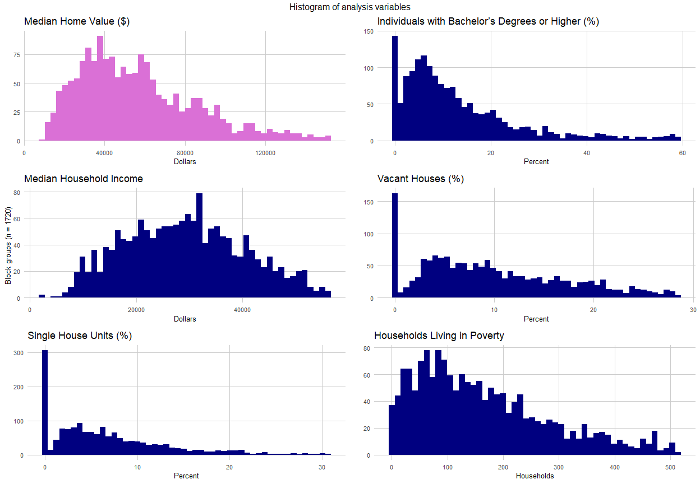
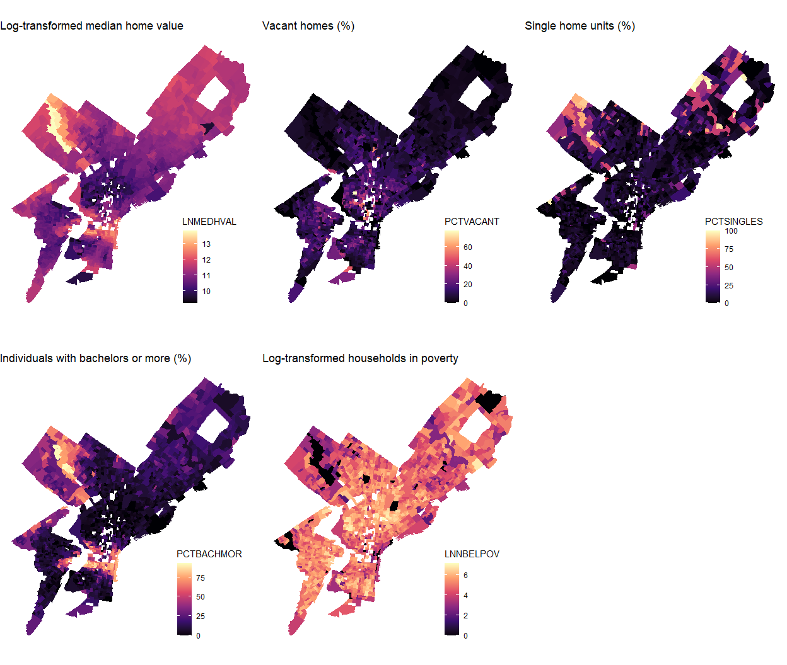
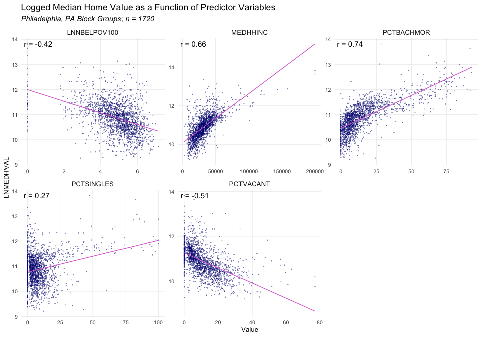

# Introduction

The ability to accurately predict house values is of great interest to real estate investors, homeowners and policymakers. This analysis examines the relationship between home sale values and select neighborhood attributes in Philadelphia.

In a survey of methods and input types for house price prediction, Geerts and colleagues (2023) present a set of variable types for prediction models, including structural features, temporal data, environmental features, and socioeconomic features. For this analysis, we focus on variables from the latter category, specifically the following:

* Percent of residents over 25 with at least a bachelor’s degree (PCTBACHMOR)
* Percent of housing units that are vacant (PCTVACANT)
* Percent of housing units that are detached single family houses (PCTSINGLES)
* Number of households with incomes below poverty level (NBELPOV100)
* Median household income  (MEDHHINC)

These indicators present a crude socioeconomic context for a neighborhood, and are well-documented as predictors of home prices. Indeed, it is reasonable that residents with higher educational attainment and income are able to afford more expensive homes. Conversely, it is also possible that the arrival of residents with higher socioeconomic status may lead to an eventual increase in property values. Using regression analysis, we find that __________________________. In light of this, we recommend that _________. Future research is needed _______________________.

# Methods  
## Data cleaning
The data in this analysis comes from the US Census Bureau's American Community Survey 5 year estimates.

The original dataset of block groups in Philadelphia has 1816 observations. We cleaned the data by removing the following block groups:
1. Block groups where population < 40
2. Block groups with no housing units
3. Block groups where median house value is lower than $10,000
4. One North Philadelphia block group with a very high outlier for median house value

After this cleaning process, we were left with 1720 observations. We additionally load a shapefile of Philadelphia's block-groups and join it to our dataframe for analysis and visualization. 

## Exploratory data analysis  
To prepare for our regression analysis, we first conduct an exploratory analysis by examining summary statistics as well as distributions of our independent and dependent variables. To test for collinearity among our predictors, we also calculate the correlations between each independent variable. The correlation is a measure of how two variables change in relation to each other. The sample correlation coefficient, $r$, ranges from -1, indicating a perfect negative correlation, to 1, indicating a perfect positive correlation. A positive correlation means that the two variables increase together, and a negative correlation means that one decreases as the other increases. A correlation coefficient of 0 indicates no linear relationship between the variables. The sample correlation coefficient $r$ is calculated as follows:

$$r = \frac{n(\Sigma xy)-(\Sigma x)(\Sigma y)}{\sqrt{[n\Sigma x^{2}-(\Sigma x)^{2}][n\Sigma y^{2}-(\Sigma y)^{2}]}}$$

First, the mean values of both variables x and y are calculated. Then, we find both variables' standard deviations. For each of the n observations in the dataset, we subtract the mean of each variable (__, __) from the observation, and divide the difference (__, __) by the variable's standard deviation (__, __). We then multiply this quotient (__, __) for each observation's x and y variable and sum this product at each observation. Finally, we divide this sum by the number of observations minus 1. 

## Multiple regression analysis

For our regression analysis, we use a multiple regression to analyze the relationship between one dependent variable (median home value) and multiple explanatory variables. Using this, we are able to gauge the strength of the relationship between each predictor and median home value, the direction of the relationship, and the goodness of model fit on our observations. Specifically, it allows us to hold individual predictors in isolation to see how, and if, median home values change in response to a unit change in the predictor.

In the following formula, median household value is a function of ______________________________________________________________, where _______________.

[[insert formula here]]

This method makes a few assumptions:
- x and y have a linear relationship
- the residuals are normally distributed, random, and homoscedastic
- observations and residuals are independent
- y is continuous and normally distributed
- predictors are not collinear (highly-correlated) 

Assuming all these conditions are met, we need to calculate the following parameters:
- $\beta _{0}$
- $\beta _{k}$
- $\sigma ^{2}$
- ....


[[need to complete this section!!]]

## Additional Analyses
### Stepwise regression
### K-fold cross validation

## Software
All analysis in this study was completed using R language packages in RStudio. 


# Results
## Exploratory results  
### Summary statistics
To begin our analysis, we first examine the summary statistics and distributions of our variables. The median home value (MEDHVAL) has a median value of \$53,250 and a mean value of \$66,288. This indicates that the data is positively skewed, with a higher share of observations below than the mean. Similarly, the independent variables (PCTBACHMOR, MEDHHINC, PCTVACANT, PCTSINGLES, and NBELPOV100) all have lower medians than means, indicating positive skewness.

In the summary statistics table, the dependent variable is the median home value (MEDHVAL), while the rest of the variables including the percentage of individuals with bachelor’s degrees or higher (PCTBACHMOR), median household income (MEDHHINC), percentage of vacant houses (PCTVACANT), percentage of single house units (PCTSINGLES), and households living in poverty (NBELPOV100) are all predictors of the dependent variable. The summary statistics table contains some key measurements, such as quantile 1, median, mean, quantile 3, maximum, and standard deviation.

Quantiles order the values of the data from lowest to highest and divide the value of each variable into 4 equal parts. Quantile 1 represents the value below which 25% of the data falls, the median (Q2) represents the value below which 50% of the data falls, and the third quartile (Q3) represents the value below which 75% of the data falls. The maximum in the table can be interpreted as quantile 4 and measures the value below which 100% of the data falls.

In the summary table, the dependent variable MEDHVAL has a quartile 1 of 35075, a median of 53250, a quartile 3 of 78625, and a maximum of 1e+06 (equal to 1,000,000). The interval between quantile 1 and the median is the smallest, indicating that the value of MEDHVAL is less variant. For PCTBACHMOR, the first quartile is 4.847, the median is 10, the mean is 16.08, the third quartile is 20.07, with a maximum value of 92.99. The standard deviation is 17.77. The first quartile for MEDHHINC is 21061, the median is 29719, the mean is 31542, the third quartile is 38750, with a maximum value of 2e+05 (200,000). The standard deviation is 16298.For PCTVACANT, the first quartile is 4.372, the median is 9.091, the mean is 11.29, the third quartile is 16.28, with a maximum value of 77.12. The standard deviation is 9.628.For PCTSINGLES, the first quartile is 2.11, the median is 5.714, the mean is 9.226, the third quartile is 11.06, with a maximum value of 100. The standard deviation is 13.25.And for NBELPOV100, the first quartile is 72, the median is 147, the mean is 189.8, the third quartile is 257, with a maximum value of 1267. The standard deviation is 164.3.

In addition to the four quantiles, the summary statistics table also provides the mean and standard deviation. The mean is the average of all values of a dataset and can be calculated by adding all values and dividing the result by the count. The standard deviation measures how dispersed the data of the dependent variable and the predictors are in relation to their means. A small standard deviation indicates that the data are clustered near the mean, while a large standard deviation indicates that the data are more spread out.

In the summary statistics table, the mean of the dependent variable MEDHVAL is 66288, and its standard deviation is 60006, which is considerably large, indicating that the data of the dependent variable is spread out. The mean of PCTBACHMOR is 16.08, and its standard deviation is 17.77, indicating that this data is also very spread out. The mean and standard deviation for MEDHHINC are 31542 and 16298, respectively. The data is not as spread out as the previous two data but still spread. The mean and standard deviation of PCTVACANT are 11.29 and 9.628, respectively, making PCTVACANT a relatively spread-out dataset as well. PCTSINGLES has a mean of 9.226 and a standard deviation of 13.25, making this predictor the most spread-out data. NBELPOV100 has a mean of 189.8 and a standard deviation of 164.3, indicating a considerable spread of data.


----------------------------------------------------------------------
 quartile_1   median   mean    quartile_3    max     sd     variance  
------------ -------- ------- ------------ ------- ------- -----------
   35075      53250    66288     78625      1e+06   60006   3.601e+09 

   4.847        10     16.08     20.07      92.99   17.77     315.8   

   21060      29719    31542     38750      2e+05   16298   265638946 

   4.372      9.091    11.29     16.28      77.12   9.628     92.71   

    2.11      5.714    9.226     11.06       100    13.25     175.5   

     72        147     189.8      257       1267    164.3     27001   
----------------------------------------------------------------------

Table: Summary Statistics

## Variable distributions

Looking at the variables plotted as histograms, we observe positive skews for median home value, individuals with bachelors degrees, vacant houses, single family houses, and households in poverty. Median household income is not visibly skewed.

<!-- -->

## Log-transformed variable distributions

After log-transformation, the dependent variable (Median Home Value) has a roughly normal distribution, so we will use LNMEDHVAL in our analysis. Of the independent variables, log-transformation only normalizes NBELPOV100 (Households living in poverty), so we will only use the log-transformed values for this variable and un-transformed values for the others.The regression we did in our assignment is all based on this log-transformed variable. The more explicit explanation of the regression assumptions will be examined in a separate section below in regression assumption checks.

<!-- -->


## Correlation matrix 
The correlation matrix generally supports the conclusions based on the visual comparison of the predictor maps, but provides a more quantitative visualization of the relationships between the predictors. 

There is presence of severe multicollinearity in this correlation matrix. In this correlation matrix, high correlations between certain pairs of variables are observed. For example, the correlation coefficients between MEDHHINC and PCTBACHMOR is 0.7, as well as the correlation coefficients between PCTBACHMOR and LNMEDHVAL. This result could indicate the possibility of multicollinearity. Additionally, the high correlation coefficient between MEDHHINC and LNNBELPOV100 is 0.6 and the correlation coefficient between PCTVACANT and LNMEDHVAL is 0.5. These results of coefficients also hint at potential multicollinearity. While the correlation matrix suggests a degree of multicollinearity.
 
<!-- -->

## Chloropleth maps

Visually interpreting the choropleth maps, the median home value and households in poverty share similarities. From the map of median home value, the region to the north of downtown Philadelphia appears darker, indicating a lower median home value. Similarly, the map of households in poverty shows yellowish clustering in the same region, indicating a higher prevalence of households in poverty. This correlation is logical because households in poverty typically cannot afford homes with high values, leading them to reside in regions with lower home values. Consequently, it is reasonable to conclude that households in poverty are strong predictors for the dependent variable of median home value.

Additionally, median home value and percentage of individuals with a bachelor's degree or higher also exhibit similarities. Regions with lower median home value are predominantly occupied by individuals without a bachelor's degree or higher, especially in North Philadelphia. Conversely, the region near Mt. Airy (NW Phila.) displays a higher median home value and a greater percentage of individuals with a bachelor's degree or higher. This correlation aligns with the general expectation that individuals with greater educational attainment tend to have better financial statuses, in contrast to those without higher education degrees. Thus, it is also reasonable to conclude that the percentage of individuals with a bachelor's degree or higher is a strong predictor for the dependent variable of median home value.

Moreover, the percentage of single-home units shares similarities with median home value, but there exists some variation. The higher percentage of single-home units in Mt. Airy and the northeastern region correlates with a higher median home value. However, the low percentage of single-home units downtown also suggests a high median home value. Consequently, the percentage of single-home units is not as strong a predictor for median home value as households in poverty and the percentage of individuals with a bachelor's degree or higher.

The percentage of vacant homes also shows a strong correlation with median home value. A low percentage of vacant homes is observed in areas with high median home values, while a high percentage of vacant homes is found in regions with lower median home values. Hence, the percentage of vacant homes serves as another strong predictor for median home value.

Given the high inter-correlation observed between the dependent variable, median home value, and predictors such as households in poverty, the percentage of individuals with a bachelor's degree or higher, and the percentage of vacant homes, concerns may arise regarding multicollinearity. These variables might display high correlations, posing challenges in differentiating the individual effects of each predictor on the dependent variable.

<!-- -->

# Multiple Regression Analysis
## Regression results 

The regression consists of the natural logarithm of median home value (LNMEDHVAL) regressed on percent of vacant house (PCTVACANT), percent of single home units (PCTSINGLES), percent of individuals with bachelor degree or higher (PCTBACHMOR), and household living in poverty (LNNBELPOV100) with natural log transformation. PCTSINGLES and PCTBACHMOR is negatively associated with median home value and PCTVACANT and LNNBELPOV100 is positively associated with median home value. 

The estimate of PCTVACANT is -0.0191569, which demonstrates that a 1-unit increase in the percentage of vacant homes is associated with a decrease of 0.0191569 in the response variable of median home value. Same as LNNBELPOV100, a 1-unit increase in the household in poverty is associated with a decrease of 0.0789054 in the median home value. PCTSINGLES and PCTBACHMOR has the estimate of 0.0029769 and 0.209098 respectively, which implies that a 1-unit increase in the percentage of single home unit and percentage of individuals with bachelor degree and more is individually associated with an increase of 0.0029769 and 0.209098 in median home value. The standard error measures the variability and precision of the estimate, with lower values indicating higher precision. The t value measures the strength of the relationship between the predictor and the dependent variable. Higher absolute t values indicate a stronger relationship. In this regression, PCTBACHMOR has the highest absolute t value of 38.494 indicating its strongest relationship with median home value, and PCTSINGLES has the lowest absolute t value of 4.234, meaning it has the weakest relationship with median home value.

Because the regression p-value is less than 0.0001, it suggests that PCTVACANT, PCTSINGLES, PCTBACHMOR, LNNBELPOV100 have an extremely low probability of having no relationship with the dependent variable MEDHVAL. Thus, we are led to reject the null hypothesis that the coefficients for these variables are equal to 0 and conclude that the variables are significant predictors of MEDHVAL.

The logarithm transformed regression model has a multiple $R^2$ of 0.6623 and adjusted $R^2$ of 0.6615 which means that approximately 66.23% of the log-transformed values of median home value can be explained by the predictors in the model. This $R^2$ indicates a moderately strong relationship between median home value and the model predictors.


```
## 
## Call:
## lm(formula = LNMEDHVAL ~ PCTVACANT + PCTSINGLES + PCTBACHMOR + 
##     LNNBELPOV100, data = dat.log)
## 
## Residuals:
##      Min       1Q   Median       3Q      Max 
## -2.25825 -0.20391  0.03822  0.21744  2.24347 
## 
## Coefficients:
##                Estimate Std. Error t value Pr(>|t|)    
## (Intercept)  11.1137661  0.0465330 238.836  < 2e-16 ***
## PCTVACANT    -0.0191569  0.0009779 -19.590  < 2e-16 ***
## PCTSINGLES    0.0029769  0.0007032   4.234 2.42e-05 ***
## PCTBACHMOR    0.0209098  0.0005432  38.494  < 2e-16 ***
## LNNBELPOV100 -0.0789054  0.0084569  -9.330  < 2e-16 ***
## ---
## Signif. codes:  0 '***' 0.001 '**' 0.01 '*' 0.05 '.' 0.1 ' ' 1
## 
## Residual standard error: 0.3665 on 1715 degrees of freedom
## Multiple R-squared:  0.6623,	Adjusted R-squared:  0.6615 
## F-statistic: 840.9 on 4 and 1715 DF,  p-value: < 2.2e-16
```

```
## Analysis of Variance Table
## 
## Response: LNMEDHVAL
##                Df  Sum Sq Mean Sq  F value    Pr(>F)    
## PCTVACANT       1 180.392 180.392 1343.087 < 2.2e-16 ***
## PCTSINGLES      1  24.543  24.543  182.734 < 2.2e-16 ***
## PCTBACHMOR      1 235.118 235.118 1750.551 < 2.2e-16 ***
## LNNBELPOV100    1  11.692  11.692   87.054 < 2.2e-16 ***
## Residuals    1715 230.344   0.134                       
## ---
## Signif. codes:  0 '***' 0.001 '**' 0.01 '*' 0.05 '.' 0.1 ' ' 1
```

# Regression Assumption Checks 

In this section, we will conduct tests on model assumptions. We have observed the distributions of variables earlier, and will continue to investigate these in the following figures.

## Scatterplots of dependent variable and predictors

The following scatterplots relate the dependent variable, LNMEDHVAL, to each predictor variable. Although a few are somewhat close, none of the relationships appear to fulfill the assumption of linearity in OLS regression.

<!-- -->

## Histogram of standardized residuals

The following histogram shows the frequency distribution of standardized residuals. A standardized residual represents the original residual value divided by the standard deviation of all residuals, producing a standardized value that represents a given residual's distance from the line of best fit. Based on the shape of this distribution, we can estimate that residuals are distributed normally in this model. **need to check interpretation here

<!-- -->

## Scatterplot of standardized residuals

The following scatterplot shows standardized residuals as a function of predicted LNMEDHVAL values. The distribution of residuals appears to demonstrate heteroscedasticity, as the variation in residuals is not uniform across predicted values. There are also a number of outlier values, which tend to be more positive towards lower predicted values and more negative towards higher predicted values.

<!-- -->

Based on the previous maps of LNMEDHVAL and predictor variables across Philadelphia, there seems to be a great deal of spatial autocorrelation in our data. All variables show geospatial clustering to some extent, suggesting that block groups are not independent of each other with respect to these variable values and are likely spatially related.


## Chloropleth map of residuals

The following map displays standardized residuals across Philadelphia. Negative residual values appear to cluster in certain areas in North Philadelphia, indicating the possible presence of significant spatial autocorrelation.

<!-- -->

# Additional Models

## Stepwise Regression

We conduct stepwise regression to provide an alternative to the original model as well as test its validity. The stepwise model path did not remove any predictors, so all four original predictors are preserved in the final stepwise regression.


```
## Start:  AIC=-3448.07
## LNMEDHVAL ~ PCTVACANT + PCTSINGLES + PCTBACHMOR + LNNBELPOV100
## 
##                Df Sum of Sq    RSS     AIC
## <none>                      230.34 -3448.1
## - PCTSINGLES    1     2.407 232.75 -3432.2
## - LNNBELPOV100  1    11.692 242.04 -3364.9
## - PCTVACANT     1    51.546 281.89 -3102.7
## - PCTBACHMOR    1   199.020 429.36 -2379.0
```

```
## Stepwise Model Path 
## Analysis of Deviance Table
## 
## Initial Model:
## LNMEDHVAL ~ PCTVACANT + PCTSINGLES + PCTBACHMOR + LNNBELPOV100
## 
## Final Model:
## LNMEDHVAL ~ PCTVACANT + PCTSINGLES + PCTBACHMOR + LNNBELPOV100
## 
## 
##   Step Df Deviance Resid. Df Resid. Dev       AIC
## 1                       1715   230.3435 -3448.073
```


## K-folds cross validation

When using k-folds cross-validation to compare our model to one that only incorporates PCTVACANT and MEDHHINC as predictors, we find that our model has a lower root mean square error (RMSE) than the latter model. Therefore, our model outperforms the restricted model.


```r
#Perform k-fold cross-validation (in which k = 5) using the CVlm command in the
# DAAG library and calculate the root mean square error (RMSE). Then re-run the
# regression model only using PCTVACANT and MEDHHINC as predictors, and again
# perform k-fold cross-validation in which k = 5. You will be asked to present the
# RMSE of both this model and the original model in your report.

cv <- CVlm(data=dat.log, reg, m=5)
```

<!-- -->

```r
mse <- attr(cv, "ms")
rmse <- sqrt(mse)
#rmse #yields 0.3664 = better model

reg2 <- lm(LNMEDHVAL ~ PCTVACANT + MEDHHINC, data=dat.log)
cv2 <- CVlm(data=dat.log, reg2, m=5)
```

<!-- -->

```r
mse2 <- attr(cv2, "ms")
rmse2 <- sqrt(mse2)
#rmse2 #yields 0.4427
```

RMSE for original model:

```
## [1] 0.3664401
```
RMSE for restricted model:

```
## [1] 0.4427216
```


# Discussion and Limitations 

In this project, we built a model based on ordinary least squares regression to predict median home value using a set of demographic variables at the block group level. These variables were: percent of residents with at least a bachelor's degree, vacancy percent of homes, percent of homes that were detached single family houses, households in poverty, and median household income. To build the model, we conducted exploratory data analysis and checked regression assumptions. To test its validity, we conducted stepwise regression and k-folds cross-validation using a restricted model.

> Talk about the quality of the model – that is, state if this is a good model
overall (e.g., R2, F-ratio test), and what other predictors that we didn’t
include in our model might be associated with our dependent variable.
i. Looking at the stepwise regression results, did the final model
include all 4 predictors or were some dropped? What does that tell
you about the quality of the model?
ii. Looking at the cross-validation results, was the RMSE better for the
4 predictor model or the 2 predictor model?
c) If you haven’t done that in the Results section, talk explicitly about the
limitations of the model – that is, mention which assumptions were
violated, and if applicable, how that may affect the model/parameter
estimation/estimated significance.
i. In addition, talk about the limitations of using the NBELPOV100
variable as a predictor – that is, what are some limitations of using
the raw number of households living in poverty rather than a
percentage?
d) Would it make sense to run Ridge or LASSO regression here? Explain briefly
(~4-5 sentences) what these methods are, when they’re used, and why
they would or would not be appropriate here.
