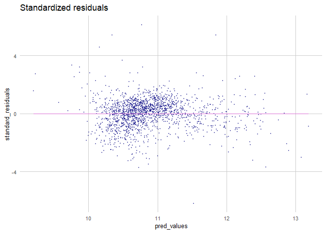
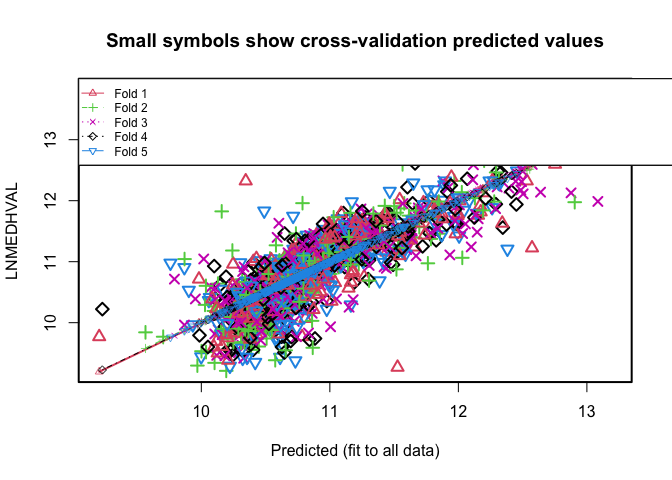
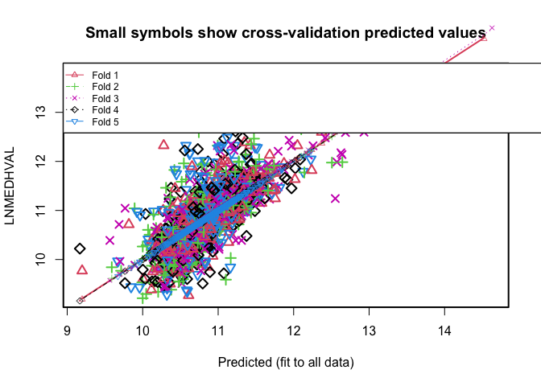

# Introduction

The capability to forecast housing values accurately has significant implications for urban planners, housing policymakers, local communities, and real estate stakeholders. This study delves into how specific neighborhood attributes within Philadelphia influence home sale values, thereby offering insights for urban planning strategies and housing policies.

In their comprehensive research on predictive methodologies for housing values, Geerts and colleagues (2023) delineated several key variable types that could influence housing prices. These categories encompass structural attributes, temporal patterns, environmental conditions, and, importantly for our study, socioeconomic features. Drawing inspiration from their findings, our study zones in on the socioeconomic determinants, detailing the following attributes:

* **Educational attainment**: Percent of residents over 25 with at least a bachelor’s degree (PCTBACHMOR)
* **Vacancy**: Percent of housing units that are vacant (PCTVACANT)
* **Single family homes**: Percent of housing units that are detached single family homes (PCTSINGLES)
* **Poverty**: Number of households with income below poverty level (NBELPOV100)
* **Median household income** (MEDHHINC)

While these indicators offer a foundational perspective on the socioeconomic climate of a neighborhood, they also historically serve as robust predictors of housing prices. Urban planning theories often posit that neighborhoods with elevated levels of education and income typically display higher housing values, given the residents' purchasing power. However, the reverse causality, wherein the influx of affluent and educated residents propels property values, cannot be ignored.

Our regression analysis discerns that the aforementioned variables explain approximately 66% of the variance in the log-transformed median home values within Philadelphia. Notably, educational attainment (PCTBACHMOR) emerges as the paramount predictor. Yet, a critical observation lies in the spatial heteroscedasticity, signifying high clustering in errors. This hints at our model's diminished predictive power in certain localized contexts.

Considering these insights, it becomes imperative for urban planners and researchers to delve deeper. A holistic, city-wide model necessitates further exploration to capture the intricate dynamics influencing housing values across diverse Philadelphia neighborhoods.

# Methods  
## Data cleaning
The data underpinning this analysis is sourced from the American Community Survey 5-year estimates, a product of the US Census Bureau.

The initial dataset encompassed block groups within Philadelphia, tallying to 1816 observations. In ensuring the robustness and relevance of our analysis, certain block groups were prudently excluded based on the following criteria:  

* Block groups with a population count of less than 40.    
* Block groups devoid of any housing units.  
* Block groups where the median house value fell below the threshold of $10,000.  
* A specific block group in North Philadelphia identified to have an anomalously high median house value outlier.  

Following this meticulous cleaning procedure, the dataset was refined down to 1720 observations. To bolster the depth of our analysis and facilitate visualization, we incorporated a shapefile demarcating Philadelphia's block groups and subsequently merged it with our core dataframe.

## Exploratory data analysis  
Prior to the comprehensive regression analysis, it's imperative to conduct a preliminary exploration of the dataset. This entails a scrutiny of summary statistics coupled with a detailed examination of the distribution patterns of our chosen independent and dependent variables. One of the pivotal aspects in regression analysis is the potential multicollinearity among predictors. To assess this, correlations between each independent variable are computed.

Correlation serves as a quantitative gauge of the mutual relationship between two variables. The sample correlation coefficient, denoted by *r*, is bounded within -1 and 1. An *r* value of -1 signifies a perfect negative correlation, whereas an *r* value of 1 indicates a perfect positive correlation. A positive value suggests a direct proportional relationship between the variables, and conversely, a negative value denotes an inverse relationship. A correlation coefficient resting at 0 conveys the absence of any discernible linear relationship between the paired variables. The mathematical formulation for the sample correlation coefficient *r* is as follows:

$$r = \frac{n(\Sigma xy)-(\Sigma x)(\Sigma y)}{\sqrt{[n\Sigma x^{2}-(\Sigma x)^{2}][n\Sigma y^{2}-(\Sigma y)^{2}]}}$$
Where:  
- **\( n \)** is the number of paired data points.  
- **\( \Sigma xy \)** is the sum of the products of the paired observations of x and y.  
- **\( \Sigma x \)** and **\( \Sigma y \)** are the sums of the x scores and y scores, respectively.  
- **\( \Sigma x^{2} \)** and **\( \Sigma y^{2} \)** are the sums of the squared x and y values, respectively.  


## Multiple regression analysis

In our analytical framework, we employ multiple regression to investigate the relationship between our dependent variable, the median home value, and various explanatory variables. Through this approach, we not only ascertain the magnitude and direction of the relationship between each predictor and the median home value but also assess the overall fit of the model to our dataset. Crucially, this methodology permits us to examine individual predictors in isolation, enabling us to discern how median home value may change in association with a unitary change in a given predictor.

In the following formula, median household value is a function of the following predictors:  
* **PCTBACHMOR**: Percentage of residents with a bachelor's degree or more.  
* **NBELPOV**: Number of households living in poverty.  
* **PCTVACANT**: Percentage of vacant homes.  
* **PCTSINGLES**: Percentage of single residents.  

The multiple regression model is:  
\[ \text{Median Home Value}_i = \beta_0 + \beta_1(\text{PCTBACHMOR}_i) + \beta_2(\text{NBELPOV}_i) + \beta_3(\text{PCTVACANT}_i) + \beta_4(\text{PCTSINGLES}_i) + \epsilon_i \]

Where \( \epsilon_i \) represents the error term for the \( i^{th} \) observation.

This method relies on the following assumptions:  
* x and y have a linear relationship
* the residuals are normally distributed, random, and homoscedastic
* observations and residuals are independent
* y is continuous and normally distributed
* predictors are not co-linear (highly-correlated)

Assuming all these conditions are met, we need to calculate the following parameters:  
- $\beta _{0}$  
- $\beta _{k}$  
- $\sigma ^{2}$  

[[need to complete this section!!]]

## Additional Analyses
### Stepwise regression
Stepwise regression, a technique rooted in data mining, systematically selects predictors that minimize the Akaike Information Criterion (AIC), which serves as an index for the relative quality of statistical models. While this method offers an efficient approach to refine regression models, it doesn't assure optimal results in a strict sense. Moreover, stepwise regression often culminates in a singular final model, overlooking the possibility of several models that could be equally valid. An additional limitation is its indifference to underlying theoretical considerations regarding predictors, potentially omitting vital variables during the optimization phase. For the purposes of this study, we only use stepwise regression primarily as a means to validate our model.

### K-fold cross validation
In k-fold cross-validation applied to a regression model, the dataset is randomly partitioned into k subsets of roughly equivalent size. The initial subset serves as the validation set while the model is trained using the remaining k−1 subsets. The mean squared error (MSE) is then computed for this first subset. This procedure is iteratively executed k times, each time designating a distinct subset as the validation set, resulting in k MSE estimates.

The k-fold root mean squared error (RMSE) represents an estimate of a typical residual's magnitude and serves as a metric to evaluate and compare diverse models. A model with the minimal k-fold RMSE is typically considered superior. This metric is derived by first averaging the MSEs over the k subsets to obtain the k-fold MSE and then extracting the square root of this mean value.

In this study, we set $k=5$.

## Software
All analysis in this study was completed using R language packages in RStudio. 


# Results
## Exploratory results  
### Summary statistics
To begin our analysis, we first examine the summary statistics and distributions of our variables. The median home value (MEDHVAL) has a median value of \$53,250 and a mean value of \$66,288. This indicates that the data is positively skewed, with a higher share of observations below than the mean. Similarly, the independent variables (PCTBACHMOR, MEDHHINC, PCTVACANT, PCTSINGLES, and NBELPOV100) all have lower medians than means, indicating positive skewness.

In the summary statistics table, the dependent variable is the median home value (MEDHVAL), while the rest of the variables including the percentage of individuals with bachelor’s degrees or higher (PCTBACHMOR), median household income (MEDHHINC), percentage of vacant houses (PCTVACANT), percentage of single house units (PCTSINGLES), and households living in poverty (NBELPOV100) are all predictors of the dependent variable. The summary statistics table contains some key measurements, such as quantile 1, median, mean, quantile 3, maximum, and standard deviation.

Quantiles order the values of the data from lowest to highest and divide the value of each variable into 4 equal parts. Quantile 1 represents the value below which 25% of the data falls, the median (Q2) represents the value below which 50% of the data falls, and the third quartile (Q3) represents the value below which 75% of the data falls. The maximum in the table can be interpreted as quantile 4 and measures the value below which 100% of the data falls.

In the summary table, the dependent variable MEDHVAL has a quartile 1 of 35075, a median of 53250, a quartile 3 of 78625, and a maximum of 1e+06 (equal to 1,000,000). The interval between quantile 1 and the median is the smallest, indicating that the value of MEDHVAL is less variant. For PCTBACHMOR, the first quartile is 4.847, the median is 10, the mean is 16.08, the third quartile is 20.07, with a maximum value of 92.99. The standard deviation is 17.77. The first quartile for MEDHHINC is 21061, the median is 29719, the mean is 31542, the third quartile is 38750, with a maximum value of 2e+05 (200,000). The standard deviation is 16298.For PCTVACANT, the first quartile is 4.372, the median is 9.091, the mean is 11.29, the third quartile is 16.28, with a maximum value of 77.12. The standard deviation is 9.628.For PCTSINGLES, the first quartile is 2.11, the median is 5.714, the mean is 9.226, the third quartile is 11.06, with a maximum value of 100. The standard deviation is 13.25.And for NBELPOV100, the first quartile is 72, the median is 147, the mean is 189.8, the third quartile is 257, with a maximum value of 1267. The standard deviation is 164.3.

In addition to the four quantiles, the summary statistics table also provides the mean and standard deviation. The mean is the average of all values of a dataset and can be calculated by adding all values and dividing the result by the count. The standard deviation measures how dispersed the data of the dependent variable and the predictors are in relation to their means. A small standard deviation indicates that the data are clustered near the mean, while a large standard deviation indicates that the data are more spread out.

In the summary statistics table, the mean of the dependent variable MEDHVAL is 66288, and its standard deviation is 60006, which is considerably large, indicating that the data of the dependent variable is spread out. The mean of PCTBACHMOR is 16.08, and its standard deviation is 17.77, indicating that this data is also very spread out. The mean and standard deviation for MEDHHINC are 31542 and 16298, respectively. The data is not as spread out as the previous two data but still spread. The mean and standard deviation of PCTVACANT are 11.29 and 9.628, respectively, making PCTVACANT a relatively spread-out dataset as well. PCTSINGLES has a mean of 9.226 and a standard deviation of 13.25, making this predictor the most spread-out data. NBELPOV100 has a mean of 189.8 and a standard deviation of 164.3, indicating a considerable spread of data.


```r
sum_stat <- function(var) {
  dat <- 
  dat %>%
    dplyr::select(var) %>%
    mutate(variable = var) %>%
    summarize(quartile_1 = quantile(dat[var], probs = 0.25, na.rm = TRUE),
           median = quantile(dat[var], probs = 0.5, na.rm = TRUE),
           mean = mean(dat[[var]], na.rm = TRUE),
           quartile_3 = quantile(dat[var], probs = 0.75, na.rm = TRUE),
           max = max(dat[var], na.rm = TRUE),
           sd = sd(dat[[var]], na.rm = TRUE),
           variance = var(dat[[var]], na.rm = TRUE))
  return(dat)
  }

medhval_summ <- sum_stat("MEDHVAL")
pctbachmorr_summ <- sum_stat("PCTBACHMOR")
medhhinc_summ <- sum_stat("MEDHHINC")
pctvacant_summ <- sum_stat("PCTVACANT")
pctsingles_summ <- sum_stat("PCTSINGLES")
nbelpov100_summ <- sum_stat("NBELPOV100")

dat.stat <- rbind(medhval_summ,
                  pctbachmorr_summ,
                  medhhinc_summ,
                  pctvacant_summ,
                  pctsingles_summ,
                  nbelpov100_summ) 

pander(dat.stat, caption = "Summary Statistics")
```


----------------------------------------------------------------------
 quartile_1   median   mean    quartile_3    max     sd     variance  
------------ -------- ------- ------------ ------- ------- -----------
   35075      53250    66288     78625      1e+06   60006   3.601e+09 

   4.847        10     16.08     20.07      92.99   17.77     315.8   

   21061      29719    31542     38750      2e+05   16298   265638946 

   4.372      9.091    11.29     16.28      77.12   9.628     92.71   

    2.11      5.714    9.226     11.06       100    13.25     175.5   

     72        147     189.8      257       1267    164.3     27001   
----------------------------------------------------------------------

Table: Summary Statistics

## Variable distributions

Looking at the variables plotted as histograms, we observe positive skews for median home value, individuals with bachelors degrees, vacant houses, single family houses, and households in poverty. Median home value, our dependent variable, is visibly skewed to the left, which makes sense as its mean is greater than its median. Individuals with bachelors degrees, vacant houses, single house units, and households living in poverty (independent variables) are also skewed to the left, and all of these except for households in poverty have a substantial spike of observations at 0. Of the independent variables, only median household income appears almost normally distributed. 


```r
grid.arrange(
ggplot(dat %>% filter(MEDHVAL <= 152525), aes(x = MEDHVAL)) + # filtering for outliers, keeping 95%
  geom_histogram(fill = "orchid", bins = 50) +
  labs(title = "Median Home Value ($)", y = "", x = "Dollars") +
  plotTheme(),

ggplot(dat %>% filter(PCTBACHMOR <= 59.13698), aes(x = PCTBACHMOR)) + # filtering for outliers, keeping 95%
  geom_histogram(fill = "navy", bins = 50) +
  labs(title = "Individuals with Bachelor’s Degrees or Higher (%)", y = "", x = "Percent") +
  plotTheme(),

ggplot(dat %>% filter(MEDHHINC <= 56444.9), aes(x = MEDHHINC)) + # filtering for outliers, keeping 95%
  geom_histogram(fill = "navy", bins = 50) +
  labs(title = "Median Household Income", y = "Block groups (n = 1720)", x = "Dollars") +
  plotTheme(),

ggplot(dat %>% filter(PCTVACANT <= 28.5154), aes(x = PCTVACANT)) + # filtering for outliers, keeping 95%
  geom_histogram(fill = "navy", bins = 50) +
  labs(title = "Vacant Houses (%)", y = "", x = "Percent") +
  plotTheme(),

ggplot(dat %>% filter(PCTSINGLES <= 30.68176), aes(x = PCTSINGLES)) + # filtering for outliers, keeping 95%
  geom_histogram(fill = "navy", bins = 50) +
  labs(title = "Single House Units (%)", y = "", x = "Percent") +
  plotTheme(),

ggplot(dat %>% filter(NBELPOV100 <= 514.05), aes(x = NBELPOV100)) + # filtering for outliers, keeping 95%
  geom_histogram(fill = "navy", bins = 50) +
  labs(title = "Households Living in Poverty", y = "", x = "Households") +
  plotTheme(),
top = "Histogram of analysis variables")
```

<!-- -->

## Log-transformed variable distributions
To make the skewed variables more easily interpretable, and also to meet the assumption of normal distribution in multiple regression analysis, we log-transform all variables except for median household income (which is normally distributed). 

After log-transformation, the dependent variable (Median Home Value) has a roughly normal distribution, so we will use LNMEDHVAL in our analysis. Of the independent variables, log-transformation only normalizes NBELPOV100 (Households living in poverty), so we will only use the log-transformed values for this variable and un-transformed values for the others.The regression we did in our assignment is all based on this log-transformed variable. The more explicit explanation of the regression assumptions will be examined in a separate section below in regression assumption checks.


```r
dat.log <- dat %>%
  mutate(LNMEDHVAL = log(MEDHVAL),
         LNPCTBACHMOR = log(1 + PCTBACHMOR), #adding one for variables with 0 values
         LNMEDHHINC = log(MEDHHINC),
         LNPCTVACANT = log(1 + PCTVACANT),
         LNPCTSINGLES = log(1 + PCTSINGLES),
         LNNBELPOV100 = log(1 + NBELPOV100))

grid.arrange(
ggplot(dat.log, aes(x = LNMEDHVAL)) + # filtering for outliers, keeping 95%
  geom_histogram(fill = "orchid", bins = 50) +
  labs(title = "Median Home Value ($)", y = "", x = "Dollars") +
  plotTheme(),

ggplot(dat.log, aes(x = LNPCTBACHMOR)) + # filtering for outliers, keeping 95%
  geom_histogram(fill = "navy", bins = 50) +
  labs(title = "Individuals with Bachelor’s Degrees or Higher (%)", y = "", x = "Percent") +
  plotTheme(),

ggplot(dat.log, aes(x = LNMEDHHINC)) + # filtering for outliers, keeping 95%
  geom_histogram(fill = "navy", bins = 50) +
  labs(title = "Median Household Income", y = "Block groups (n = 1720)", x = "Dollars") +
  plotTheme(),

ggplot(dat.log, aes(x = LNPCTVACANT)) + # filtering for outliers, keeping 95%
  geom_histogram(fill = "navy", bins = 50) +
  labs(title = "Vacant Houses (%)", y = "", x = "Percent") +
  plotTheme(),

ggplot(dat.log, aes(x = LNPCTSINGLES)) + # filtering for outliers, keeping 95%
  geom_histogram(fill = "navy", bins = 50) +
  labs(title = "Single House Units (%)", y = "", x = "Percent") +
  plotTheme(),

ggplot(dat.log, aes(x = LNNBELPOV100)) + # filtering for outliers, keeping 95%
  geom_histogram(fill = "navy", bins = 50) +
  labs(title = "Households Living in Poverty", y = "", x = "Households") +
  plotTheme(),
top = "Histogram of log-transformed independent variables")
```

<!-- -->


## Correlation matrix 
The correlation matrix generally supports the conclusions based on the visual comparison of the predictor maps, but provides a more quantitative visualization of the relationships between the predictors. 

There is presence of severe multicollinearity in this correlation matrix. In this correlation matrix, high correlations between certain pairs of variables are observed. For example, the correlation coefficients between MEDHHINC and PCTBACHMOR is 0.7, as well as the correlation coefficients between PCTBACHMOR and LNMEDHVAL. This result could indicate the possibility of multicollinearity. Additionally, the high correlation coefficient between MEDHHINC and LNNBELPOV100 is 0.6 and the correlation coefficient between PCTVACANT and LNMEDHVAL is 0.5. These results of coefficients also hint at potential multicollinearity, suggesting that we should not include all of our independent variables in our final regression analysis. 
 

```r
dat.corplot <- dat.log %>%
  dplyr::select(-POLY_ID, -AREAKEY, -MEDHVAL, -LNPCTBACHMOR, -LNMEDHHINC, -LNPCTVACANT, -LNPCTSINGLES, -NBELPOV100)

ggcorrplot(round(cor(dat.corplot %>% na.omit()), 1),
  p.mat = cor_pmat(dat.corplot %>% na.omit()),
  colors = c("navy", "white", "orchid1"),
  type="lower",
  insig = "blank",
  show.legend = FALSE,
  lab = TRUE) +  
    labs(title = "Log-transformed median home value correlation with independent variables") 
```

<!-- -->

## Chloropleth maps
To examine the spatial distribution of our variables, we plot them as chloropleth maps. 

Visually interpreting the choropleth maps, the median home value and households in poverty share similarities. From the map of median home value, the region to the north of downtown Philadelphia appears darker, indicating a lower median home value. Similarly, the map of households in poverty shows yellowish clustering in the same region, indicating a higher prevalence of households in poverty. This correlation is logical because households in poverty typically cannot afford homes with high values, leading them to reside in regions with lower home values. Consequently, it is reasonable to conclude that households in poverty are strong predictors for the dependent variable of median home value.

Additionally, median home value and percentage of individuals with a bachelor's degree or higher also exhibit similarities. Regions with lower median home value are predominantly occupied by individuals without a bachelor's degree or higher, especially in North Philadelphia. Conversely, the region near Mt. Airy (NW Phila.) displays a higher median home value and a greater percentage of individuals with a bachelor's degree or higher. This correlation aligns with the general expectation that individuals with greater educational attainment tend to have better financial statuses, in contrast to those without higher education degrees. Thus, it is also reasonable to conclude that the percentage of individuals with a bachelor's degree or higher is a strong predictor for the dependent variable of median home value.

Moreover, the percentage of single-home units shares similarities with median home value, but there exists some variation. The higher percentage of single-home units in Mt. Airy and the northeastern region correlates with a higher median home value. However, the low percentage of single-home units downtown also suggests a high median home value. Consequently, the percentage of single-home units is not as strong a predictor for median home value as households in poverty and the percentage of individuals with a bachelor's degree or higher.

The percentage of vacant homes also shows a strong correlation with median home value. A low percentage of vacant homes is observed in areas with high median home values, while a high percentage of vacant homes is found in regions with lower median home values. Hence, the percentage of vacant homes serves as another strong predictor for median home value.

Given the high inter-correlation observed between the dependent variable, median home value, and predictors such as households in poverty, the percentage of individuals with a bachelor's degree or higher, and the percentage of vacant homes, concerns may arise regarding multicollinearity. These variables might display high correlations, posing challenges in differentiating the individual effects of each predictor on the dependent variable.


```r
library(gridExtra)
grid.arrange(
ggplot(dat.sf) +
  geom_sf(aes(fill = LNMEDHVAL), color = "transparent") +
  scale_fill_viridis_c(option = "A", direction = 1) +
  labs(title = "Log-transformed median home value") +
  theme_void() +
  theme(legend.position = c(0.8, 0.2)),

ggplot(dat.sf) +
  geom_sf(aes(fill = PCTVACANT), color = "transparent") +
  scale_fill_viridis_c(option = "A", direction = 1) +
  labs(title = "Vacant homes (%)") +
  theme_void() +
  theme(legend.position = c(0.8, 0.2)),

ggplot(dat.sf) +
  geom_sf(aes(fill = PCTSINGLES), color = "transparent") +
  scale_fill_viridis_c(option = "A", direction = 1) +
  labs(title = "Single home units (%)") +
  theme_void() +
  theme(legend.position = c(0.8, 0.2)),

ggplot(dat.sf) +
  geom_sf(aes(fill = PCTBACHMOR), color = "transparent") +
  scale_fill_viridis_c(option = "A", direction = 1) +
  labs(title = "Individuals with bachelors or more (%)") +
  theme_void() +
  theme(legend.position = c(0.8, 0.2)),

ggplot(dat.sf) +
  geom_sf(aes(fill = LNNBELPOV), color = "transparent") +
  scale_fill_viridis_c(option = "A", direction = 1) +
  labs(title = "Log-transformed households in poverty") +
  theme_void() +
  theme(legend.position = c(0.8, 0.2)), ncol = 3)
```

<!-- -->

# Multiple Regression Analysis
## Regression results 

The regression consists of:
- the natural logarithm of median home value (LNMEDHVAL) regressed on percent of vacant house (PCTVACANT)
- percent of single home units (PCTSINGLES)
- percent of individuals with bachelor degree or higher (PCTBACHMOR)
- households living in poverty (LNNBELPOV100) with natural log transformation

The logarithm transformed regression model has a multiple $R^2$ of 0.6623 and adjusted $R^2$ of 0.6615 which means that approximately 66.23% of the log-transformed values of median home value can be explained by the predictors in the model. This $R^2$ indicates a moderately strong relationship between median home value and the model predictors.

### Vacancy rate and households in poverty
PCTVACANT and LNNBELPOV100 are negatively associated with median home value, indicating that increases in vacancy and poverty rate are associated with decreases in home prices.

The estimate of PCTVACANT is -0.0191569, which demonstrates that a 1-unit increase in the percentage of vacant homes is associated with a decrease of 0.0191569 in the response variable of log-transformed median home value. Similarly, a 1-unit increase in the log-transformed share of households in poverty (LNNBELPOV100) is associated with a decrease of 0.0789054 in the median home value. In practical terms, a 1% increase in PCTVACANT and LNNBELPOV100 respectively lead to a $191.57 and $789.05 decrease in median home value.

### Single homes and bachelors degrees
PCTSINGLES and PCTBACHMOR are positively associated with median home value, meaning that increases in educational attainment and single homes are associated with increases in home prices. 

PCTSINGLES and PCTBACHMOR have the estimates of 0.0029769 and 0.209098 respectively, which implies that a 1-unit increase in the percentage of single home units and the percentage of individuals with a bachelor's degree is individually associated with an increase of 0.0029769 and 0.209098 in log-transformed median home value. In other words, a 1% increase in PCTSINGLES and PCTBACHMOR respectively leads to a $29.77 and $209.10 increase in median home value.

### Accuracy
The standard error measures the variability and precision of the estimate, with lower values indicating higher precision. The t value measures the strength of the relationship between the predictor and the dependent variable. Higher absolute t values indicate a stronger relationship. In this regression, PCTBACHMOR has the highest absolute t value of 38.494 indicating its strongest relationship with median home value, and PCTSINGLES has the lowest absolute t value of 4.234, meaning it has the weakest relationship with median home value.

### Null hypothesis
Because the regression p-value is less than 0.0001, it suggests that PCTVACANT, PCTSINGLES, PCTBACHMOR, LNNBELPOV100 have an extremely low probability of having no relationship with the dependent variable MEDHVAL. Thus, we are led to reject the null hypothesis that the coefficients for these variables are equal to 0 and conclude that the variables are significant predictors of LNMEDHVAL.


```r
# Assuming there’s no severe multicollinearity, use the lm command to run
# the regression where LNMEDHVAL is the dependent variable and
# PCTVACANT, PCTSINGLES, PCTBACHMOR, and LNNBELPOV100 are
# predictors.
# 
# In your report, be sure to present the summary of the fit as well as the
# ANOVA table containing the regression and error sum of squares (use the
# summary and anova commands). The only thing you should be looking at in
# the output from the anova command is the error sum of squares, and not
# any of the p-values.
# 
# c. Use the fitted, residuals and rstandard commands to save the predicted
# values, residuals and standardized residuals, respectively.

reg <- lm(LNMEDHVAL ~ PCTVACANT + PCTSINGLES + PCTBACHMOR + LNNBELPOV100, data=dat.log)
summary(reg)
```

```
## 
## Call:
## lm(formula = LNMEDHVAL ~ PCTVACANT + PCTSINGLES + PCTBACHMOR + 
##     LNNBELPOV100, data = dat.log)
## 
## Residuals:
##      Min       1Q   Median       3Q      Max 
## -2.25825 -0.20391  0.03822  0.21744  2.24347 
## 
## Coefficients:
##                Estimate Std. Error t value Pr(>|t|)    
## (Intercept)  11.1137661  0.0465330 238.836  < 2e-16 ***
## PCTVACANT    -0.0191569  0.0009779 -19.590  < 2e-16 ***
## PCTSINGLES    0.0029769  0.0007032   4.234 2.42e-05 ***
## PCTBACHMOR    0.0209098  0.0005432  38.494  < 2e-16 ***
## LNNBELPOV100 -0.0789054  0.0084569  -9.330  < 2e-16 ***
## ---
## Signif. codes:  0 '***' 0.001 '**' 0.01 '*' 0.05 '.' 0.1 ' ' 1
## 
## Residual standard error: 0.3665 on 1715 degrees of freedom
## Multiple R-squared:  0.6623,	Adjusted R-squared:  0.6615 
## F-statistic: 840.9 on 4 and 1715 DF,  p-value: < 2.2e-16
```

```r
anova(reg)
```

```
## Analysis of Variance Table
## 
## Response: LNMEDHVAL
##                Df  Sum Sq Mean Sq  F value    Pr(>F)    
## PCTVACANT       1 180.392 180.392 1343.087 < 2.2e-16 ***
## PCTSINGLES      1  24.543  24.543  182.734 < 2.2e-16 ***
## PCTBACHMOR      1 235.118 235.118 1750.551 < 2.2e-16 ***
## LNNBELPOV100    1  11.692  11.692   87.054 < 2.2e-16 ***
## Residuals    1715 230.344   0.134                       
## ---
## Signif. codes:  0 '***' 0.001 '**' 0.01 '*' 0.05 '.' 0.1 ' ' 1
```

```r
#vif(reg)
dat.log$pred_values <- fitted(reg)
dat.log$residual_values <- residuals(reg)
dat.log$standard_residuals <- rstandard(reg)
```

# Regression Assumption Checks 

In this section, we conduct tests on model assumptions. We have observed the distributions of variables earlier, and will continue to investigate these in the following figures.

## Scatterplots of dependent variable and predictors

The following scatter plots relate the dependent variable, LNMEDHVAL, to each predictor variable. Although a few are somewhat close, none of the relationships appear to fulfill the assumption of linearity in OLS regression. PCTBACHMOR, PCTSINGLES, and PCTVACANT further violate the assumption of homoscedasticity, with observably higher variance in LNMEDHVAL at lower values of each variable. 


```r
cor.long <- dat.log %>%
  dplyr::select(LNMEDHVAL, PCTBACHMOR, MEDHHINC, PCTVACANT, PCTSINGLES, LNNBELPOV100) %>%
  gather(Variable, Value, -LNMEDHVAL) %>%
  mutate(Value = as.numeric(Value))

cor.cor <-
  cor.long %>%
    group_by(Variable) %>%
    summarize(correlation = cor(Value, LNMEDHVAL, use = "complete.obs"))

ggplot(cor.long, aes(Value, LNMEDHVAL)) +
  geom_point(size = 0.1, color = "navy", alpha = 0.4) +
  geom_text(data = cor.cor, aes(label = paste("r =", round(correlation, 2))),
            x=-Inf, y=Inf, vjust = 1.5, hjust = -.1, size = 4) +
  geom_smooth(method = "lm", se = FALSE, color = "orchid", linewidth = 0.5) +
  facet_wrap(~Variable, ncol = 3, scales = "free") +
  plotTheme() + 
  labs(title = "Logged Median Home Value as a Function of Predictor Variables", subtitle = "Philadelphia, PA Block Groups; n = 1720") 
```

<!-- -->

## Histogram of standardized residuals

The following histogram shows the frequency distribution of standardized residuals. A standardized residual represents the original residual value divided by the standard deviation of all residuals, producing a standardized value that represents a given residual's distance from the line of best fit. Based on the shape of this distribution, we can estimate that residuals have a slight skew to the left, indicating that the median is greater than the mean.


```r
ggplot(dat.log, aes(standard_residuals)) +
  geom_histogram(binwidth = 0.5, fill = "navy") +
  plotTheme() + 
  labs(title = "Histogram of Standardized Residuals")
```

<!-- -->

## Scatterplot of standardized residuals

The following scatterplot shows standardized residuals as a function of predicted LNMEDHVAL values. The distribution of residuals appears to demonstrate heteroscedasticity, as the variation in residuals is not uniform across predicted values. There are also a number of outlier values, which tend to be more positive towards lower predicted values and more negative towards higher predicted values.


```r
# Create a scatter plot with Standardized Residuals on the y-axis and
# Predicted Values on the x-axis. You will be asked to present this scatter plot
# in your report, so take a screenshot of it if you plan to use MS Word.

ggplot(dat.log, aes(pred_values, standard_residuals)) +
  geom_point(size = 0.5, color = "navy", alpha = 0.4) +
  #geom_text(data = cor.cor, aes(label = paste("r =", round(correlation, 2))),
  #          x=-Inf, y=Inf, vjust = 1.5, hjust = -.1, size = 4) +
  geom_smooth(method = "lm", se = FALSE, color = "orchid", linewidth = 0.5) +
  plotTheme() + 
  labs(title = "Standardized residuals") 
```

<!-- -->

Based on the previous maps of LNMEDHVAL and predictor variables across Philadelphia, there seems to be a great deal of spatial autocorrelation in our data. All variables show geospatial clustering to some extent, suggesting that block groups are not independent of each other with respect to these variable values and are likely spatially related.


## Chloropleth map of residuals
The following map displays standardized residuals across Philadelphia. Negative residual values appear to cluster in certain areas in North Philadelphia, indicating the possible presence of substantial spatial autocorrelation.


```r
#histogram and a choropleth map of standardized regression
#residuals that you saved using the rstandard command earlier


dat.sf<-merge(dat.log,dat.sf,by="POLY_ID")%>%
  st_as_sf()

ggplot(dat.sf) +
  geom_sf(aes(fill = standard_residuals), color = "transparent") +
  scale_fill_viridis_c(option = "A", direction = 1) +
  labs(title = "Chloropleth map of Standardized Residuals") +
  theme_void()
```

<!-- -->

# Additional Models

## Stepwise Regression

We conduct stepwise regression to provide an alternative to the original model as well as test its validity. The stepwise model path did not remove any predictors, so all four original predictors are preserved in the final stepwise regression.


```r
#Use the step and step$anova commands in the MASS library to run stepwise
# regression and determine the best model based on the Akaike Information
# Criterion.

step <- stepAIC(reg, direction="both")
```

```
## Start:  AIC=-3448.07
## LNMEDHVAL ~ PCTVACANT + PCTSINGLES + PCTBACHMOR + LNNBELPOV100
## 
##                Df Sum of Sq    RSS     AIC
## <none>                      230.34 -3448.1
## - PCTSINGLES    1     2.407 232.75 -3432.2
## - LNNBELPOV100  1    11.692 242.04 -3364.9
## - PCTVACANT     1    51.546 281.89 -3102.7
## - PCTBACHMOR    1   199.020 429.36 -2379.0
```

```r
step$anova
```

```
## Stepwise Model Path 
## Analysis of Deviance Table
## 
## Initial Model:
## LNMEDHVAL ~ PCTVACANT + PCTSINGLES + PCTBACHMOR + LNNBELPOV100
## 
## Final Model:
## LNMEDHVAL ~ PCTVACANT + PCTSINGLES + PCTBACHMOR + LNNBELPOV100
## 
## 
##   Step Df Deviance Resid. Df Resid. Dev       AIC
## 1                       1715   230.3435 -3448.073
```


## K-folds cross validation

When using k-folds cross-validation to compare our model to one that only incorporates PCTVACANT and MEDHHINC as predictors, we find that our model has a lower root mean square error (RMSE) than the latter model. Therefore, our model outperforms the restricted model.


```r
#Perform k-fold cross-validation (in which k = 5) using the CVlm command in the
# DAAG library and calculate the root mean square error (RMSE). Then re-run the
# regression model only using PCTVACANT and MEDHHINC as predictors, and again
# perform k-fold cross-validation in which k = 5. You will be asked to present the
# RMSE of both this model and the original model in your report.

cv <- CVlm(data=dat.log, reg, m=5)
```

<!-- -->

```r
mse <- attr(cv, "ms")
rmse <- sqrt(mse)
#rmse #yields 0.3664 = better model

reg2 <- lm(LNMEDHVAL ~ PCTVACANT + MEDHHINC, data=dat.log)
cv2 <- CVlm(data=dat.log, reg2, m=5)
```

<!-- -->

```r
mse2 <- attr(cv2, "ms")
rmse2 <- sqrt(mse2)
#rmse2 #yields 0.4427
```

RMSE for original model:

```r
rmse
```

```
## [1] 0.3664401
```
RMSE for restricted model:

```r
rmse2
```

```
## [1] 0.4427216
```


# Discussion and Limitations   
## **Analysis Overview**:

Using ordinary least squares regression, we sought to predict the median home value based on census demographic variables at the block group level: 
- Percentage of residents possessing at least a **bachelor's degree**.
- **Home vacancy rate**.
- Percentage of detached **single-family homes**.
- Proportion of **households living in poverty**.
- **Median household income**.

Our methodology involved an exploratory data analysis followed by a multiple regression analysis in adherence to the standard regression assumptions of linearity in our indicators, no multicolinearity, and homoscedasticity. We tested our model's validity through stepwise regression and k-folds cross-validation, applying the latter to a constrained model variant.

Our final model yielded an adjusted \( R^2 \) of 0.66. This suggests that our selected predictors account for 66% of the variance in median home values at the census block group level in Philadelphia.

## **Key Findings**:

1. **Educational attainment**: A notable finding was the strong influence of education levels on home values. This aligns with the dominance of _"meds and eds"_ in Philadelphia's local economy.
2. **Vacancy Rates**: Despite high vacancy rates typical of post-industrial cities, our data suggests that home values aren't meaningfully impacted by vacancy, possibly due to its pervasive nature.
3. **Single-Family Homes**: The prevalence of detached single-family homes didn't notably impact home values. This could be linked to gentrification processes where the composition of the immediate neighborhood becomes secondary.
4. **Income and Poverty Dynamics**: The potent predictive value of median household income and poverty rates in a racially and socioeconomically stratified city was anticipated. These metrics mirror the broader living environment, providing insights into the relationship between socio-demographic elements and housing values in urban locales.

## **Limitations**:

- **Spatial Autocorrelation**: A substantial spatial autocorrelation in the residuals was observed, undermining the model's generalizability across diverse neighborhood contexts.
- **Sample Size**: The census data, which is reliant on household response rates, has inherent limitations regarding sample size.
- **Sample Bias**: Underrepresented groups such as those with lower income, socioeconomic status, non-English speakers, and minorities, are less likely to respond to the census, resulting in a sample bias which can skew certain variables associated with household demographics.
- **Heteroscedasticity**: A non-constant variance (heteroscedasticity) was noted in the standard errors.
- **Unexplained Variance**: The model doesn't account for approximately 33% of the variance in home values in Philadelphia block groups.

## **Recommendations**:

- **Policy and Research**: The model offers valuable insights for policymakers and academic research, particularly with regards to the relationship between educational attainment and home values. This finding could be expanded upon with implications for real estate development and affordable housing policy around large educational institutions such as Temple, Drexel, and Penn.

- **Industry Caution**: Given its limitations, the model might not be apt for real estate or related industries. 

## **Model Evaluation**:

Our regression results highlight that all four predictors significantly influence median home value. The model exhibits a strong goodness of fit with each predictor explaining some variance in the outcome. Cross-validation results emphasize the advantage of a four-predictor model over its two-predictor counterpart, evident through a reduced RMSE. Potential supplementary predictors, like neighborhood safety, could further refine the model since safer locales tend to have higher home values. Higher resolution data such as point-level amenity data could further improve the model, as census demographic variables often share similar spatial distributions.

## **Assumptions Violations**:

Visual inspections of scatter plots indicate breaches of the linearity and homoscedasticity assumptions. The histogram of standardized residuals hints at a mild left-skew. The presence of multicolinearity, as revealed in the correlation matrix, poses threats to model accuracy. Using raw counts of households in poverty could distort its impact on home values, failing to account for variation in population size across block groups.

## **Ridge or LASSO Regression**:

Considering the multicolinearity issue, Ridge and LASSO regression could be effective Both methods introduce a shrinkage penalty on coefficient estimates, ensuring more stable coefficients and enhancing the model's ease of interpretation.
