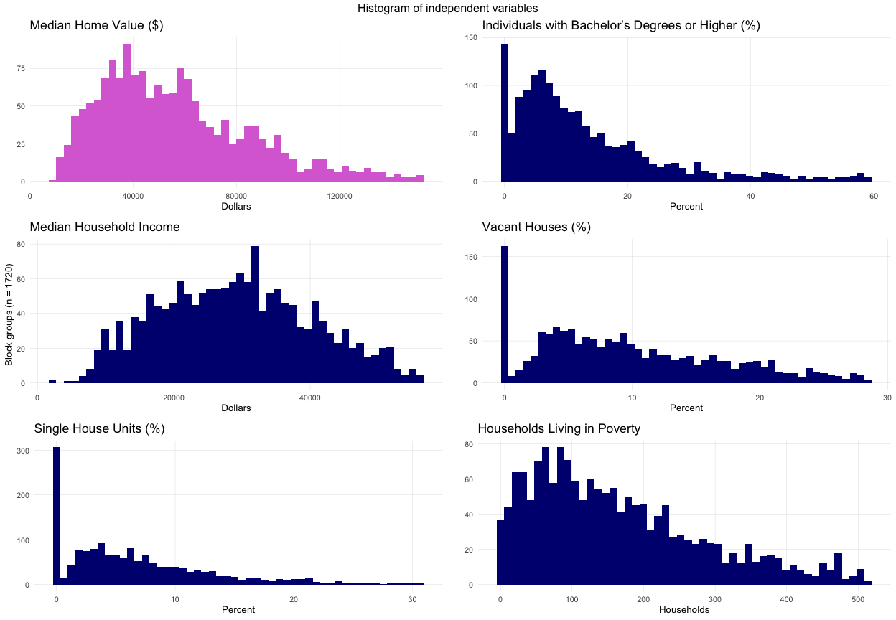
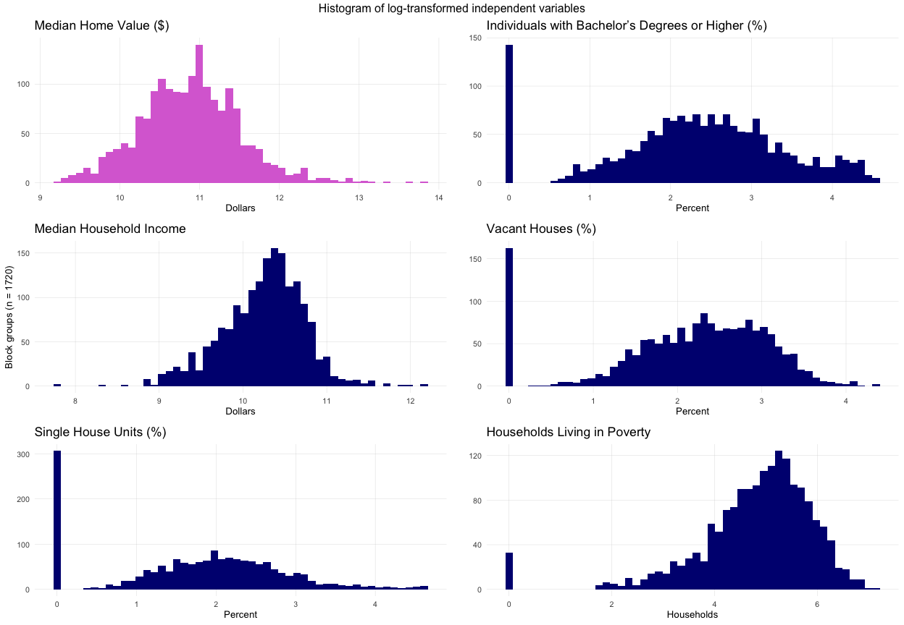
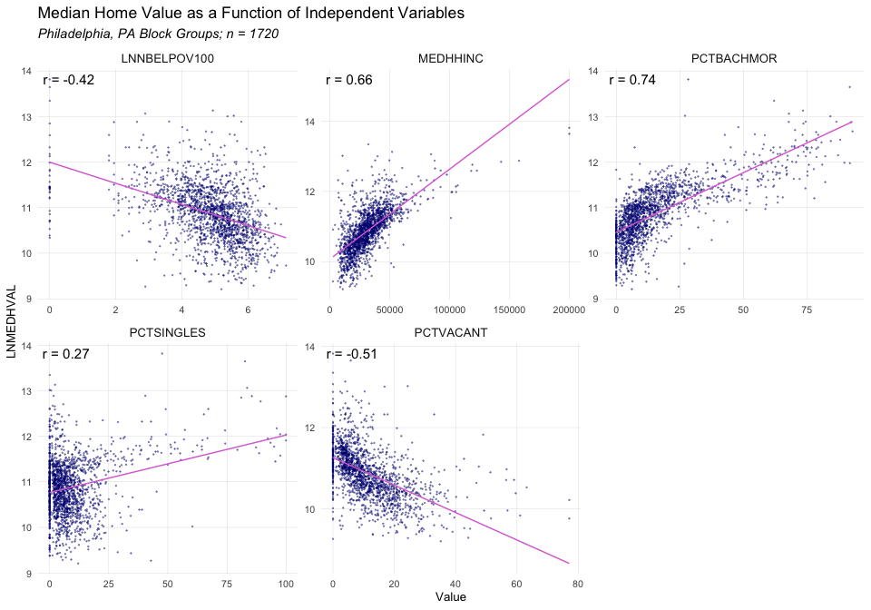
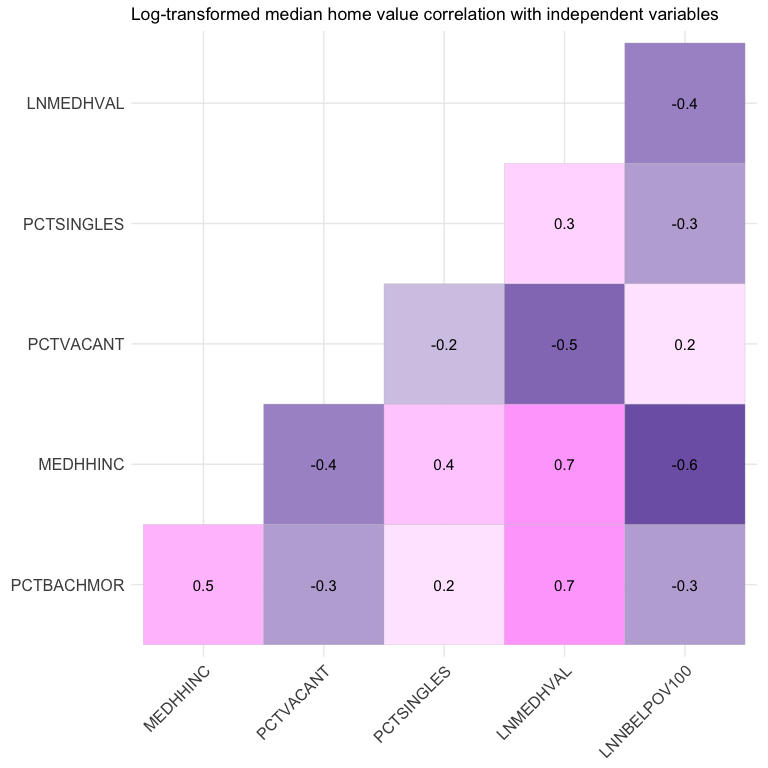
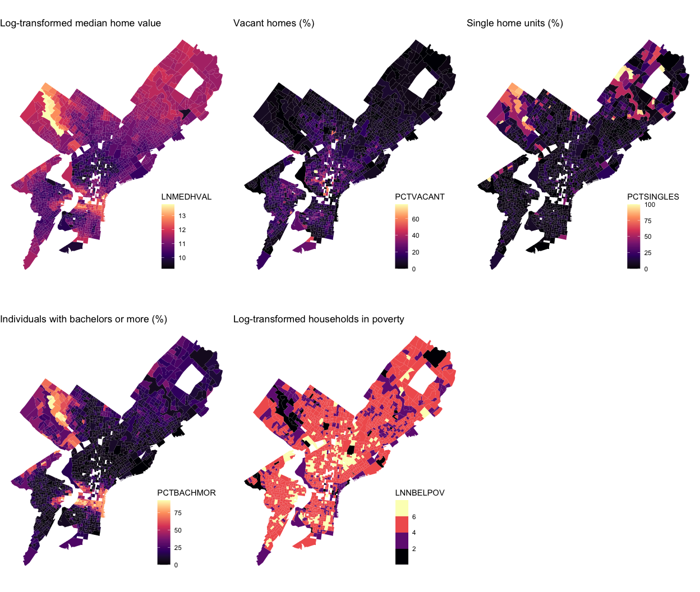

# Introduction

```r
knitr::opts_chunk$set(
	echo = FALSE,
	message = FALSE,
	warning = FALSE
)
library(dplyr)
library(pander)
library(sf)
library(tidyr)
library(lubridate)
library(fuzzyjoin)
library(ggplot2)
library(tidygeocoder)
library(mapview)
library(tigris)
library(FNN)
library(janitor)
library(stringr)
library(ggpubr)
library(gridExtra)
library(ggcorrplot)

# Load themes for maps and plots (you can edit these)
mapTheme <- function(base_size = 12) {
  theme(
    text = element_text(color = "black", family="Helvetica"),
    plot.title = element_text(colour = "black", hjust=0),
    plot.subtitle=element_text(face="italic", hjust = 0),
    plot.caption=element_text(size = 7, hjust = 0),
    axis.ticks = element_blank(),
    axis.text = element_blank(),
    axis.title = element_blank(),
    panel.grid.major = element_blank(),
    panel.grid.minor = element_blank(),
    panel.border = element_blank(),
    panel.background = element_blank(),
    legend.background = element_blank(),
    legend.position= c(0.8, 0.2)
  )
}

plotTheme <- function(base_size = 12) {
  theme(
    text = element_text(color = "black"),
    plot.title = element_text(colour = "black"),
    plot.subtitle = element_text(face="italic"),
    plot.caption = element_text(hjust=0),
    axis.ticks = element_blank(),
    panel.background = element_blank(),
    panel.grid.major = element_line("grey80", size = 0.1),
    panel.grid.minor = element_blank(),
    panel.border = element_blank(),
    strip.background = element_blank(),
    strip.text = element_text(size=12),
    axis.title = element_text(size=10),
    axis.text = element_text(size=8),
    plot.background = element_blank(),
    legend.background = element_blank(),
    legend.title = element_text(colour = "black", face = "italic"),
    legend.text = element_text(colour = "black", face = "italic"),
    strip.text.x = element_text(size = 10)
  )
} 
```

# Methods 


# Exploratory data analysis  
## Summary statistics

-----------------------------------------------------------------------
  variable    quartile_1   median   mean    quartile_3    max     sd   
------------ ------------ -------- ------- ------------ ------- -------
  MEDHVAL       35075      53250    66288     78625      1e+06   60006 

 PCTBACHMOR     4.847        10     16.08     20.07      92.99   17.77 

  MEDHHINC      21060      29719    31542     38750      2e+05   16298 

 PCTVACANT      4.372      9.091    11.29     16.28      77.12   9.628 

 PCTSINGLES      2.11      5.714    9.226     11.06       100    13.25 

 NBELPOV100       72        147     189.8      257       1267    164.3 
-----------------------------------------------------------------------

Table: Summary Statistics

## Histograms 
<!-- -->

## Log transformed histograms 
After log-transformation, the dependent variable (Median Home Value) has a roughly normal distribution, so we will use LNMEDHVAL in our analysis. Of the independent variables, log-transformation only normalizes NBELPOV100 (Households living in poverty), so we will only use the log-transformed values for this variable and un-transformed values for the others.
<!-- -->

## Scatter plots
<!-- -->

## Correlation matrix  
Median household income is strongly correlated with log-transformed number of households living in poverty. We should only include one to avoid multicollinearity.  
<!-- -->

## Chloropleth maps
<!-- -->

# Multiple Regression Analysis
## Regression results 


# Regression Assumption Checks 
## Scatterplot of standardized residuals


## Additional Models


## K-folds cross validation


## Histogram and chloropleth map of residuals


# Discussion and Limitations 

